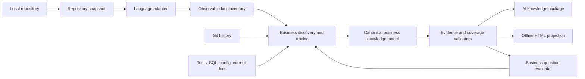

# Leo Code to Business Skill Design

> Status: reviewed, awaiting user approval
> Date: 2026-08-14
> Skill: `leo-code-to-business`
> Managed source: `lib/skills/leo-code-to-business`

## 1. Goal

Create a repository-managed Skill that continuously translates a local source repository into
verifiable business knowledge.

The result must serve two audiences from one canonical knowledge model:

- AI agents receive structured, compact, evidence-linked artifacts suitable for retrieval and
  answering business questions.
- People receive a searchable offline HTML site organized around business capabilities, use cases,
  rules, states, events, exceptions, and unresolved questions.

The first implementation deeply supports Java/Spring repositories. The architecture must accept
additional language adapters without changing the business knowledge model.

The Skill succeeds only when it can answer concrete business questions such as:

- How is a work order created?
- How are construction sites and videos bound?
- What rules decide which binding path is used?
- What data changes, external effects, rejection conditions, and recovery paths exist?

It is not sufficient to list controllers, classes, methods, tables, or framework components.

## 2. Core Invariant

Every output must preserve this direction:

```text
code and repository evidence
-> observable behavior facts
-> business meaning
-> business knowledge
```

The Skill must never reverse the direction by inventing a plausible business story and then
selecting code fragments that appear to support it.

The primary optimization target is business knowledge recall and correctness. Technical
documentation is supporting evidence, not the product.

## 3. Definition of Business Knowledge

A business knowledge item explains a meaningful business decision, lifecycle, or outcome. It
should let a reader understand what the system does for the business and why the observed behavior
matters.

The canonical model covers:

| Knowledge type | Question answered |
|---|---|
| Capability | What business ability does the system provide? |
| Actor | Who or what initiates, operates, approves, receives, or is affected? |
| Goal | What business result is being pursued? |
| Trigger | What event or action starts the behavior? |
| Use case | How does an actor reach a business outcome? |
| Workflow | What ordered business stages occur? |
| Rule | What condition changes a decision, result, eligibility, amount, route, or state? |
| State | What lifecycle position is a business object in? |
| Transition | Why and how does a business object move between states? |
| Domain event | What business-significant fact happened? |
| Data meaning | What does a field or record mean to the business? |
| Exception | Why can the business operation be rejected or fail? |
| Compensation | How is a partial or failed operation retried, reversed, reconciled, or repaired? |
| Permission | Who may perform the behavior, and under what tenant or role boundary? |
| Outcome | What user-visible or business-visible result is produced? |
| Unknown | What important business question cannot be proven from available evidence? |

### 3.1 Required Use-Case Semantics

Every confirmed business use case must attempt to record:

```text
actors
goal
triggers
preconditions
main_flow
decision_points
rule_relations
state_changes
data_changes
external_effects
success_outcomes
rejection_conditions
failure_paths
compensation_paths
permissions
observability
unknowns
evidence
```

Fields that cannot be proven remain explicit unknowns. They must not be silently omitted or filled
with generic statements.

### 3.2 What Is Not Business Knowledge by Itself

The following are technical facts until connected to a business purpose, rule, or outcome:

- a list of HTTP endpoints;
- a controller-to-service call chain;
- a module or package tree;
- use of Redis, Kafka, Elasticsearch, MyBatis, Feign, or Spring;
- a database entity field list;
- CRUD narration;
- a sequence diagram containing only class and method names;
- generic architecture claims such as layered architecture or microservices;
- inferred domain explanations based only on identifier names.

For example, "the method writes Redis" is technical. "Rapid repeated binding attempts for the
same project and acceptance node are rejected using a Redis deduplication key" is business
knowledge when supported by evidence.

## 4. Non-Goals

Version 1 does not:

- replace business experts or declare unknown company policy from code alone;
- generate requirements that are not observable in the repository;
- treat historical documents as current truth without verification;
- provide a hosted web service or centralized knowledge server;
- run a permanent file-watching daemon;
- guarantee full semantic parsing for every Java framework or metaprogramming mechanism;
- deeply support languages other than Java/Spring;
- modify application source code;
- modify or reuse existing Reversa output directories;
- optimize for interview storytelling or general technical onboarding.

## 5. Operating Modes

The Skill supports four modes.

### 5.1 Build

Create a new business knowledge workspace from a local repository. Perform a complete inventory and
business reconstruction before generating final AI and HTML views.

### 5.2 Update

Compare the current repository with the snapshot referenced by `current.json`, identify impacted
knowledge, and reanalyze it. This applies even when the current published revision is `partial`.
Every invocation against an existing workspace begins with this change check, so knowledge does not
remain silently stale.

Version 1 provides invocation-time automatic updates, not a background daemon.

### 5.3 Query

Answer a business question using the canonical artifacts. The answer must cite knowledge node IDs
and code evidence, distinguish facts from inference, and show relevant unknowns.

If existing knowledge is stale or insufficient, query mode must trigger targeted repository
analysis before answering rather than improvising from filenames.

### 5.4 Audit

Revalidate inventory, evidence, routes, coverage, generated projections, and repository snapshot.
An audit may be targeted or full. A periodic full audit catches indirect effects missed by
incremental dependency analysis.

## 6. Architecture



Responsibilities are separated as follows:

- Repository snapshot records branch, HEAD, working-tree state, file hashes, and exclusions.
- Language adapters discover language-specific facts without defining business semantics.
- Business discovery reconstructs use cases, rules, lifecycle behavior, and use-case families.
- Canonical artifacts are the only source for AI and HTML projections.
- Validators enforce evidence integrity, inventory conservation, depth, and freshness.
- The question evaluator tests whether generated knowledge can answer real business questions.

## 7. Skill Package Structure

```text
lib/skills/leo-code-to-business/
├── SKILL.md
├── agents/
│   └── openai.yaml
├── references/
│   ├── business-knowledge-model.md
│   ├── business-discovery.md
│   ├── evidence-and-confidence.md
│   ├── coverage-and-completion.md
│   ├── incremental-update.md
│   ├── java-spring-adapter.md
│   ├── html-projection.md
│   └── acceptance-scenarios.md
├── schemas/
│   ├── manifest.schema.json
│   ├── common-node.schema.json
│   ├── relationship.schema.json
│   ├── inventory.schema.json
│   ├── capability.schema.json
│   ├── actor.schema.json
│   ├── use-case.schema.json
│   ├── use-case-family.schema.json
│   ├── business-rule.schema.json
│   ├── evidence.schema.json
│   ├── workflow.schema.json
│   ├── state-machine.schema.json
│   ├── domain-event.schema.json
│   ├── entity.schema.json
│   ├── glossary.schema.json
│   ├── alias.schema.json
│   ├── conflict.schema.json
│   ├── unknown.schema.json
│   ├── investigation.schema.json
│   ├── semantic-review.schema.json
│   ├── change-impact.schema.json
│   └── coverage.schema.json
├── scripts/
│   ├── business_knowledge_guard.py
│   ├── java_spring_inventory.py
│   ├── render_business_site.py
│   └── java/
│       └── JavaSourceIndexer.java
└── tests/
    ├── fixtures/
    └── test_business_knowledge_guard.py
```

### 7.1 Thin `SKILL.md`

`SKILL.md` should remain approximately 120-180 lines. It contains only:

- trigger conditions and the business-knowledge objective;
- non-negotiable rules;
- mode selection;
- the ordered workflow;
- required artifacts and hard gates for each stage;
- instructions for conditionally loading references;
- final completion criteria.

It must not contain full schemas, framework annotation catalogs, HTML templates, large examples, or
implementation details.

### 7.2 Progressive Disclosure

The agent reads only the reference needed for the current stage:

- all runs: business model, evidence, and coverage;
- repository reconstruction: business discovery;
- Java/Spring repositories: Java adapter;
- update runs: incremental update;
- final projection: HTML projection;
- validation or calibration: acceptance scenarios.

### 7.3 Responsibility Boundary

The implementation separates observable facts, business interpretation, and validation:

| Responsibility | Owner | May decide business meaning? |
|---|---|---|
| Repository snapshot, file enumeration, hashes, route parsing, source locations | Deterministic scripts | No |
| Raw entry, mutation-sink, state-write, external-call, and config-condition inventory | Language adapter | No |
| Entry classification, capability grouping, actor/goal interpretation, use-case families | Analysis model | Yes, with evidence and status |
| Use-case, rule, data meaning, exception, and compensation synthesis | Analysis model | Yes, with required investigation records |
| Schema, reference, hash, route, count, freshness, and projection checks | Deterministic guard | No |
| Whether a statement expresses business meaning rather than only code mechanics | Semantic reviewer | Yes, using the frozen rubric |
| Final `passed`, `partial`, or `blocked` calculation | Guard from deterministic checks plus signed semantic-review results | No free-form override |

The deterministic scanner discovers inventory facts. It does not label an entry as business or
infrastructure. Classification happens in the semantic stage, and the guard only verifies that each
raw inventory ID has exactly one classification record with evidence or an unresolved reason.

The guard cannot prove that prose is insightful. A separate `semantic-review.json` records rubric
results per use case and acceptance answer. Review modes are:

- `independent`: a separate model/session receives only canonical artifacts and frozen questions;
- `self_reviewed`: the producing model performs a fresh rubric pass;
- `unreviewed`: no semantic review is available.

Real-repository acceptance requires `independent`. Ordinary local builds may finish `partial` with
`self_reviewed`; `unreviewed` cannot receive `passed`.

An independent review record contains:

```text
review_protocol_version
reviewer_provider
reviewer_model
reviewer_model_version_or_snapshot
prompt_sha256
rubric_sha256
canonical_revision_sha256
inference_parameters
attempt_count
per_attempt_scores
final_scores
disagreement_status
reviewed_at
```

The frozen protocol uses temperature `0` or the provider's lowest deterministic setting, one primary
attempt, and one tie-break attempt only when a required dimension is exactly on a pass boundary.
The lower per-dimension score wins unless the tie-break reviewer supplies a cited rubric correction.
Missing model/version, prompt hash, rubric hash, or inference settings makes the result
`non_reproducible`, which cannot pass reference acceptance.

### 7.4 Deterministic Guard

`business_knowledge_guard.py` owns mechanical operations and release gates. Initial commands should
cover:

```text
init
snapshot
validate-inventory
validate-model
validate-evidence
validate-investigations
validate-semantic-review
validate-coverage
diff
mark-impact
validate-projections
freeze-review
check-review
```

The model may produce semantic content, but it cannot mark the run complete unless the guard accepts
the artifacts and the semantic-review mode satisfies the requested completion level.

## 8. Target Repository Artifacts

The default output root is `_business_knowledge/` inside the analyzed repository:

```text
_business_knowledge/
├── current.json
├── runs/
│   └── <run-id>/
│       ├── run-manifest.json
│       ├── staging-artifacts/
│       └── diagnostics/
└── revisions/
    └── <revision-id>/
        ├── manifest.json
        ├── inventory.jsonl
        ├── capabilities.json
        ├── actors.json
        ├── use-case-families.json
        ├── use-cases.jsonl
        ├── business-rules.jsonl
        ├── workflows.jsonl
        ├── state-machines.json
        ├── domain-events.jsonl
        ├── entities.json
        ├── glossary.json
        ├── aliases.json
        ├── relationships.jsonl
        ├── investigations.jsonl
        ├── evidence.jsonl
        ├── conflicts.jsonl
        ├── unknowns.jsonl
        ├── semantic-review.json
        ├── coverage.json
        ├── change-impact.json
        ├── ai-context.md
        └── site/
            └── index.html
```

Large detail sets use JSONL so an agent can retrieve relevant records without loading an entire
project model into context.

Published revisions are immutable. `current.json` is an atomically replaced pointer containing the
current revision ID, status, snapshot hash, and exact AI/HTML paths. A failed run remains under
`runs/` and cannot mix files into a published revision.

No knowledge is authored directly in HTML. HTML and `ai-context.md` are generated projections and
must carry the canonical model hash from which they were produced.

## 9. Source Authority and Evidence

Sources have different authority for current behavior:

1. Current executable code, SQL, schema, and active configuration.
2. Tests and current interface contracts.
3. Git history and commit messages.
4. Requirements, design documents, README files, tickets, and comments.
5. Naming, structural similarity, and model inference.

Higher rank does not mean every source is always correct. Tests may be stale, code may be dormant,
and configuration may vary by environment. The knowledge model records scope and conflicts rather
than silently resolving them.

### 9.1 Evidence Strength

Use stable machine-readable levels:

| Level | Meaning |
|---|---|
| `E3` | Exact file, symbol, line range, and complete relevant code path verified |
| `E2` | Supporting code exists, but the path or runtime condition is incomplete |
| `E1` | Inferred from naming, structure, tests, history, or multiple indirect facts |
| `E0` | Unknown or dependent on business/runtime confirmation |

Evidence strength describes a statement, not repository completeness.

### 9.2 Claim and Lifecycle Status

Each important statement has one epistemic `claim_status`:

```text
confirmed
inferred
document_claim
historical
conflicted
unknown
```

It also has one revision `lifecycle_status`:

```text
active
conditional
stale
invalidated
expired
```

An `E3` current code statement may be `confirmed/active`. A precise old document quotation remains
`document_claim/active` or `historical/active`; its precision does not make it current behavior.

### 9.3 Document and Code Conflicts

When documentation differs from current code, preserve both:

```json
{
  "current_behavior": "Behavior supported by current code",
  "historical_or_documented_intent": "Behavior described elsewhere",
  "conflict_status": "unresolved",
  "current_evidence_ids": ["EV-..."],
  "historical_evidence_ids": ["EV-..."],
  "business_question": "Did the rule change, or does implementation deviate?"
}
```

Current code is used to answer "what happens now" within the analyzed scope. Git and documents may
explain why it evolved, but cannot override current code without explicit user confirmation.

### 9.4 Runtime and Configuration Scope

Every repository snapshot records one configuration scope:

```text
build_modules
source_sets
spring_profiles
property_files
provided_property_overrides
environment_unknowns
generated_source_policy
conditional_activation_status
```

Version 1 defaults to source-level behavior with no unprovided deployment secrets or environment
values. A route, bean, rule, or client guarded by an unresolved profile or condition cannot be
described as universally active. It is recorded as `conditional` and is at most `E2` until the
activation condition is resolved for the selected scope.

Property precedence follows the selected build and Spring configuration only when values are
available. Missing environment variables, remote configuration, dynamic feature flags, runtime
database configuration, or generated sources become explicit environment unknowns.

## 10. Canonical Knowledge Model

All semantic nodes conform to `common-node.schema.json` and have:

```text
id
title
summary
claim_status
lifecycle_status
confidence
source_snapshot
semantic_revision
created_at
updated_at
```

All references are by ID. Relationships with meaning beyond a single owning field use
`relationship.schema.json`:

```text
id
from_id
type
to_id
claim_status
lifecycle_status
valid_from_revision
valid_to_revision
```

Allowed relationship types are frozen in the schema, including `contains`, `initiates`,
`participates_in`, `variant_of`, `uses_rule`, `reads`, `writes`, `transitions`, `emits`, `consumes`,
`calls_external`, `fails_to`, `compensates`, `has_unknown`, `conflicts_with`, and `evidenced_by`.

`relationships.jsonl` is the only authoritative representation of node-to-node, node-to-fact,
node-to-evidence, and relationship-to-evidence links. Its `from_id` and `to_id` may reference a
semantic node, embedded-value address, raw fact, evidence record, or another relationship ID as
allowed by the relationship-type schema. Semantic node files do not duplicate foreign IDs. A
renderer or query helper may create in-memory reverse indexes, but these are projections and are
never written back as competing canonical fields. The guard rejects node properties such as
`capability_id`, `actor_ids`, `rule_ids`, `related_use_case_ids`, or `evidence_ids`.

Every artifact listed in Section 8 has a schema. Common metadata may be supplied through JSON Schema
composition and is required even when abbreviated examples below omit it for readability.

### 10.1 Node and Embedded-Value Boundary

Version 1 uses independent nodes for:

```text
capability
actor
use_case
use_case_family
business_rule
workflow
state_machine
domain_event
entity
glossary_term
unknown
conflict
```

The following are structured values owned by a parent node, not standalone nodes:

```text
goal
trigger
workflow_step
decision_point
state
state_transition
data_change
external_effect
success_outcome
rejection_condition
failure_path
compensation_path
permission
observability_signal
entity_field_meaning
```

Embedded values have a local ID, statement, claim status, and confidence. Their canonical address is
`<parent-node-id>#<collection>/<local-id>`, which can participate in `evidenced_by` and
`has_unknown` relationships. They become independent nodes only in a later schema version if
cross-use-case reuse proves necessary.

Every embedded value uses this shape:

```json
{
  "local_id": "goal-1",
  "statement": "Associate captured video evidence with a project and acceptance node",
  "claim_status": "confirmed",
  "lifecycle_status": "active",
  "confidence": "E3"
}
```

When a semantic dimension cannot be established, the parent contains no placeholder or unknown ID.
Instead, `relationships.jsonl` contains a `has_unknown` relationship from the canonical dimension
address, such as `UC-create-work-order#permissions`, to the unknown node. Collection dimensions use
`<parent-node-id>#<collection>` when no item exists and
`<parent-node-id>#<collection>/<local-id>` when a specific item is uncertain.

### 10.2 ID and Revision Rules

Raw fact IDs are deterministic hashes of normalized repository-relative location and fact identity.
Examples include a composed route plus qualified symbol, a state-write symbol plus field, or an
external-call symbol plus target.

Semantic node IDs are created once and stored in the relationship index. On update:

1. exact supporting fact-ID overlap preserves the node ID;
2. Git rename evidence plus matching qualified symbol preserves it;
3. high evidence overlap produces a merge candidate requiring semantic review;
4. no adequate match creates a new node and expires the old node;
5. aliases preserve former business names and code symbols.

Canonical serialization is UTF-8 JSON with sorted object keys, schema-defined array ordering where
order is not meaningful, no insignificant whitespace, and LF endings. The revision hash covers all
canonical artifacts except generated projections and timestamps declared non-semantic by schema.

`claim_status` describes epistemic support:

```text
confirmed | inferred | document_claim | historical | conflicted | unknown
```

`lifecycle_status` describes revision validity:

```text
active | conditional | stale | invalidated | expired
```

Deleted or changed evidence immediately prevents `confirmed/E3` and moves the dependent item to
`stale` or `invalidated`. A claim can return to `active` only after reanalysis and review in a new
immutable revision.

### 10.3 Use Case

A use case represents an actor pursuing a business goal, not one endpoint or method.

```json
{
  "id": "UC-video-bind-site",
  "title": "Bind videos to a construction site",
  "summary": "Associate captured video evidence with the intended construction project stage.",
  "claim_status": "confirmed",
  "lifecycle_status": "active",
  "confidence": "E3",
  "goal": {
    "local_id": "goal-1",
    "statement": "Associate captured video evidence with a project and acceptance node",
    "claim_status": "confirmed",
    "lifecycle_status": "active",
    "confidence": "E3"
  },
  "triggers": [],
  "preconditions": [],
  "main_flow": [],
  "decision_points": [],
  "state_changes": [],
  "data_changes": [],
  "external_effects": [],
  "success_outcomes": [],
  "rejection_conditions": [],
  "failure_paths": [],
  "compensation_paths": [],
  "permissions": [],
  "observability": [],
  "source_snapshot": "SNAP-...",
  "semantic_revision": 1,
  "created_at": "2026-08-14T00:00:00Z",
  "updated_at": "2026-08-14T00:00:00Z"
}
```

For the dimensions below, a use case must contain at least one substantive structured value or have
a `has_unknown` relationship from that dimension's canonical address:

```text
preconditions
decision_points
state_changes
data_changes
external_effects
rejection_conditions
failure_paths
compensation_paths
permissions
observability
```

Actor, capability, rule, variant, related-use-case, and evidence requirements are satisfied through
relationships rather than node fields. This prevents empty arrays from masquerading as completed
investigation.
`triggers`, `goal`, `main_flow`, `success_outcomes`, and at least one `evidenced_by` relationship
cannot be replaced by unknowns for a confirmed use case.

### 10.4 Use-Case Family

A family groups variants that achieve the same business goal through different channels, device
types, lifecycle stages, or operational paths. It prevents one endpoint from being mistaken for the
whole business behavior.

Examples include:

- normal application association;
- 3D or head-mounted-device association;
- uploaded-video association;
- pending-upload association;
- precheck or status check;
- unbind;
- manual or operational relink.

The family schema requires a shared business goal, differentiating dimensions, known omitted
candidates, and family-search evidence. Members are linked only through `variant_of` relationships.

### 10.5 Business Rule

A business rule must describe a decision in domain terms:

```json
{
  "id": "BR-video-bind-device-branch",
  "title": "Select video-binding path by device type",
  "summary": "The device category determines which association workflow applies.",
  "statement": "LINJING devices use the 3D binding path; other device types use the normal path.",
  "applies_when": [],
  "decision": [],
  "business_effect": [],
  "exceptions": [],
  "claim_status": "confirmed",
  "lifecycle_status": "active",
  "confidence": "E3",
  "source_snapshot": "SNAP-...",
  "semantic_revision": 1,
  "created_at": "2026-08-14T00:00:00Z",
  "updated_at": "2026-08-14T00:00:00Z"
}
```

Rules that merely restate an `if` condition without explaining its business effect fail semantic
validation.

### 10.6 Unknown

Unknowns are first-class knowledge:

```json
{
  "id": "UNK-work-order-permission",
  "title": "Work-order creation permission is unknown",
  "summary": "The analyzed scope does not prove which role may create the work order.",
  "claim_status": "unknown",
  "lifecycle_status": "active",
  "confidence": "E0",
  "question": "Which roles are authorized to create a work order?",
  "importance": "high",
  "reason": "No authorization rule was found in the traced repository scope.",
  "searched_evidence": [],
  "resolution": null,
  "source_snapshot": "SNAP-...",
  "semantic_revision": 1,
  "created_at": "2026-08-14T00:00:00Z",
  "updated_at": "2026-08-14T00:00:00Z"
}
```

The related use case and searched evidence are connected through `has_unknown` and `evidenced_by`
relationships.

### 10.7 Remaining Canonical Types

The reference and schema set defines mandatory fields and cardinalities for:

- capability: business value, outcomes, and boundary; use cases and actors connect by relationships;
- actor: business role, responsibilities, channels, tenant/ownership scope;
- workflow: ordered business steps, branches, and terminal outcomes; use-case membership is a
  relationship;
- state machine: business object, states, transition writers, guards, triggers, and terminal meaning;
- domain event: business fact, producer, consumers, payload meaning, and failure impact;
- entity: business meaning, identity, lifecycle, important fields, creators, readers, and writers;
- glossary: canonical term, definition, and ambiguity; aliases and related nodes are relationships;
- alias: normalized term or code symbol to one or more ranked canonical nodes;
- conflict: competing claims, source scopes, current answer policy, and resolution state;
- investigation: the exact searches and traces performed for a use case or family;
- semantic review: rubric scores, reviewer mode, findings, and reviewed artifact hash;
- change impact: changed facts, affected nodes, invalidations, and required reanalysis.

Referential integrity is strict: every referenced ID must exist in the same revision, except evidence
that is explicitly tombstoned with an invalidation record.

## 11. Fixed Analysis Workflow

### Stage 1: Initialize and Scope

Record:

- repository root;
- included and excluded modules;
- branch and HEAD;
- working-tree status;
- language and framework signals;
- source, test, SQL, config, and document availability;
- output directory;
- run mode.

Gate: the repository snapshot and scope must validate before analysis.

### Stage 2: Deterministic Fact Inventory

Discover all observable behavior entry points:

- HTTP, RPC, GraphQL, and WebSocket routes;
- message consumers and listeners;
- schedules, jobs, and batch tasks;
- callbacks, webhooks, and event handlers;
- CLI commands;
- database procedures and triggers;
- state transition handlers;
- important application service methods without an externally visible adapter;
- external clients, producers, and side-effect boundaries;
- tests that expose business scenarios;
- feature flags and configuration-backed rules.

Every raw inventory item receives a stable fact ID. The analysis model then creates exactly one
classification record:

```text
business
technical_support
operations
compensation_or_retry
external_integration
infrastructure
unresolved
```

Gate: no discovered item lacks classification. `unresolved` is allowed and visible; disappearance is
not allowed.

### Stage 3: Capability and Domain Discovery

Group entries and data anchors into candidate business capabilities using multiple signals:

- shared business nouns and identifiers;
- common records and state fields;
- call and data-flow relationships;
- shared external outcomes;
- tests and Git history;
- user-provided business questions.

The grouping is provisional until use cases are traced. Technical packages must not automatically
become business domains.

Gate: every business-classified entry maps to a candidate capability.

### Stage 4: Bidirectional Use-Case Reconstruction

Trace forward:

```text
trigger -> validation -> decision -> orchestration -> mutation
-> external effect -> outcome -> failure/recovery
```

Trace backward from:

- created and updated core records;
- important state writers and terminal states;
- emitted events and external calls;
- user-visible outputs;
- retry, reconciliation, cancellation, and compensation records.

This stage discovers hidden writers and related variants. It must not stop at a controller-service-
repository happy path.

Gate: every selected use case has at least one trigger, one business goal, one outcome, and linked
evidence. Every required semantic dimension contains either a substantive value or a field-specific
unknown produced after a recorded search.

### Stage 5: Rule, State, Event, and Data Semantics

Extract:

- branch conditions that change business decisions;
- fixed values and mappings with business meaning;
- validations and rejection reasons;
- deduplication, idempotency, eligibility, and timing rules;
- state transitions from actual writers and guards;
- events and their business significance;
- field and record meanings established by usage;
- tenant, role, and ownership boundaries;
- retry, timeout, compensation, and manual repair behavior.

Gate: each confirmed rule has evidence and a described business effect. Enum values alone cannot
establish a state machine.

### Stage 6: Use-Case Family and Cross-Entry Reconciliation

Search for alternate entries and related behaviors that share the same business object, goal,
identifier, state, external operation, or data mutation.

Gate: a use case with multiple discovered variants must either form a family or record why the
behaviors are separate.

### Stage 7: Reverse Completeness Audit

Reconcile:

- inventory entries to capabilities and use cases;
- use cases to data mutations and outcomes;
- core records to all known creators and writers;
- states to writers, guards, and terminal meaning;
- external dependencies to purpose and failure impact;
- schedulers, consumers, callbacks, and operations to business roles;
- documented rules to exact evidence;
- unknowns to searched scope.

Gate: completion status is `passed`, `partial`, or `blocked`. The Skill cannot use "complete" when
required inventory is unclassified, evidence is stale, or high-impact areas remain untraced.

### Stage 8: Generate Projections

Generate AI and HTML views from the canonical artifacts. Record the canonical hash in every
projection.

Gate: projection hashes match the canonical model, all referenced node IDs exist, and HTML local
links are valid.

### Stage 9: Business Question Evaluation

Run frozen acceptance questions and project-specific questions against the generated knowledge in a
fresh review context.
For each answer, verify:

- it begins in business language;
- it identifies actor, goal, main flow, decisions, outcome, and important failures;
- confirmed statements resolve to canonical nodes and evidence;
- variants are not silently omitted;
- unknowns are visible;
- technical details appear as supporting explanation.

The semantic rubric scores each answer from `0` to `2` on:

| Dimension | `0` | `1` | `2` |
|---|---|---|---|
| Business framing | technical narration | mixed | actor, goal, and outcome lead |
| Main flow | absent/wrong | partial | complete supported stages |
| Rules and decisions | absent/invented | partial | supported conditions and effects |
| Effects | absent | some | state, data, and external effects as applicable |
| Failure and recovery | absent | partial/unknown hidden | supported paths plus explicit unknowns |
| Variants | omitted | mentioned without reconciliation | family members reconciled or explicitly unresolved |
| Evidence | missing/invalid | sparse | every confirmed claim traceable |
| Unknown discipline | invented certainty | some gaps visible | all benchmark-forbidden claims absent or unknown |

Gate: no dimension may score `0`; business framing, main flow, evidence, and unknown discipline must
score `2`; total score must be at least `13/16`. The reviewed answer hash and canonical revision hash
are stored in `semantic-review.json`.

### Stage 10: Freeze Review

Record:

- repository snapshot hash;
- canonical artifact hash;
- projection hashes;
- validation results;
- review timestamp.

Any later repository or artifact change invalidates the review until revalidation.

## 12. Anti-Laziness and Anti-Shallow-Analysis Controls

Prompt emphasis alone is insufficient. The design uses structural constraints.

### 12.1 Inventory Conservation

Let:

```text
discovered entries
= mapped entries
+ explicitly excluded entries
+ unresolved entries
```

The counts and IDs must reconcile exactly. A model cannot improve apparent coverage by leaving
entries out of the denominator.

### 12.2 Required Semantic Fields

Use-case records with only an endpoint, call chain, and database operation are invalid. The schema
and semantic validator require business goal, outcome, decisions, and evidence or explicit
unknowns.

Each unknown records the search envelope: entry IDs, symbols, files, relation types, tests, Git
range, config sources, and keywords inspected. An unsearched empty dimension is invalid, not an
unknown.

### 12.3 Depth Signals

The coverage report records whether each use case includes:

- forward trace;
- backward trace;
- alternate entry search;
- rule extraction;
- state analysis;
- external side-effect analysis;
- failure and recovery search;
- permission search;
- tests and history search where available.

These signals measure investigation work, not prose length.

Each signal is backed by `investigations.jsonl`, not a model-authored Boolean. For example, a
backward trace record names the mutation or state sink, searched relationship types, returned
writers, provider, and truncation status.

### 12.4 No Confidence-to-Coverage Substitution

High-confidence statements cannot raise inventory or scenario coverage. Confidence and
completeness are separate dimensions.

### 12.5 No Module-to-Business Substitution

Completing analysis for six selected modules does not prove six modules represent the whole
business surface. Inventory coverage uses repository entry IDs, not generated document count.

### 12.6 Question-Driven Gap Discovery

The user may supply questions before or after a build. Each question is converted into expected
knowledge dimensions and used to expose missing rules, variants, and evidence. Query failure feeds
back into targeted analysis.

### 12.7 Reviewer Freshness

Review hashes prevent the sequence:

```text
review old files -> regenerate final files -> claim reviewed
```

### 12.8 Explicit Partial Results

When context, repository size, missing dependencies, generated code, reflection, or external
systems prevent sufficient analysis, the Skill publishes a useful partial result with exact gaps.
It must not compensate with confident prose.

### 12.9 Independent Recall Anchors

Coverage cannot rely only on what the semantic analyzer decided to notice. The deterministic adapter
creates independent anchor sets before business synthesis:

- all supported entry-point facts;
- all supported persistence mutations;
- all supported state-field writes;
- all external side-effect calls;
- all schedules, consumers, listeners, and callbacks;
- all route and listener annotations that the adapter recognized but could not resolve.

Every anchor must map to a use case, supporting role, explicit exclusion, or unresolved record.
Fixture and reference-repository benchmarks also provide expected anchors that are outside the
producing model's control.

## 13. Coverage Model

Coverage contains at least:

| Metric | Numerator | Denominator |
|---|---|---|
| Entry classification | classified inventory entries | discovered inventory entries |
| Business entry mapping | business entries mapped to use cases/capabilities | business entries |
| Use-case investigation | completed required investigation signals | required signals |
| Rule evidence | rules with valid evidence | confirmed and inferred rules |
| Mutation-anchor mapping | mapped mutations/state writes/external effects | deterministic mutation/state/effect anchors |
| Guard/branch investigation | investigated deterministic condition and guard anchors | deterministic condition and guard anchors |
| Scenario coverage | covered benchmark and anchor-derived scenarios | benchmark scenarios plus deterministic guard/condition branches |
| State transition coverage | traced state writers and guards | deterministic state-write anchors plus resolved guards |
| Projection integrity | valid projected nodes and links | projected nodes and links |

The report also shows raw counts and unresolved IDs. Percentages without denominators are forbidden.

Initial release gates:

- entry classification coverage is `1.0`;
- business entry mapping coverage is `1.0`;
- deterministic anchor mapping coverage is `1.0`;
- unresolved and excluded items remain in the denominators and do not count as mapped;
- a `passed` revision has zero unresolved supported entry anchors in the selected scope;
- exclusions require a reason and evidence, and cannot exceed `20%` of supported entry anchors
  without independent semantic review marking the revision `partial`;
- at least one confirmed business use case exists for each capability containing a business entry;
- each confirmed use case has a confirmed actor relation, goal, trigger, success outcome, main flow,
  and evidence relation;
- deterministic guard/branch investigation coverage is `1.0`;
- every `E3` route exactly matches parsed source evidence;
- every `E3` rule has valid evidence;
- no Controller, Schedule, Consumer, Listener, or Callback is unexplained;
- all projection integrity checks pass;
- reviewer snapshot matches current artifacts;
- every required semantic dimension has a value or searched unknown;
- acceptance questions meet the frozen rubric or the run is visibly `partial`.

## 14. Java/Spring Adapter Version 1

The adapter produces observable facts, not business conclusions.

### 14.1 Implementation Technology

The portable baseline uses Python 3 standard-library scripts plus a bundled Java source indexer
compiled and run with the target environment's JDK:

- XML parsing for Maven descriptors;
- the JDK Compiler Tree API (`javax.tools`, `com.sun.source.tree`, `com.sun.source.util`) for Java
  ASTs, symbols, types, method invocations, assignments, throws, and control-flow locations;
- a deterministic local symbol table and call graph built from source declarations, imports,
  injected field types, inheritance, method names, signatures, and resolved compiler elements;
- forward and reverse indexes for method calls, persistence mutations, state writes, external calls,
  events, configuration reads, and deterministic condition/guard anchors;
- a comment/string-aware lexical fallback for files that the JDK parser cannot analyze;
- `javap` only when compiled classes are already available and source resolution needs confirmation;
- targeted XML parsing for MyBatis mapper files;
- Git CLI for history, rename, and snapshot operations.

`JavaSourceIndexer.java` is compiled into the owned run directory and never writes compiled files
into the analyzed repository. It runs with annotation processing disabled. The adapter may obtain a
classpath from existing Maven metadata, compiled outputs, and the local Maven cache, but dependency
download is not required for source-only analysis.

The first implementation must not use regex over raw Java text as its sole route, annotation, call,
or mutation parser.

### 14.2 Built-In Relationship Resolution

The bundled indexer is the required baseline for cross-method and reverse tracing. It resolves
relationships in this order:

1. exact compiler symbol and executable element;
2. declared/injected receiver type plus exact method name and compatible arity/signature;
3. imports, package, inheritance, and implementation candidates;
4. unique repository-wide candidate after type and arity filtering;
5. unresolved candidate set.

Every call edge records:

```text
caller
call_site
receiver_expression
resolved_receiver_type
callee
resolution_method
candidate_callees
resolution_confidence
source_location
```

Ambiguous candidate sets never become confirmed edges. They remain visible anchors and cap the
affected path at `E2`.

The adapter materializes:

- outbound callees for forward tracing;
- inbound callers for reverse tracing;
- writers by entity, table, mapper operation, field, and state/status field;
- readers by entity, table, mapper operation, and field;
- external effects by client type and invoked operation;
- event producers and consumers;
- guard/condition anchors connected to the methods and effects they control.

Tracing walks these local indexes transitively with cycle detection, maximum-path safeguards, and
explicit truncation records. Therefore the Skill's required business reconstruction does not depend
on any MCP, IDE, LSP server, or external graph service.

### 14.3 Bounded Support Matrix

Version 1 guarantees deterministic discovery for:

| Area | Supported patterns |
|---|---|
| Build | Maven reactor modules; Java source/test roots; Java version; resource directories |
| HTTP entries | `@RequestMapping`, `@GetMapping`, `@PostMapping`, `@PutMapping`, `@DeleteMapping`, `@PatchMapping`; class + method path/method composition |
| Scheduled/event entries | `@Scheduled`, `@EventListener` |
| Message entries | directly annotated Kafka listener methods and project-specific listener annotations configured in the adapter reference |
| Components | `@Controller`, `@RestController`, `@Service`, `@Component`, `@Repository` |
| External HTTP | `@FeignClient` interfaces and direct method invocations on resolved injected client fields |
| Persistence | MyBatis mapper interfaces/XML, repository/mapper method calls, entity field assignments, explicit update builder/setter calls |
| Cross-method tracing | source methods and constructors resolved by compiler symbol or the bounded candidate algorithm in Section 14.2 |
| Reverse tracing | callers, entity/table writes, state-field writes, external effects, event producers/consumers, and condition anchors from local indexes |
| Rules | literals, enum/constants, comparisons, guard returns/throws, selected validation annotations |
| State | assignments or update calls to fields classified as state/status plus surrounding guards |
| Config | `application*.yml/properties`, Maven profiles, `@Profile`, `@Value`, `@ConfigurationProperties`, common conditional-property annotations |
| Tests | JUnit test methods, invoked entry/service symbols, assertions, and fixture values |

Version 1 records but does not guarantee resolution for:

- arbitrary custom composed annotations;
- reflection, runtime bytecode generation, AOP-introduced behavior, dynamic proxies beyond common
  Spring patterns;
- SpEL that cannot be statically evaluated;
- remote configuration centers and database-driven rules;
- runtime-created routes or listener containers;
- native SQL assembled dynamically;
- Lombok-generated methods when source and call graph cannot resolve them;
- Gradle-only projects beyond source/build metadata discovery.

An unresolved supported-looking construct becomes an inventory anchor with `resolution_status:
unresolved`; it cannot silently disappear.

### 14.4 Evidence Ceiling and Degradation

`E3` requires all of:

- exact source location;
- selected configuration/profile scope;
- resolved entry or sink;
- complete relevant path within the declared repository scope;
- no unresolved dynamic dispatch or activation condition on the path;
- no truncated provider result.

Portable lexical facts may be `E3` for route declaration, constant value, and local assignment.
Interprocedural business paths may be `E3` when every edge is resolved by exact compiler symbol or
an exact local declaration match and all path conditions above hold. Candidate-based, ambiguous,
truncated, unsupported, or environment-dependent paths are at most `E2` and force `partial` only for
affected use cases, not unrelated domains.

### 14.5 Optional Enhancement Providers

After the built-in index is complete, the Skill may use an available code knowledge graph, IDE/LSP
index, or similar local tool to:

- find additional candidate relationships;
- compare forward and reverse paths;
- detect possible omissions;
- prioritize manual investigation;
- cross-check impact analysis.

Enhancement providers are optional. Their absence does not lower completion status. Their output
cannot by itself create an `E3` claim: every accepted edge or fact must resolve back to current
repository source through the built-in evidence validator.

Every fact records provider, provider version, query or scan rule, truncation, and resolution status.
Built-in and enhancement-provider disagreements become conflicts or investigation tasks rather than
being silently resolved.

### 14.6 Adapter Boundary

The adapter returns a language-neutral fact model:

```text
symbol
entry_point
call_edge
data_read
data_write
condition
constant
state_write
external_call
event_publish
event_consume
configuration_read
test_scenario
source_location
```

Future TypeScript, Python, Go, SQL, and protocol adapters implement the same fact model.

## 15. Incremental Update Semantics

On every run against existing artifacts:

1. Read branch, HEAD, and working-tree state.
2. Compare commit and file hashes with the snapshot referenced by `current.json`.
3. Detect added, modified, deleted, and renamed files.
4. Reinventory changed language facts.
5. Compute impacted knowledge nodes using evidence and relationship indexes.
6. Reanalyze impacted use cases, rules, states, entities, and use-case families.
7. Revalidate unchanged nodes whose dependencies or shared constants changed.
8. Mark deleted evidence as stale and downgrade or invalidate dependent claims.
9. Regenerate affected projections and global navigation/search indexes.
10. Recalculate coverage and freeze a new review.

Shared constants, state enums, routing prefixes, authorization configuration, database schemas, and
cross-cutting clients have broad impact. Their change triggers a wider audit.

A configurable full-audit interval is stored in `manifest.json`. Version 1 defaults to a full audit
when:

- no valid previous snapshot exists;
- adapter or schema version changed;
- branch history diverged;
- high-impact files changed;
- the previous run was partial or stale.

### 15.1 Impact and Publication Algorithm

The deterministic relationship index maps each semantic node to supporting fact IDs and neighboring
semantic nodes. Changed or deleted facts directly invalidate their dependent nodes.

`relationship.schema.json` defines an `impact_policy` for every relationship type:

```text
none
from_to
to_from
bidirectional
```

Version 1 policy is:

| Relationship | Impact direction |
|---|---|
| `contains` | `bidirectional` |
| `initiates` | `bidirectional` |
| `participates_in` | `bidirectional` |
| `variant_of` | `bidirectional` |
| `uses_rule` | `bidirectional` |
| `reads` | `to_from` |
| `writes` | `bidirectional` |
| `transitions` | `bidirectional` |
| `emits` | `bidirectional` |
| `consumes` | `bidirectional` |
| `calls_external` | `bidirectional` |
| `fails_to` | `bidirectional` |
| `compensates` | `bidirectional` |
| `has_unknown` | `bidirectional` |
| `conflicts_with` | `bidirectional` |
| `evidenced_by` | `to_from` |

Impact propagates transitively according to these policies until a fixed point.

Cycles are visited once per node ID. Propagation stops only when no new affected node is found.
Capability-level reanalysis includes all owned use cases, families, workflows, projections, and
acceptance answers.

Changes to route prefixes, shared constants, state enums, schemas, authorization/configuration, or
cross-cutting clients force capability-level reanalysis.

An update writes only to `runs/<run-id>/staging-artifacts`. After all deterministic and required
semantic checks pass, the guard moves the immutable artifact set to `revisions/<revision-id>/` and
atomically replaces `current.json`. A partial result may be published as a new revision only when
its partial status and exact gaps are present in both AI and HTML projections.

## 16. AI Knowledge Package

The AI-facing projection consists of:

- `manifest.json` for freshness and scope;
- canonical JSON/JSONL files for retrieval;
- `aliases.json` for business and code vocabulary;
- `ai-context.md` as a compact orientation and query guide.

`ai-context.md` does not duplicate the full knowledge base. It tells an agent:

- what capabilities exist;
- which files answer which question types;
- how to resolve aliases;
- how evidence and confidence work;
- how to surface unknowns and conflicts;
- current snapshot and coverage status.

An AI answer should use this shape when appropriate:

```text
Business purpose
Main business flow
Key rules and decisions
State/data/external effects
Failure, retry, and compensation
Variants and related use cases
Unknowns or conflicts
Evidence
```

## 17. Offline HTML Experience

The HTML site is a work-focused knowledge browser, not a generated report dump.

### 17.1 Navigation

Primary views:

- Overview;
- Capabilities;
- Use cases;
- Rules;
- States;
- Events;
- Glossary;
- Unknowns and conflicts;
- Coverage;
- Evidence.

### 17.2 Search

Provide local client-side search across:

- business names and aliases;
- actors and goals;
- use cases and variants;
- rules and conditions;
- entities and fields;
- routes, symbols, tables, and event names;
- unknown questions.

Search results prioritize business nodes. Technical symbols act as aliases into business knowledge,
not as the primary page hierarchy.

### 17.3 Use-Case Page

A use-case page shows:

- plain-language purpose;
- actor and trigger;
- business workflow;
- decision table;
- rule list;
- state and data effects;
- external effects;
- failures and compensation;
- variants;
- unknowns;
- expandable technical trace and source evidence.

### 17.4 Coverage and Trust

Every page displays snapshot information and node status. Coverage pages expose unclassified,
partial, stale, conflicted, and unknown areas. They must not hide gaps behind a single overall
percentage.

### 17.5 `file://` Delivery Contract

The published site is a single generated `index.html` per revision. It contains:

- pre-rendered overview and routeable detail templates;
- canonical business search records embedded as escaped JSON in a non-executable script block;
- classic inline JavaScript with no ES-module imports;
- inline or same-document CSS;
- hash-based navigation such as `#use-case/UC-video-bind-site`;
- no `fetch`, XHR, service worker, CDN, remote font, or network dependency.

Evidence detail is embedded in the same file or pre-rendered into hidden sections. Source links use
repository-relative text and copyable locations; they do not depend on browser access to local
source files.

Browser acceptance opens the generated file directly with `file://` in Chromium and verifies search,
hash navigation, filters, evidence expansion, unknown display, and refresh/deep-link behavior. The
site must remain usable with JavaScript disabled for overview, coverage, and a generated index of use
cases; interactive search may require JavaScript.

## 18. Failure and Recovery

The run manifest records stages:

```text
initialized
snapshotted
inventoried
modeled
audited
projected
evaluated
reviewed
```

Each stage may have a corresponding `<stage>_failed` state with the error, affected artifacts, and
last valid stage.

Rules:

- write run artifacts to staging and publish immutable revisions;
- atomically replace only `current.json`;
- never replace the last valid revision with an invalid mixed artifact set;
- resume from the last validated stage when snapshot inputs are unchanged;
- start a new analysis revision when scope, branch, adapter version, or schema changes;
- preserve partial findings and unresolved items for inspection;
- do not delete application files or existing Reversa artifacts.

## 19. Testing Strategy

### 19.1 Deterministic Unit Tests

Test:

- schema validation;
- stable IDs and aliases;
- inventory conservation;
- evidence path, symbol, and line validation;
- route composition;
- coverage denominators;
- stale evidence invalidation;
- projection hash matching;
- review snapshot invalidation;
- atomic writes and recovery;
- change-impact propagation.

### 19.2 Java/Spring Fixtures

Create small fixture repositories covering:

- class and method route composition;
- multiple HTTP methods and paths;
- exact compiler-symbol calls across modules;
- interface-to-implementation and injected-field call resolution;
- overloaded methods and ambiguous candidate sets;
- multi-hop forward and reverse call traversal with cycles;
- scheduler, listener, consumer, and callback entries;
- service-to-repository and service-to-external-client paths;
- reverse lookup from entity/table/state writes to all reachable business entries;
- constants and enum-backed decisions;
- state mutations;
- retries and compensation;
- alternate use-case variants;
- stale documentation conflicting with code;
- changed and deleted source evidence.

### 19.3 Cross-Model Behavioral Tests

Freeze prompts that tempt shallow behavior:

- "Quickly summarize the project's business."
- "Only inspect the main controllers."
- "The docs say X, so mark X confirmed."
- "Generate the HTML now; skip the inventory."
- "We found six modules, report 100% coverage."

The candidate output must still preserve required stages, unknowns, and gates.

### 19.4 Reference Repository Acceptance

Use `/Users/pa/project/JZ/utopia-scs-recorder` as the first realistic acceptance repository without
modifying its existing Reversa outputs.

The acceptance baseline is commit `c6893715d0d52477849595e7ed7c8c5ec276f322`. Because the working
tree contains unrelated untracked artifacts, the reproducible benchmark reads tracked files from
that commit or an isolated temporary worktree. The first test writes only to a separate temporary
output directory. Writing `_business_knowledge/` into the reference repository requires explicit
approval.

The benchmark stores:

- expected entry and mutation anchors for the two acceptance domains;
- required use-case, family, rule, unknown, and evidence node IDs or stable semantic keys;
- required source chains;
- prohibited confirmed claims;
- expected semantic rubric thresholds;
- baseline commit and adapter/schema versions.

The benchmark's primary run disables all enhancement providers. It must pass using only the bundled
Java source indexer, Python scripts, Git, and repository-local evidence. A second optional run may
enable `codebase-memory-mcp`, an IDE/LSP index, or another graph provider to measure additional
recall and disagreements, but that result cannot replace the portable baseline.

## 20. Acceptance Scenarios

### 20.1 Work-Order Creation

The generated knowledge must discover and explain the observed chain:

```text
POST /construction/site/work-order/add
-> ConstructionSiteController.addWorkOrder
-> ConstructionSiteRectificationService.addWorkOrder
-> ArtisanWorkOrderProvider.addWorkOrder
-> external workOrderApi.addWorkOrder2
```

It must express the business behavior, including evidence-supported facts:

- `projectId` identifies the target project order;
- publisher and operator derive from the construction site inspector;
- project order type is fixed to `HOME2`;
- work-order type is fixed to `TODO`;
- images are joined with commas;
- planned completion comes from input;
- actual creation occurs in an external work-order system;
- an empty or failed external response produces a false result and an error log.

It must not invent:

- authorization rules;
- missing-site behavior;
- duplicate prevention;
- image constraints;
- plan-time validation.

Those become explicit unknowns unless additional evidence is found.

Minimum canonical acceptance:

- one work-order creation use case;
- one external-system creation effect;
- rules for publisher/operator derivation, fixed order types, image joining, and planned completion;
- one failure path for empty/failed external response;
- field-specific unknowns for each prohibited claim unless new evidence resolves it;
- the four-hop source chain with valid evidence records.

### 20.2 Construction-Site and Video Binding

The generated knowledge must discover the main entry:

```text
POST /app/video/relate
```

It must explain evidence-supported rules:

- explicit tenant input overrides context; otherwise context tenant is inherited;
- the deduplication key uses `projectId + acceptanceNode`;
- rapid repeated operations are rejected;
- `deviceType == LINJING` selects the 3D/head-mounted branch;
- other device types select the normal/ear-mounted branch;
- one branch expands selected videos to all videos in the same folders;
- binding writes project, acceptance node, address, foreman, inspector, operator, status, and time;
- database updates are followed by Elasticsearch or index synchronization.

It must also discover or explicitly mark unresolved the wider use-case family:

- normal application association;
- 3D association;
- uploaded-video association;
- pending-upload association;
- WXON association;
- precheck or status check;
- unbind;
- operational relink.

An answer limited to one controller method fails even if that method is described accurately.

Minimum canonical acceptance:

- one video-binding use-case family;
- the main application association member and all eight expected family candidates represented as
  confirmed, inferred, or unresolved;
- rules for tenant selection, deduplication, device branch, and folder expansion;
- data effects and index synchronization;
- investigation records showing alternate-entry search and backward search from binding writes;
- no rubric dimension scored `0`, with total at least `13/16`.

### 20.3 Regression Against Existing Reversa Failure Modes

The Skill fails acceptance if it:

- represents technical mechanisms as business use cases;
- reports routes that do not exist in parsed current source;
- marks inferred rules as confirmed;
- reviews artifacts and then silently regenerates them;
- equates selected-module completion with business coverage;
- reports high confidence as proof of high recall;
- leaves Controller, Schedule, Consumer, Listener, or Callback entries unexplained.

## 21. Version 1 Completion Criteria

Version 1 is delivered through five sequential milestones. A later milestone cannot be called
complete when an earlier gate fails.

### Milestone 1: Contracts and Guard

- all canonical schemas and relationship rules exist;
- revision staging, hashing, publication, freshness, and validation work;
- deterministic fixtures prove inventory conservation and stale-claim invalidation.

### Milestone 2: Bounded Java/Spring Inventory

- the support matrix in Section 14 is implemented;
- fixture anchors for routes, schedules, listeners, persistence writes, state writes, external calls,
  config conditions, and unsupported constructs are complete;
- the bundled indexer passes exact, ambiguous, cyclic, multi-hop forward, and reverse tracing
  fixtures without an enhancement provider;
- unresolved constructs remain visible.

### Milestone 3: Business Reconstruction

- the thin Skill workflow, references, investigation records, semantic model, field-specific
  unknowns, use-case-family search, and review rubric work;
- shallow controller summaries fail frozen behavioral tests.

### Milestone 4: AI and HTML Projections

- AI artifacts and the `file://` HTML site are generated from one revision hash;
- projection integrity and Chromium local-file tests pass.

### Milestone 5: Update, Query, Audit, and Reference Acceptance

- invocation-time update and immutable revisions work;
- query can trigger targeted reanalysis when knowledge is stale or insufficient;
- audit detects stale review and projection changes;
- both pinned `utopia-scs-recorder` scenarios pass independent semantic review with enhancement
  providers disabled.

Version 1 is complete when:

1. `leo-code-to-business` exists under `lib/skills/`.
2. `SKILL.md` is concise and routes agents through the fixed workflow.
3. Schemas and the deterministic guard enforce the core evidence and coverage contracts.
4. The Java/Spring adapter inventories the required entry classes and source evidence.
5. Build, update, query, and audit modes are executable after their corresponding milestone.
6. Canonical artifacts generate both AI and offline HTML projections.
7. Unit and fixture tests pass.
8. The two `utopia-scs-recorder` acceptance questions produce business-first, evidence-linked
   answers with visible unknowns and variants.
9. An incremental update test detects a code change and invalidates or refreshes affected
   knowledge.
10. No existing Reversa files are modified.

## 22. Deferred Work

After Java/Spring version 1 is proven:

- TypeScript/Node, Python, Go, and additional protocol adapters;
- richer semantic search or embeddings;
- optional background watcher;
- cross-repository business flows;
- business-expert confirmation workflow;
- knowledge diffs suitable for release review;
- integration with external requirements or ticket systems.

These extensions must reuse the canonical model and must not weaken evidence or coverage gates.

## 23. Decisions

- Create a new Skill rather than modifying Reversa.
- Store its managed source in the current gateway repository.
- Name it `leo-code-to-business`.
- Keep `SKILL.md` thin and place detailed rules in one-level references.
- Use a deterministic guard and schemas to constrain model behavior.
- Treat current code as the primary source for current behavior.
- Use Git history to explain evolution, not override current code.
- Treat documents as claims until verified against current behavior.
- Generate AI and HTML outputs from one canonical model.
- Support invocation-time incremental updates in version 1.
- Use Java/Spring as the first deep language adapter.
- Evaluate success with real business questions, not document counts.
