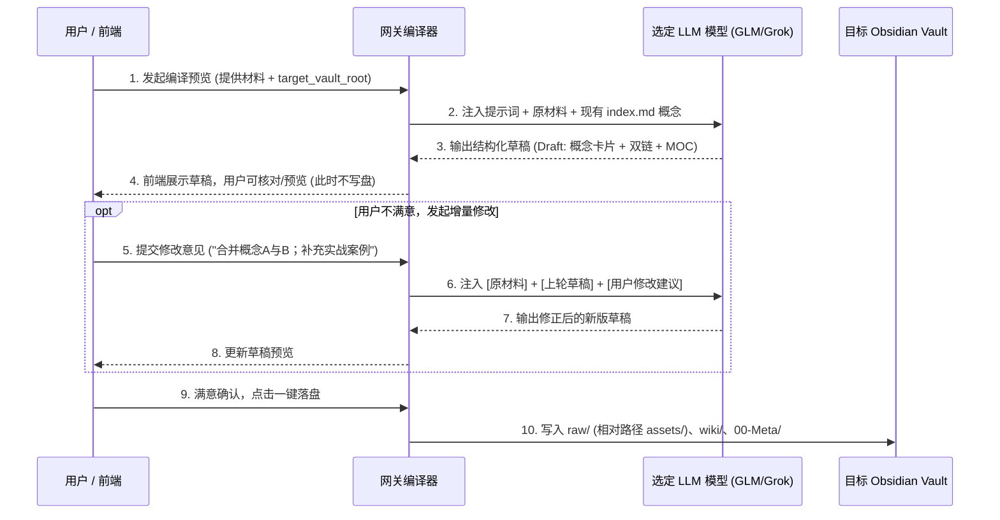

# Leo Karpathy LLM Wiki 编译知识沉淀规范

本 Skill 旨在将散落于网关、网页、笔记工具（Craft）、长视频与文档中的零散信息，按照 **Andrej Karpathy** 倡导的 **"Stop retrieving. Start compiling."**（不要反复即时检索，而要将知识持续编译沉淀）的核心理念，转化为高质量、网状互联、离线自包含的 **Obsidian 本地知识库（Vault）**。

---

## 零、 必备前置输入与交互规则（Required Inputs & Prompting）

在执行本 Skill 之前，**必须明确目标 Obsidian 知识库根目录**：

* **核心参数**：`target_vault_root`（目标 Obsidian Vault 的本地绝对路径，例如 `D:/Obsidian/MyKnowledge` 或 `/Users/xxx/Documents/Vault`）。
* **交互规则（强制执行）**：
  1. **严禁臆测默认路径**：严禁私自将文件写入操作系统的临时目录、工作区内部临时文件夹或任意未经用户许可的路径；
  2. **前置询问**：若用户未在指令中显式提供 `target_vault_root`，Skill 执行的第一步必须**立即暂停并主动询问用户**：
     > “请提供目标 Obsidian 知识库（Vault）的根目录绝对路径（如 `D:/Obsidian/MyWiki`），以便将原始材料、原子卡片与双链索引准确沉淀至您的本地知识库。”
  3. **路径存在性与初始化**：当用户指定路径后，系统若发现该目录尚未创建，应提示用户“将自动在指定位置初始化 Vault 目录结构 (`raw/`, `wiki/`, `00-Meta/`)”。

---

## 一、 核心哲学与三层分层架构

知识库必须满足**完全脱离网关或云端也能独立离线使用**的要求。目录结构划分为严格的三层：

```
My-Obsidian-Vault/
├── 00-Meta/                          # [Layer 3] 索引与审计层
│   ├── index.md                      # 全局知识大纲与主题地图 (MOC - Map of Content)
│   └── log.md                        # 编译与演进日志 (Append-only 审计流水)
├── raw/                              # [Layer 1] 原始材料不可变沉淀层 (脱网离线底本)
│   ├── assets/                       # 原始配图与多媒体 (本地相对路径，防盗链)
│   └── YYYY-MM-DD-来源标题.md        # 原始清洗后的 Markdown / HTML 原文
└── wiki/                             # [Layer 2] LLM 编译沉淀层 (原子概念卡片)
    ├── [[原子概念A]].md               # 高密度核心概念卡片 (带双向链接)
    └── [[原子概念B]].md
```

### 1. Layer 1：`raw/` 原始材料沉淀层（离线自包含底本）
* **定位**：不可篡改的事实原典（Source of Truth）。
* **规则**：
  - 无论源于网页抓取、本地 PDF 抽取、Craft 导入还是 Whisper 视频字幕，均以纯 Markdown 格式永久归档至 `raw/`；
  - 关联的所有图片和多媒体附件必须存入 `raw/assets/`，文章内的图片引用必须使用相对路径 `assets/xxx.png`；
  - **彻底脱离网关依赖**：用户单靠 Obsidian 打开整个目录，任何外链图片和原文均可离线查阅。

### 2. Layer 2：`wiki/` 概念编译层（原子双链知识网）
* **定位**：由 LLM 编译、重构、提炼出的原子概念节点。
* **规则**：
  - **一概念一卡片（Atomic Concept）**：拒绝把整篇文章原样当成 Wiki。必须拆解为核心理论、系统架构、算法原理或决策模型；
  - **第一性原理与密集双链**：正文中频繁使用 Obsidian 标准双向链接语法 `[[概念名称]]`，主动织入现有知识网；
  - **防孤岛原则**：每个新建的 Wiki 页面，必须至少与现有库中 2 个以上的概念产生引用链接；
  - **冲突与争议显式标注**：若新内容与既有 Wiki 概念存在冲突，严禁直接粗暴覆盖，必须单列 `### 争议与不同流派观点` 并标注各自出处。

### 3. Layer 3：`00-Meta/` 索引与日志层（全局导航与审计）
* `00-Meta/index.md`：全局动态主题导航（MOC），按领域分类聚合所有 `[[概念]]` 入口；
* `00-Meta/log.md`：追溯日志，单行记录每次摄入的事件（如 `2026-09-05: 摄入 Craft 笔记《谬误》 -> 编译生成 [[滑坡谬误]]、[[稻草人谬误]]，更新 [[论证偏差]]`）。

---

## 二、 编译提示词（LLM Compiler Prompt）

当网关或 Agent 执行编译时，必须使用如下系统提示词：

```markdown
You are an elite Knowledge Compiler and Research Librarian operating under the Andrej Karpathy LLM Wiki paradigm: "Stop retrieving. Start compiling."

Your goal is to process incoming raw material (articles, video transcripts, notes, papers) and COMPILE it into high-density, interconnected Obsidian markdown pages.

### Output Requirements:
1. Extract 2-5 load-bearing atomic concepts from the raw input.
2. For each concept, generate a structured markdown document:
   - YAML Frontmatter:
     ---
     title: "Exact Concept Name"
     source: "raw/<original_file.md>"
     tags: [domain, type]
     compiled_at: "YYYY-MM-DD"
     ---
   - Section 1: Core Definition & First Principles (核心定义与本质)
   - Section 2: Mechanics & Architecture (运行机理与推导链路)
   - Section 3: Trade-offs, Failure Modes & Edge Cases (权衡与边界)
   - Section 4: Cross-Connections (关联概念): list [[Related Concept 1]], [[Related Concept 2]]
3. Ensure all links use the Obsidian format `[[Target Page]]`.
4. Provide an updated entry for `index.md` and a 1-line log for `log.md`.
```

---

## 三、 标准 Frontmatter 与 Dataview 规范

每个 `wiki/*.md` 页面必须包含标准 YAML 元数据，方便 Obsidian Dataview 插件进行动态聚合统计：

```yaml
---
title: "滑坡谬误"
aliases: ["Slippery Slope Fallacy", "滑坡效应"]
category: "认知与逻辑"
tags: [逻辑学, 批判性思维, 决策模型]
source: "raw/2026-09-05-谬误.md"
compiled_by: "gateway-karpathy-compiler"
compiled_at: "2026-09-05"
status: "compiled"
---
```

---

## 四、 编译与增量迭代工作流（Compilation & Incremental Refinement Flow）

针对网关无多轮会话 Session 上下文的特性，采用 **“草稿暂存 + 无状态全量上下文增量修正”** 的工作流：



### 1. 阶段一：草稿生成（Draft Preview）
1. **上下文装配**：网关读取指定 Vault 现有的 `00-Meta/index.md`，提取库中已有概念列表注入上下文，指示模型“优先在正文中用 `[[现有概念]]` 织入现有网络”；
2. **生成草稿**：调用模型生成原子概念卡片、正文与 MOC 映射，返回前端预览，**不直接触碰本地磁盘**。

### 2. 阶段二：增量修改闭环（Incremental Refinement Loop）
若用户对首次生成不满意，可输入自然语言修改意见：
* **无状态重提炼 Prompt 结构**：
  ```markdown
  You are an expert Knowledge Refiner.
  
  [Raw Input Material]
  ...
  
  [Previous Compilation Draft]
  ...
  
  [User Feedback & Instructions]
  ...
  
  Please refine the compilation draft according to the user feedback while preserving established high-quality sections.
  ```
* 每次增量调整均携带“前次草稿 + 用户反馈”，模型在单次无状态调用中即可实现精准的二次修改。

### 3. 阶段三：原子化落盘（Atomic Commit）
用户确认满意后，网关一次性执行：
1. **原典与媒体归档**：输入材料沉淀至 `raw/YYYY-MM-DD-标题.md`，配图拷入 `raw/assets/` 并转为相对路径 `assets/...`；
2. **原子卡片发布**：写入 `wiki/[[概念]].md`；
3. **确定性注册**：追加 `00-Meta/index.md` 主题入口与 `00-Meta/log.md` 审计流水。

