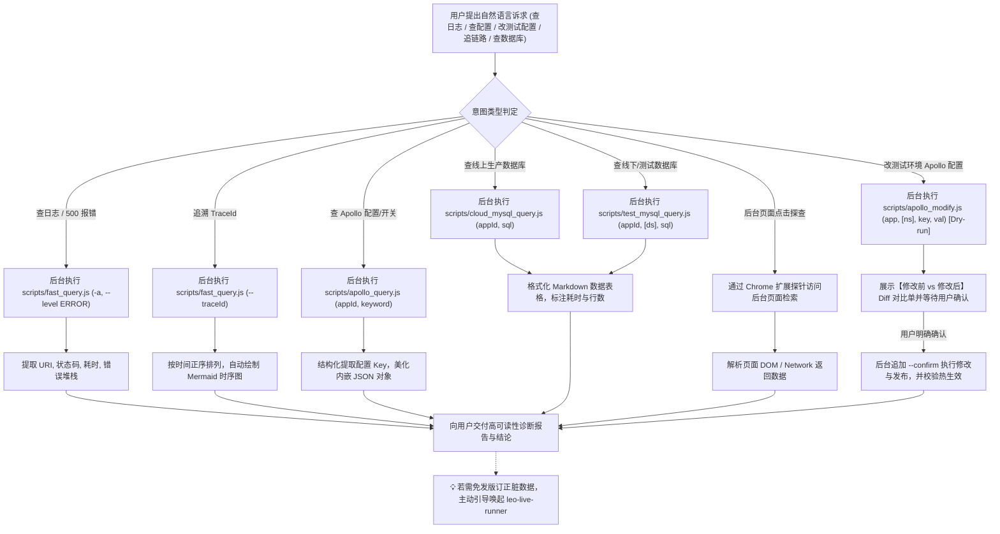

# 🔍 Leo Live Inspector (线上数据探查、日志检索、Trace 链路透视与 Apollo 配置中枢)

本 Skill 专门指导 AI 执行线上生产环境与测试环境的 **全场景数据观测、诊断与测试配置管理（Observe, Diagnose & Configure）**：
1. **⚡ FAST / Kibana 毫秒级日志检索**：直连内网 ES 网关，快速捞取微服务报错日志、接口真实请求入参 (`request_in`) 与响应结果 (`request_out`)；
2. **⚙️ Apollo 配置中心秒级直连探查与测试环境安全修改发布**：直连 Apollo ConfigService 秒级读取全量实时配置、业务开关与白名单；支持测试环境 (`test-apollo.portal.life.ke.com`) 配置热修改与发布，内置严格 Pre-flight Diff 对比与人工确认闭环，默认作为【业务开关】(SWITCH) 发布；
3. **🧵 TraceId 全链路时序还原**：跨微服务追溯完整请求生命周期，自动提炼调用步骤并绘制 **Mermaid 时序交互图**；
4. **🧭 索引自学习与 Chrome 扩展探针自愈**：初次查询新服务自动通过 Chrome 扩展探针（Leo cookie.txt Locally）提取 ES cluster/index 映射并本地持久化；
5. **🌐 后台页面点击与数据探查（扩展能力）**：支持借助浏览器自动化/扩展能力在后台管理系统、运维看板中通过页面点击和元素审查提取业务数据。

> ⚠️ **【核心执行原则：AI 全自动后台执行，严禁要求用户手动运行命令】**
> - **底层脚本（`scripts/fast_query.js`、`scripts/apollo_query.js` 与 `scripts/apollo_modify.js`）是 AI 专用的后台探查与配置工具**。
> - 用户只负责用自然语言表达排查、查配置或改测试配置意图（如 *“帮我看下 500 报错”*、*“根据 traceId 画个时序图”*、*“查下 iot-platform 的 apollo 配置”*、*“把测试环境 liveRunner 白名单加上 12”*）。
> - **AI 必须在后台自动解析意图并主动执行对应脚本**：
>   - 查日志/查配置/查库：AI 后台静默执行，提取关键日志、出入参、实时配置或调用链，交付结构化表格与结论。
>   - **修改测试 Apollo 配置（风控例外）**：AI **必须先执行 Pre-flight（Dry-Run）**，向用户展示【变更前 vs 变更后】Diff 对比单，**等待用户明确确认**后再追加 `--confirm` 执行发布并校验。
> - **切勿在回复中输出“请您手动在终端运行 node scripts/...”等推卸给用户的言论。**

---

## 🎯 触发场景与意图自动映射 (Intent Mapping Matrix)

当用户提出以下自然语言需求时，AI **立即在后台自动组装参数并执行脚本**：

| 用户自然语言诉求示例 | AI 后台自动执行的标准命令 | 预期交付产物 |
| :--- | :--- | :--- |
| *“查下 iot-platform 最新 10 条日志”* | `node scripts/fast_query.js -a iot-platform -t 15m -n 10` | 格式化概况与最新日志表格 |
| *“看下刚才报的 500 错误/异常堆栈”* | `node scripts/fast_query.js -a <app> --level ERROR -t 30m -n 10` | 异常原因、报错位置与堆栈解析 |
| *“根据 TraceId 361922-10... 抓下调用链路”* | `node scripts/fast_query.js -a <app> --traceId "361922-10..."` | **必须输出 Mermaid 时序交互图** 与关键调用耗时 |
| *“查下今天 14:00~14:30 之间的门锁操作”* | `node scripts/fast_query.js -a <app> --from "2026-08-31 14:00:00" --to "2026-08-31 14:30:00" -q "门锁"` | 该时间段内的事件时序分析 |
| *“抓取 /api/sync/lockDetail 接口的真实响应数据”* | `node scripts/fast_query.js -a <app> --uri "/api/sync/lockDetail" --bltag request_out --slim -n 5` | 提取并格式化脱敏后的出参 JSON |
| **“查下 iot-platform 在 Apollo 上的配置”** | `node scripts/apollo_query.js iot-platform` | 微服务全量配置项概览（默认线上环境，自动去重） |
| **“查下【测试环境】saas 的 Apollo 配置或开关”** | `node scripts/apollo_query.js saas -e test` | 测试环境 (test.config.apollo.ke.com) 实时配置 |
| **“查下【预发环境】saas 的超时配置 timeout”** | `node scripts/apollo_query.js saas -e preview timeout` | 预发环境 (prev.config.apollo.ke.com) 超时参数明细 |
| **“看下 iot-platform 上的 lockAuth 开关或白名单”** | `node scripts/apollo_query.js iot-platform lockAuth` | 匹配到的业务开关、白名单及解析后的格式化 JSON |
| **“查下 Apollo application.properties 里的 weitang 配置”** | `node scripts/apollo_query.js iot-platform application.properties weitang` | 指定命名空间下的精准配置项 |
| **“把测试环境 iot 的 liveRunner.access.ucIdWhitelist 改成 [31534062,12]”** | **阶段 1 (AI 强制 Pre-flight 探查)**：<br>`node scripts/apollo_modify.js iot liveRunner.access.ucIdWhitelist "[31534062,12]"` | 向用户展示【变更前 vs 变更后】Diff 确认单、锁定 Namespace 与发布属性（业务开关 SWITCH），**停下等待用户明确确认** |
| **用户明确确认（“确认修改”、“发布吧”、“同意更改”）** | **阶段 2 (用户确认后正式发布)**：<br>`node scripts/apollo_modify.js iot liveRunner.access.ucIdWhitelist "[31534062,12]" --confirm` | 写入 Portal、发布版本并直连 ConfigService 验证客户端热生效结果 |
| **“把测试环境 saas 的 timeout 改成 5000”** | `node scripts/apollo_modify.js saas timeout 5000` (先展示 Diff 确认单) | 自动嗅探多 Namespace，锁定所属 namespace，生成 Diff 待确认 |
| **“修改测试环境 platform 的 application 空间下的某个 key 为 xxx”** | `node scripts/apollo_modify.js platform application <key> "<val>"` | 精准指定 Namespace 进行修改，隔离其他命名空间 |
| *“查下【测试环境】warehouse 最新的 10 条日志”* | `node scripts/test_log_query.js warehouse -n 10` | 测试环境容器日志表格，含 Pod 与泳道名 |
| *“看下【测试环境】algo 的 500 报错或异常堆栈”* | `node scripts/test_log_query.js algo --level ERROR -t 30m` | 大禹泳道 Pod 异常原因与堆栈解析 |
| *“根据 TraceId 361922... 查测试环境链路”* | `node scripts/test_log_query.js <app> --traceId "361922..."` | 跨测试容器追溯出入参与请求生命周期 |
| *“查下大禹泳道 lixiaojing03 上部署的 algo 日志”* | `node scripts/test_log_query.js algo --lane lixiaojing03 -n 10` | 多泳道动态感知与日志过滤 |
| **“查下 recorder 最新的 5 条图片数据 (线上)”** | `node scripts/cloud_mysql_query.js recorder "SELECT id, source, ctime FROM image_understanding_detail ORDER BY id DESC LIMIT 5"` | 线上数据库实时表数据表格，含耗时与行数 |
| **“查下【测试环境】saas 库的订单数据”** | `node scripts/test_mysql_query.js saas "SELECT * FROM algo_detect_report ORDER BY id DESC LIMIT 5"` | 测试环境默认主库直连表格，毫秒级响应 |
| **“查下【测试环境】saas 租户 1 库 (tenant1) 的数据”** | `node scripts/test_mysql_query.js saas tenant1 "SELECT * FROM algo_detect_report LIMIT 5"` | 多数据源精准切换，支持租户分库查验 |
| **“查看仓颉系统测试环境有哪些数据源”** | `node scripts/test_mysql_query.js cangjie --list-ds` | 列出该微服务下所有已配置的多数据源及默认库 |
| **“指定端口 6763 和库名查线上 SQL”** | `node scripts/cloud_mysql_query.js 6763 utopia_scs_recorder "SELECT count(*) FROM image_understanding_detail"` | 线上自定义端口与库名统计输出 |

---

## 🧭 标准诊断与探查工作流 (Inspection Loop)



---

## ⚡ 1. FAST 日志检索内部 CLI 参数速查
AI 后台执行 `node scripts/fast_query.js [flags]`：

| 参数 Flag | 简写 | 默认值 | 说明 |
| :--- | :--- | :--- | :--- |
| `--app` | `-a` | `iot-platform` | 目标微服务名 (如 `iot-platform`, `utopia-scs-saas`) |
| `--query` | `-q` | `*` | Lucene 检索短语 / 表达式 |
| `--time` | `-t` | `24h` | 相对时间范围 (如 `15m`, `1h`, `24h`, `7d`) |
| `--from` | - | `null` | 起始时间 (支持 `2026-08-31 14:00:00` 或 `now-1h`) |
| `--to` | - | `now` | 结束时间 (支持绝对时间或 `now`) |
| `--size` | `-n` | `20` (Trace: `50`) | 最大返回日志条数 |
| `--order` | `-o` | `desc` (Trace: `asc`) | 排序方式: `desc` (最新在前) 或 `asc` (正序链路) |
| `--level` | `-l` | `null` | 日志级别过滤: `ERROR`, `WARN`, `INFO`, `DEBUG` |
| `--bltag` | - | `null` | 出入参标签: `request_in`, `request_out` 等 |
| `--uri` | `-u` | `null` | 接口 URI 过滤 (如 `/api/sync/lockDetail`) |
| `--traceId` | `--tid` | `null` | 指定 TraceId (自动切换为正序链路回溯模式) |
| `--slim` | - | `false` | 瘦身模式，截断超长报文与堆栈 JSON |
| `--format` | `-f` | `json` | 输出格式: `json`, `brief`, `table` |

### 1.2 线下/测试环境：Paoding Loki 容器与泳道日志检索
AI 后台执行 `node scripts/test_log_query.js <appId> [options]`：

| 参数 Flag | 简写 | 默认值 | 说明 |
| :--- | :--- | :--- | :--- |
| `<appId>` | - | 必填 | 目标微服务别名 (如 `saas`, `algo`, `warehouse`, `iot`) |
| `--query` | `-q` | `*` | 关键词或报错过滤短语 (如 `NullPointer`, `Timeout`) |
| `--level` | `-l` | `null` | 日志级别: `ERROR`, `WARN`, `INFO`, `DEBUG` |
| `--traceId` | `--tid` | `null` | 指定 TraceId 过滤与调用链回溯 |
| `--lane` | `--ns` | `null` | 指定大禹泳道名或命名空间 (如 `lixiaojing02`, `lixiaojing03`) |
| `--pod` | - | `null` | 显式指定 Pod 实例名称 |
| `--time` | `-t` | `1h` | 相对时间跨度 (如 `15m`, `30m`, `1h`, `2h`) |
| `--size` | `-n` | `20` (Trace: `50`) | 最大返回日志条数 |
| `--format` | `-f` | `table` | 输出格式: `table` (表格), `brief` (紧凑), `json` |
| `--slim` | - | `false` | 瘦身模式，截断超长堆栈或报文 |
| `--set-cookie`| - | - | 保存更新 Paoding 登录 Cookie 凭证至本地缓存 |

> 💡 **自动分流支持**：在 `fast_query.js` 中指定 `--env test` 时，底层会自动委派至 `test_log_query.js` 容器直连通道。

## ⚙️ 2. Apollo 配置探查与测试环境动态修改

### 2.1 Apollo 全环境配置只读探查 (`scripts/apollo_query.js`)
AI 后台执行 `node scripts/apollo_query.js <appId|alias> [namespace|keyKeyword] [keyKeyword] [options]`：

| 参数/选项 | 简写 | 默认值 | 说明 |
| :--- | :--- | :--- | :--- |
| `<appId\|alias>` | - | 必填 | 目标微服务唯一 ID 或口语别名 (如 `saas`, `platform`, `iot`) |
| `[namespace\|keyword]` | - | 可选 | 命名空间（若含 `.` 或等于 `application`）或 key 检索词 |
| `[keyKeyword]` | - | 可选 | 当第 2 个参数为命名空间时，此参数为 key 关键词 |
| `--env` | `-e` | `prod` | **目标环境**: `test` (测试), `preview` (预发), `prod` (生产), `dev` (开发) |
| `--exact` | - | `false` | 精确匹配 key（默认采用不区分大小写的模糊包含） |
| `--cluster` | - | `default` | 集群名称 |
| `--server` | - | 动态匹配 | 显式覆盖 Apollo ConfigService 服务端地址 |
| `--json` | - | `false` | 输出纯 JSON 格式 |

---

### 2.2 【测试环境】Apollo 配置动态修改与两阶段发布 (`scripts/apollo_modify.js`)
AI 后台执行 `node scripts/apollo_modify.js <appId|alias> [namespace] <key> <value> [options]`：

| 参数/选项 | 简写 | 默认值 | 说明 |
| :--- | :--- | :--- | :--- |
| `<appId\|alias>` | - | 必填 | 目标微服务 ID 或别名 (如 `iot`, `saas`, `platform`, `recorder`) |
| `[namespace]` | - | 自动嗅探 | 命名空间。不传时**全自动探测所有 Namespace** 并精确定位所属空间；传则精准修改指定空间 |
| `<key>` | - | 必填 | 待修改的配置键名 (如 `liveRunner.access.ucIdWhitelist`, `test.switch`) |
| `<value>` | - | 必填 | 新的配置目标值 (如 `"[31534062,12]"`, `true`, `5000`) |
| `--confirm` | - | `false` | **发布确认门禁**。未提供时为 Pre-flight 安全预览模式，提供后真正执行写入与发布 |
| `--type <1\|2\|3>` | `-t` | `3` (switch) | **发布属性**：`3` 或 `switch` (业务开关，默认且推荐), `1` (业务变更), `2` (业务降级) |
| `--comment` | `-m` | 自动生成 | 本次发布说明 (例如 `AI 辅助修改配置: <key>`) |
| `--cookie` | - | 动态读取 | 临时传入 Apollo Portal Cookie (默认自动读取 `~/.shrimp`) |
| `--json` | - | `false` | 以 JSON 格式输出 Diff 或发布结果 |

#### 🛡️ 核心风控与安全规范 (Zero Silent Mutation)
1. **严格两阶段发布机制（绝对禁止静默变更）**：
   - ⚠️ **严禁 AI 直接带 `--confirm` 一步到位修改配置！**
   - **阶段一 (Pre-flight / Dry-Run)**：AI 收到修改诉求后，必须先在后台执行不带 `--confirm` 的命令：
     ```bash
     node scripts/apollo_modify.js iot liveRunner.access.ucIdWhitelist "[31534062,12]"
     ```
     提取出【当前旧值 vs 目标新值】Diff、锁定目标微服务、所属 Namespace 与发布属性，形成可视化 Diff 确认单呈现给用户，询问：*“请您确认是否将配置修改为以上内容并发布？”*；
   - **阶段二 (Post-flight / Commit)**：用户回复明确肯定指令（如 *“确认”、“发布吧”、“修改吧”*）后，AI 再次在后台追加 `--confirm` 执行提交：
     ```bash
     node scripts/apollo_modify.js iot liveRunner.access.ucIdWhitelist "[31534062,12]" --confirm
     ```
     提交后脚本会自动直连 ConfigService 回查热生效状态，向用户交付发布单号与最新生效值。
2. **发布属性规范**：
   - 默认且必须为【业务开关】(`releaseAttribute: "3"`)，符合贝壳测试环境配置变更管理与审计规范。
3. **多 Namespace 隔离与自动定位**：
   - 脚本自动读取目标微服务的所有 Namespace。若用户未显式指定，脚本会自动在所有 Namespace 中搜索该 Key 并精确定位所属 Namespace；
   - 亦可显式传入 Namespace（如 `node scripts/apollo_modify.js iot application liveRunner.access.ucIdWhitelist "[31534062,12]"`），确保隔离其他 Namespace，绝不串改其它配置。
4. **鉴权凭证规范（精准引导，严禁引导安装外部浏览器）**：
   - 目标站点：`http://test-apollo.portal.life.ke.com`
   - 核心凭证 Cookie 键名：**`jt_apollo_login_token`**
   - 本地持久化路径：`~/.shrimp/skills/live-inspector/test_apollo_cookie.json`
   - 当凭证失效时，AI 必须明确指引用户使用已有的 Chrome 扩展（**Leo cookie.txt Locally**）复制 **`jt_apollo_login_token`**，或通过 F12 复制该 Cookie。**严禁出现任何引导用户安装 `ego-browser` 的言论。**

---

## 🗄️ 3. 数据库查询内部 CLI 参数速查 (线上云网关 / 线下直连双模)

### 3.1 线上生产环境：服务云 MySQL 自助查询
AI 后台执行 `node scripts/cloud_mysql_query.js <appId|port> [database|sql] [sql] [options]`：

| 参数/选项 | 简写 | 默认值 | 说明 |
| :--- | :--- | :--- | :--- |
| `<appId\|port>` | - | 必填 | 目标微服务别名 (如 `recorder`, `saas`, `algo`) 或端口号 (如 `6763`) |
| `[database\|sql]` | - | 必填 | 库名（当第 1 参数为端口时）或待执行的 SQL（当第 1 参数为服务别名时） |
| `[sql]` | - | 可选 | 待执行的 SQL 语句（当第 1 参数为端口号时） |
| `--role` | - | `Slave` | 查询角色: `Slave` (从库只读) 或 `Master` (主库) |
| `--env` | `-e` | `prod` | 环境控制，指定 `test` / `dev` 时自动委派给 `test_mysql_query.js` |
| `--set-token` | - | - | 保存更新服务云 `cloud_console_token_egg` 凭证至本地缓存 |
| `--token` | - | - | 临时覆盖 Token |
| `--json` | - | `false` | 输出纯 JSON 数据结果 |

### 3.2 线下/测试环境：MySQL 本地直连查询 (零外部依赖、多数据源支持)
AI 后台执行 `node scripts/test_mysql_query.js <service|host> [datasource|sql] [sql] [options]`：

| 参数/选项 | 简写 | 默认值 | 说明 |
| :--- | :--- | :--- | :--- |
| `<service\|host>` | - | 必填 | 微服务别名 (如 `saas`, `iot`, `recorder`, `cangjie`) 或测试库 Host/Port |
| `[datasource]` | - | 可选 | 多数据源别名 (如 `tenant0`, `tenant1`, `base`)，未填自动走默认主库 |
| `[sql]` | - | 必填 | 待执行的 SQL (以 `SELECT`/`SHOW`/`DESC` 开头) |
| `--ds <alias>` | - | 自动匹配 | 显式指定数据源名称 |
| `--list-ds` | - | `false` | 列出该服务下全部已注册的测试数据源与默认库 |
| `-p, --password` | - | 动态嗅探 | 临时提供密码（握手验通后自动静默持久化至 `~/.shrimp`） |
| `--max-rows` | - | `50` | 最大返回数据行数 |
| `--json` | - | `false` | 输出格式化 JSON |

> 💡 **测试库密码安全机制**：
> 1. **零硬编码**：Skill 仓库内绝无任何明文密码；
> 2. **智能目录引导**：若缺少密码，AI 主动引导用户切换至该项目的本地代码根目录（例如 `cd /Users/pa/project/JZ/utopia-scs-saas`），脚本将自动就地从 `application-test.yml` / `.env.test` 解析密码并直连；
> 3. **验通即静默沉淀**：一旦握手测试成功，系统无感沉淀至 `~/.shrimp/skills/live-inspector/test_databases.json`，后续永久免输。

---

## 📊 4. AI 交付呈现规范

1. **日志排查交付**：概况元信息 ➕ 结构化明细表格 ➕ 异常原因与堆栈分析；
2. **TraceId 追溯交付**：**强制绘制清晰的 Mermaid 时序交互图**（展示 上游 -> 微服务 -> DB/Redis/下游）；
3. **Apollo 配置交付**：标明配置中心来源、命名空间、配置 Key、格式化解析后的 JSON 结构，并解释业务含义；
4. **协同引导**：当发现数据异常或开关需要动态干预时，主动提示可唤起 `leo-live-runner` 进行免发版处理。

---

## 🔌 5. 跨平台 Token/Cookie 凭证获取与 Chrome 插件引导规范

当执行查库或日志自愈遇到 **凭证缺失** 或 **凭证过期（302 重定向）** 时，AI 必须根据用户操作系统（Mac / Windows）主动提供清晰、精准的引导，严禁仅抛出冷冰冰的报错或模糊的 F12 指引：

### 🔑 核心凭证 Key 速查
* **Apollo 测试环境配置修改**：目标页面 `http://test-apollo.portal.life.ke.com` ➔ 核心 Key: **`jt_apollo_login_token`**
* **服务云 MySQL 查库**：目标页面 `https://cloud.intra.ke.com/database/mysql/self-check` ➔ 核心 Key: **`cloud_console_token_egg`**（`2.0...` 开头长串）
* **FAST 日志全量自愈**：目标页面 `https://fast.ke.com` ➔ 核心 Key: **`_secondx`**（32位十六进制字符串）

---

### 🖥️ 分平台 Chrome 插件安装与引导流程（首选推荐）

#### 🍏 macOS 用户引导指引：
1. **一键自动安装（最推荐）**：在终端执行：
   ```bash
   bash ~/.agents/skills/leo-live-inspector/scripts/setup_chrome_ext.sh
   ```
   *脚本会自动定位插件目录并复制到剪贴板，同时替您打开 Chrome 扩展管理页。*
2. **或者手动在 Chrome 加载**：
   * 打开 `chrome://extensions/` 并开启右上角【开发者模式】；
   * 点击左上角【加载已解压的扩展程序】；
   * 按快捷键 `Cmd + Shift + G`，粘贴插件路径：
     `~/.agents/skills/leo-live-inspector/resources/chrome_extension`（或工程下的 `resources/chrome_extension`），回车并确认。
3. **获取凭证**：
   * 打开目标页面（服务云或 FAST）；
   * 点击浏览器右上角拼图中的 **Leo cookie.txt Locally** 图标；
   * 在列表中找到对应 Key（**`cloud_console_token_egg`** 或 **`_secondx`**），点击右侧 **【复制】** 发给 AI；
   * *（或者直接点击【📥 下载 cookies.txt】，脚本会自动从 Downloads 目录读取，免手动粘贴）*。

#### 🪟 Windows 用户引导指引：
1. **一键自动安装（最推荐）**：
   * 双击运行 Skill 目录下的 `scripts\setup_chrome_ext.bat`；
   * *批处理脚本会自动通过 `%~dp0` 动态获取当前盘符的绝对路径并塞入 Windows 剪贴板，同时打开 Chrome 扩展页。*
2. **或者手动在 Chrome 加载**：
   * 打开 `chrome://extensions/` 并开启右上角【开发者模式】；
   * 点击左上角【加载已解压的扩展程序】；
   * 在弹窗路径栏直接按 `Ctrl + V` 粘贴剪贴板中的路径并回车确认。
3. **获取凭证**：
   * 打开服务云或 FAST 页面，点击插件图标；
   * 对应 Key 点击 **【复制】** 发给 AI（或点击【📥 下载 cookies.txt】）。

---

### 🛠️ 备选方案：无插件场景下的 F12 手动提取（受限环境）
如果用户由于安全策略无法安装插件，AI 指引其按以下步骤手动复制：
1. 在已登录的目标页面按 `F12` 打开控制台；
2. 切换到【Application (应用)】➔ 左侧展开【Cookies】➔ 点击对应域名；
3. 搜索并双击复制对应的 Key（查库找 `cloud_console_token_egg`，日志找 `_secondx`），复制后发给 AI。

---

## 📚 规范与实战文档索引

- **Apollo 配置探查协议与实战手册**：[references/apollo-config-guide.md](references/apollo-config-guide.md)
- **FAST 日志协议与检索自愈机制**：[references/fast-log-guide.md](references/fast-log-guide.md)
- **后台页面点击与数据探查指南**：[references/page-inspect-guide.md](references/page-inspect-guide.md)
- **Trace 全链路时序排障实战**：[examples/100_trace_and_log_query.md](examples/100_trace_and_log_query.md)
