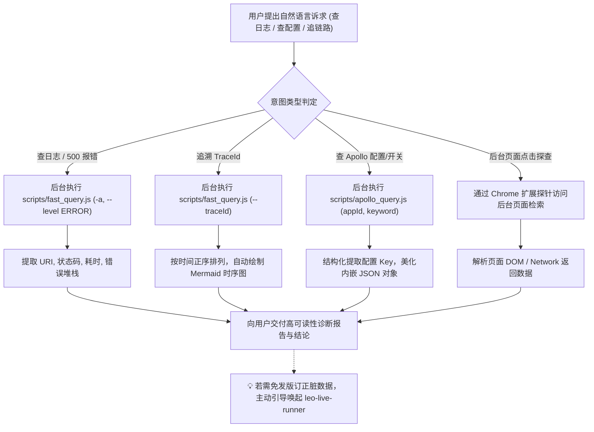

# 🔍 Leo Live Inspector (线上数据探查、日志检索、Trace 链路透视与 Apollo 配置中枢)

本 Skill 专门指导 AI 执行线上生产环境与测试环境的 **全场景数据观测与诊断（Observe & Diagnose）**：
1. **⚡ FAST / Kibana 毫秒级日志检索**：直连内网 ES 网关，快速捞取微服务报错日志、接口真实请求入参 (`request_in`) 与响应结果 (`request_out`)；
2. **⚙️ Apollo 配置中心秒级直连探查**：直连 Apollo ConfigService (`http://apollo.configservice.life.ke.com`)，秒级读取微服务实时配置项、业务开关、超时参数与白名单；
3. **🧵 TraceId 全链路时序还原**：跨微服务追溯完整请求生命周期，自动提炼调用步骤并绘制 **Mermaid 时序交互图**；
4. **🧭 索引自学习与跨平台双探针自愈**：初次查询新服务自动通过 macOS `ego-browser` 或 Windows/Chrome 扩展探针提取 ES cluster/index 映射并本地持久化；
5. **🌐 后台页面点击与数据探查（扩展能力）**：支持借助浏览器自动化/扩展能力在后台管理系统、运维看板中通过页面点击和元素审查提取业务数据。

> ⚠️ **【核心执行原则：AI 全自动后台执行，严禁要求用户手动运行命令】**
> - **底层脚本（`scripts/fast_query.js` 与 `scripts/apollo_query.js`）是 AI 专用的后台探查工具**。
> - 用户只负责用自然语言表达排查或查配置意图（如 *“帮我看下 500 报错”*、*“根据 traceId 画个时序图”*、*“查下 iot-platform 的 apollo 配置”*、*“看下超时开关”*）。
> - **AI 必须在后台自动解析意图并主动执行对应脚本**，提取关键日志、出入参、实时配置或调用链，最终向用户直接交付结构化表格、Mermaid 交互时序图和清晰结论。
> - **切勿在回复中输出“请您手动在终端运行 node scripts/...”等推卸给用户的言论。**

---

## 🎯 触发场景与意图自动映射 (Intent Mapping Matrix)

当用户提出以下自然语言需求时，AI **立即在后台自动组装参数并执行脚本**：

| 用户自然语言诉求示例 | AI 后台自动执行的标准命令 | 预期交付产物 |
| :--- | :--- | :--- |
| *“查下 iot-platform 最新 10 条日志”* | `node scripts/fast_query.js -a iot-platform -t 15m -n 10` | 格式化概况与最新日志表格 |
| *“看下刚才报的 500 错误/异常堆栈”* | `node scripts/fast_query.js -a <app> --level ERROR -t 30m -n 10` | 异常原因、报错位置与堆栈解析 |
| *“根据 TraceId 361922-10... 抓下调用链路”* | `node scripts/fast_query.js -a <app> --traceId "361922-10..."` | **必须输出 Mermaid 时序交互图** 与关键调用耗时 |
| *“查下今天 14:00~14:30 之间的门锁操作”* | `node scripts/fast_query.js -a <app> --from "2026-08-31 14:00:00" --to "2026-08-31 14:30:00" -q "门锁"` | 该时间段内的事件时序分析 |
| *“抓取 /api/sync/lockDetail 接口的真实响应数据”* | `node scripts/fast_query.js -a <app> --uri "/api/sync/lockDetail" --bltag request_out --slim -n 5` | 提取并格式化脱敏后的出参 JSON |
| **“查下 iot-platform 在 Apollo 上的配置”** | `node scripts/apollo_query.js iot-platform` | 微服务全量配置项概览（默认线上环境，自动去重） |
| **“查下【测试环境】saas 的 Apollo 配置或开关”** | `node scripts/apollo_query.js saas -e test` | 测试环境 (test.config.apollo.ke.com) 实时配置 |
| **“查下【预发环境】saas 的超时配置 timeout”** | `node scripts/apollo_query.js saas -e preview timeout` | 预发环境 (prev.config.apollo.ke.com) 超时参数明细 |
| **“看下 iot-platform 上的 lockAuth 开关或白名单”** | `node scripts/apollo_query.js iot-platform lockAuth` | 匹配到的业务开关、白名单及解析后的格式化 JSON |
| **“查下 Apollo application.properties 里的 weitang 配置”** | `node scripts/apollo_query.js iot-platform application.properties weitang` | 指定命名空间下的精准配置项 |
| **“查下 recorder 最新的 5 条图片数据”** | `node scripts/cloud_mysql_query.js recorder "SELECT id, source, ctime FROM image_understanding_detail ORDER BY id DESC LIMIT 5"` | 数据库实时表数据表格，含耗时与行数 |
| **“查下 saas 库的租户配置或订单”** | `node scripts/cloud_mysql_query.js saas "SELECT * FROM algo_detect_report ORDER BY id DESC LIMIT 5"` | SaaS 租户库表数据明细 |
| **“指定端口 6763 和库名查 SQL”** | `node scripts/cloud_mysql_query.js 6763 utopia_scs_recorder "SELECT count(*) FROM image_understanding_detail"` | 自定义端口与库名统计输出 |

---

## 🧭 标准诊断与探查工作流 (Inspection Loop)

---

## ⚡ 1. FAST 日志检索内部 CLI 参数速查
AI 后台执行 `node scripts/fast_query.js [flags]`：

| 参数 Flag | 简写 | 默认值 | 说明 |
| :--- | :--- | :--- | :--- |
| `--app` | `-a` | `iot-platform` | 目标微服务名 (如 `iot-platform`, `utopia-scs-saas`) |
| `--query` | `-q` | `*` | Lucene 检索短语 / 表达式 |
| `--time` | `-t` | `24h` | 相对时间范围 (如 `15m`, `1h`, `24h`, `7d`) |
| `--from` | - | `null` | 起始时间 (支持 `2026-08-31 14:00:00` 或 `now-1h`) |
| `--to` | - | `now` | 结束时间 (支持绝对时间或 `now`) |
| `--size` | `-n` | `20` (Trace: `50`) | 最大返回日志条数 |
| `--order` | `-o` | `desc` (Trace: `asc`) | 排序方式: `desc` (最新在前) 或 `asc` (正序链路) |
| `--level` | `-l` | `null` | 日志级别过滤: `ERROR`, `WARN`, `INFO`, `DEBUG` |
| `--bltag` | - | `null` | 出入参标签: `request_in`, `request_out` 等 |
| `--uri` | `-u` | `null` | 接口 URI 过滤 (如 `/api/sync/lockDetail`) |
| `--traceId` | `--tid` | `null` | 指定 TraceId (自动切换为正序链路回溯模式) |
| `--slim` | - | `false` | 瘦身模式，截断超长报文与堆栈 JSON |
| `--format` | `-f` | `json` | 输出格式: `json`, `brief`, `table` |

---

## ⚙️ 2. Apollo 配置探查内部 CLI 参数速查
AI 后台执行 `node scripts/apollo_query.js <appId|alias> [namespace|keyKeyword] [keyKeyword] [options]`：

| 参数/选项 | 简写 | 默认值 | 说明 |
| :--- | :--- | :--- | :--- |
| `<appId\|alias>` | - | 必填 | 目标微服务唯一 ID 或口语别名 (如 `saas`, `platform`, `iot`) |
| `[namespace\|keyword]` | - | 可选 | 命名空间（若含 `.` 或等于 `application`）或 key 检索词 |
| `[keyKeyword]` | - | 可选 | 当第 2 个参数为命名空间时，此参数为 key 关键词 |
| `--env` | `-e` | `prod` | **目标环境**: `test` (测试), `preview` (预发), `prod` (生产), `dev` (开发) |
| `--exact` | - | `false` | 精确匹配 key（默认采用不区分大小写的模糊包含） |
| `--cluster` | - | `default` | 集群名称 |
| `--server` | - | 动态匹配 | 显式覆盖 Apollo ConfigService 服务端地址 |
| `--json` | - | `false` | 输出纯 JSON 格式 |

---

## 🗄️ 3. 服务云 MySQL 自助查询内部 CLI 参数速查
AI 后台执行 `node scripts/cloud_mysql_query.js <appId|port> [database|sql] [sql] [options]`：

| 参数/选项 | 简写 | 默认值 | 说明 |
| :--- | :--- | :--- | :--- |
| `<appId\|port>` | - | 必填 | 目标微服务别名 (如 `recorder`, `saas`, `algo`) 或端口号 (如 `6763`) |
| `[database\|sql]` | - | 必填 | 库名（当第 1 参数为端口时）或待执行的 SQL（当第 1 参数为服务别名时） |
| `[sql]` | - | 可选 | 待执行的 SQL 语句（当第 1 参数为端口号时） |
| `--role` | - | `Slave` | 查询角色: `Slave` (从库只读) 或 `Master` (主库) |
| `--set-token` | - | - | 保存更新服务云 `cloud_console_token_egg` 凭证至本地缓存 |
| `--token` | - | - | 临时覆盖 Token |
| `--json` | - | `false` | 输出纯 JSON 数据结果 |

---

## 📊 4. AI 交付呈现规范

1. **日志排查交付**：概况元信息 ➕ 结构化明细表格 ➕ 异常原因与堆栈分析；
2. **TraceId 追溯交付**：**强制绘制清晰的 Mermaid 时序交互图**（展示 上游 -> 微服务 -> DB/Redis/下游）；
3. **Apollo 配置交付**：标明配置中心来源、命名空间、配置 Key、格式化解析后的 JSON 结构，并解释业务含义；
4. **协同引导**：当发现数据异常或开关需要动态干预时，主动提示可唤起 `leo-live-runner` 进行免发版处理。

---

## 🔌 5. 服务云 Token 凭证获取与 Chrome 插件引导规范

当执行查库遇到 **Token 缺失** 或 **Token 过期（HTTP 302 重定向至登录页）** 时，AI 必须主动向用户提供友好引导，严禁仅抛出冷冰冰的报错：

1. **首选推荐：引导安装/使用内置通用 Chrome 插件 (`Leo cookie.txt Locally`)**
   * **插件绝对路径**：
     * Skill 内置目录：`resources/chrome_extension`（或 `~/.agents/skills/leo-live-inspector/resources/chrome_extension`）
     * 源码主目录：`extensions/leo-cookie-txt-locally`
   * **一键引导脚本**：可直接在 Mac 执行 `bash scripts/setup_chrome_ext.sh`（自动复制路径至剪贴板并打开 Chrome 扩展管理页）；
   * **手动 3 步**：打开 `chrome://extensions` ➔ 开启【开发者模式】➔ 点击【加载已解压的扩展程序】➔ 粘贴上述路径。
   * **提取 Token**：在服务云页面点击插件图标，直接点【复制】单项 Token 或点【📥 下载 cookies.txt】（脚本自动监听 Downloads 目录，下载后立即可查）。

2. **备选方案：无插件场景下的 F12 手动提取**
   * 引导用户在已登录的服务云页面按 `F12` ➔【Application (应用)】➔【Cookies】➔【cloud.intra.ke.com】；
   * 复制 `cloud_console_token_egg` 的值并在聊天框发给 AI。

---

## 📚 规范与实战文档索引

- **Apollo 配置探查协议与实战手册**：[references/apollo-config-guide.md](references/apollo-config-guide.md)
- **FAST 日志协议与检索自愈机制**：[references/fast-log-guide.md](references/fast-log-guide.md)
- **后台页面点击与数据探查指南**：[references/page-inspect-guide.md](references/page-inspect-guide.md)
- **Trace 全链路时序排障实战**：[examples/100_trace_and_log_query.md](examples/100_trace_and_log_query.md)
