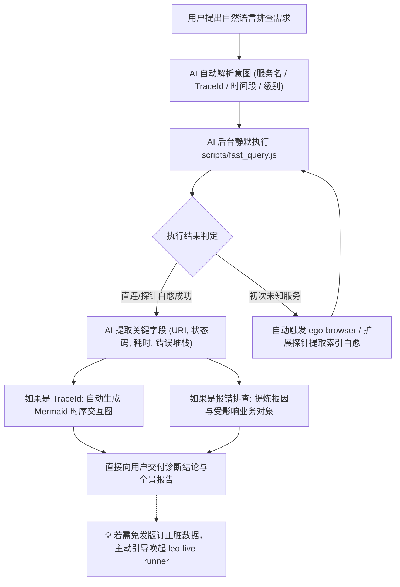

# 🔍 Leo Live Inspector (线上数据探查、日志检索与 Trace 全链路透视镜)

本 Skill 专门指导 AI 执行线上生产环境与测试环境的 **全场景数据观测与诊断（Observe & Diagnose）**。

> ⚠️ **【核心执行原则：AI 全自动后台执行，严禁要求用户手动运行命令】**
> - **底层脚本 `scripts/fast_query.js` 是 AI 专用的后台探查工具**。
> - 用户只负责用自然语言表达排查意图（如 *“帮我看下 500 报错”*、*“根据 traceId 画个时序图”*、*“查下昨天下午 2 点的日志”*）。
> - **AI 必须在后台自动解析意图并主动执行脚本**，提取关键日志、出入参与调用链，最终向用户直接交付结构化表格、Mermaid 交互时序图和根因结论。
> - **切勿在回复中输出“请您手动在终端运行 node scripts/...”等推卸给用户的言论。**

---

## 🎯 触发场景与意图自动映射 (Intent Mapping Matrix)

当用户提出以下自然语言需求时，AI **立即在后台自动组装参数并调用 `fast_query.js`**：

| 用户自然语言诉求示例 | AI 后台自动执行的标准命令 | 预期交付产物 |
| :--- | :--- | :--- |
| *“查下 iot-platform 最新 10 条日志”* | `node scripts/fast_query.js -a iot-platform -t 15m -n 10` | 格式化概况与最新日志表格 |
| *“看下刚才报的 500 错误/异常堆栈”* | `node scripts/fast_query.js -a <app> --level ERROR -t 30m -n 10` | 异常原因、报错位置与堆栈解析 |
| *“根据 TraceId 361922-10... 抓下调用链路”* | `node scripts/fast_query.js -a <app> --traceId "361922-10..."` | **必须输出 Mermaid 时序交互图** 与关键调用耗时 |
| *“查下今天 14:00~14:30 之间的门锁操作”* | `node scripts/fast_query.js -a <app> --from "2026-08-31 14:00:00" --to "2026-08-31 14:30:00" -q "门锁"` | 该时间段内的事件时序分析 |
| *“抓取 /api/sync/lockDetail 接口的真实响应数据”* | `node scripts/fast_query.js -a <app> --uri "/api/sync/lockDetail" --bltag request_out --slim -n 5` | 提取并格式化脱敏后的出参 JSON |

---

## 🧭 标准诊断工作流 (Diagnose Loop)



---

## ⚡ 1. AI 内部调用参数速查 (Internal CLI Spec)

AI 在后台调用 `node scripts/fast_query.js` 时使用的参数规范：

```bash
# 格式: node scripts/fast_query.js [flags]
```

| 参数 Flag | 简写 | 默认值 | 说明 |
| :--- | :--- | :--- | :--- |
| `--app` | `-a` | `iot-platform` | 目标微服务名 (如 `iot-platform`, `utopia-scs-saas`) |
| `--query` | `-q` | `*` | Lucene 检索短语 / 表达式 |
| `--time` | `-t` | `24h` | 相对时间范围 (如 `15m`, `1h`, `24h`, `7d`) |
| `--from` | - | `null` | 起始时间 (支持 `2026-08-31 14:00:00` 或 `now-1h`) |
| `--to` | - | `now` | 结束时间 (支持绝对时间或 `now`) |
| `--size` | `-n` | `20` (Trace: `50`) | 最大返回日志条数 |
| `--order` | `-o` | `desc` (Trace: `asc`) | 排序方式: `desc` (最新在前) 或 `asc` (时序正序) |
| `--level` | `-l` | `null` | 日志级别过滤: `ERROR`, `WARN`, `INFO`, `DEBUG` |
| `--bltag` | - | `null` | 出入参标签: `request_in`, `request_out` 等 |
| `--uri` | `-u` | `null` | 接口 URI 过滤 (如 `/api/sync/lockDetail`) |
| `--traceId` | `--tid` | `null` | 指定 TraceId (自动切换为正序链路回溯模式) |
| `--env` | `-e` | `prod` | 环境切换: `prod`, `test`, `dev` |
| `--cluster` | - | 自动匹配 | 显式覆盖 Kibana ES 集群地址 |
| `--index` | - | 自动匹配 | 显式覆盖 ES 索引模式 |
| `--slim` | - | `false` | 瘦身模式，截断超长报文与堆栈 JSON |
| `--format` | `-f` | `json` | 输出格式: `json` (默认结构化), `brief` (单行摘要), `table` (表格) |
| `--timeout` | - | `15000` | 超时时间 (毫秒) |

---

## 📊 2. AI 结果交付与呈现规范

AI 解析后台日志后，**必须按照以下结构向用户汇报**：

1. **概况与检索元信息**：
   - 标明微服务名称、命中时间范围、日志级别分布与响应耗时。
2. **结构化明细表格**：
   - 提取：时间戳、日志级别、接口 URI / 模块、TraceId、核心业务动作与关键参数。
3. **TraceId 链路可视化（强制）**：
   - 只要涉及 TraceId 追溯，**必须绘制清晰的 Mermaid 时序交互图**（展示 上游 -> 微服务 -> DB/Redis/下游 的流转过程）。
4. **根因定位与后续建议**：
   - 明确指出异常根因（如 `NullPointerException`、参数校验失败、下游超时、并发竞争等）；
   - 当定位到脏数据或异常状态时，主动提示：
     > 💡 *“已定位到异常数据。若需免发版直接订正该数据或修复状态，可使用 `leo-live-runner` 编写安全的动态 Java 修复脚本。”*

---

## 📚 规范与实战文档索引

- **FAST 日志协议与检索自愈机制**：[references/fast-log-guide.md](references/fast-log-guide.md)
- **后台页面点击与数据探查指南**：[references/page-inspect-guide.md](references/page-inspect-guide.md)
- **Trace 全链路时序排障实战**：[examples/100_trace_and_log_query.md](examples/100_trace_and_log_query.md)
