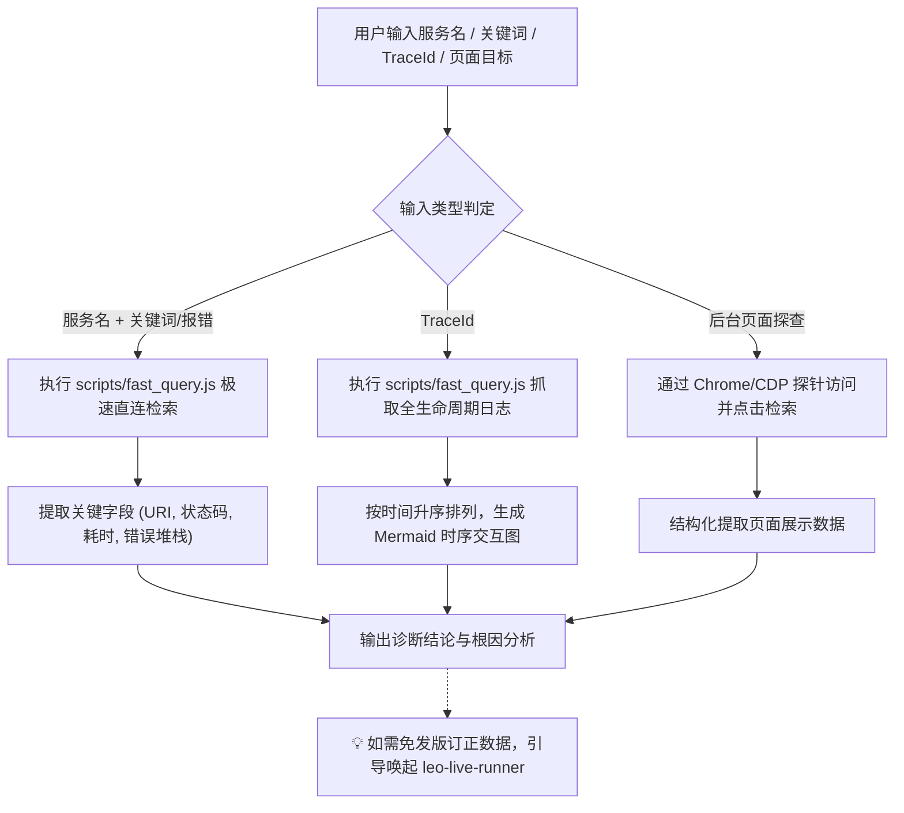

# 🔍 Leo Live Inspector (线上数据探查、日志检索与 Trace 全链路透视镜)

本 Skill 专门指导 AI 执行线上生产环境与测试环境的 **全场景数据观测与诊断（Observe & Diagnose）**：
1. **⚡ FAST / Kibana 毫秒级日志检索**：直连内网 ES 网关，快速捞取微服务报错日志、接口真实请求入参 (`request_in`) 与响应结果 (`request_out`)；
2. **🧵 TraceId 全链路时序还原**：跨微服务追溯完整请求生命周期，自动提炼调用步骤并绘制 **Mermaid 时序交互图**；
3. **🧭 索引自学习与跨平台双探针自愈**：初次查询新服务自动通过 macOS `ego-browser` 或 Windows/Chrome 扩展探针提取 ES cluster/index 映射并本地持久化；
4. **🌐 后台页面点击与数据探查（扩展能力）**：支持借助浏览器自动化/扩展能力在后台管理系统、运维看板中通过页面点击和元素审查提取业务数据。

---

## 🎯 触发场景

当用户提出以下任一需求时激活本 Skill：
1. **微服务日志与异常排查**：
   - 查特定微服务的报错、500 异常或接口调用记录（如 *“查一下 iot-platform 最近 10 分钟的房源封禁请求”*、*“看下 utopia-scs-saas 刚才报的 500 错误堆栈”*）；
2. **TraceId 全链路追踪**：
   - 根据 TraceId 还原完整调用链路与时序（如 *“根据 traceId 361922-10... 抓下全链路日志并画个时序图”*）；
3. **真实出入参抓取**：
   - 抓取网关或微服务接口真实的请求入参 (`request_in`) 与响应体 (`request_out`)；
4. **后台页面数据探查**：
   - 在运维门户、运营管理后台页面通过点击、筛选检索业务数据。

---

## 🧭 标准诊断工作流 (Diagnose Loop)



---

## ⚡ 1. FAST / Kibana 极速日志与 Trace 检索

### 常用命令快速调用
AI 直接通过 Node.js 脚本毫秒级直连查询（单次纯 HTTP 请求耗时 < 200ms）：

```bash
# 格式: node scripts/fast_query.js [appCode] [query/traceId] [timeRange] [size]

# 1. 查微服务最近日志 (默认 24h)
node scripts/fast_query.js iot-platform '"开始执行房源封禁"' 1h 5

# 2. 根据 TraceId 追溯全链路
node scripts/fast_query.js iot-platform '"361922-10.22.53.98-4130-1787830157652-8055"' 48h 30

# 3. 跨服务查 500 异常或 ERROR 堆栈
node scripts/fast_query.js utopia-scs-saas 'loglevel:ERROR' 15m 10
```

### Lucene 语法规则
| 排查目标 | 推荐 Lucene 语法 | 说明 |
| :--- | :--- | :--- |
| **精确短语匹配** | `"开始执行房源封禁"` | 必须加双引号，避免中文分词导致的倒排检索扩散 |
| **接口 URI 过滤** | `data_uri:"/risk/house/ban"` | 精准过滤 HTTP 控制器请求路由 |
| **HTTP 入参/出参** | `data_bltag:request_in` 或 `data_bltag:request_out` | 过滤网关层/过滤器记录的真实出入参 JSON |
| **异常堆栈过滤** | `loglevel:ERROR` 或 `logLevel:ERROR` | 抓取未捕获业务异常与堆栈 |
| **TraceId 追溯** | `"361922-10.22.53.98-4130-1787830157652-8055"` | 全链路还原上游至下游调用链 |

---

## 📊 2. 结果呈现规范

1. **单次/多条请求排查**：
   - 必须提炼出：请求时间、接口 URI、请求入参核心字段、响应状态码、执行耗时、异常原因。
2. **TraceId 链路追溯**：
   - 提取完整调用步骤，并**必须为用户绘制清晰的 Mermaid 时序交互图**（参考 [examples/100_trace_and_log_query.md](examples/100_trace_and_log_query.md)）。
3. **后续行动建议**：
   - 当排查出由于脏数据或未捕获状态异常导致的问题时，主动提示用户：
     > 💡 *“已定位到异常数据。若需免发版直接订正该数据或修复状态，可使用 `leo-live-runner` 编写安全的动态 Java 修复脚本。”*

---

## 🌐 3. 页面点击与后台数据探索（未来扩展）

对于无法通过直接日志检索获取的业务数据（如各后台业务管控台、审批流详情、配置中心等）：
* 可通过本地 Chrome 扩展探针或浏览器自动化工具，打开目标后台页面；
* 模拟点击筛选、输入查询条件并解析 DOM/Network 响应中的数据；
* 详见 [references/page-inspect-guide.md](references/page-inspect-guide.md)。

---

## 📚 规范与实战文档索引

- **FAST 日志协议与检索自愈机制**：[references/fast-log-guide.md](references/fast-log-guide.md)
- **后台页面点击与数据探查指南**：[references/page-inspect-guide.md](references/page-inspect-guide.md)
- **Trace 全链路时序排障实战**：[examples/100_trace_and_log_query.md](examples/100_trace_and_log_query.md)
