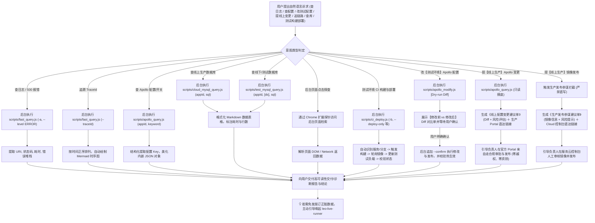

# 🔍 Leo Live Inspector (线上数据探查、日志检索、Trace 链路透视、Apollo 配置与测试构建部署中枢)

本 Skill 专门指导 AI 执行线上生产环境与测试环境的 **全场景数据观测、诊断、配置与交付闭环（Observe, Diagnose, Configure & Deliver）**：
1. **⚡ FAST / Kibana 毫秒级日志检索**：直连内网 ES 网关，快速捞取微服务报错日志、接口真实请求入参 (`request_in`) 与响应结果 (`request_out`)；
2. **📡 Kafka 消息无损只读探查与测试环境模拟投递**：以 Topic 为核心资产，支持【零 Commit、零 Rebalance】秒级拉取线上/测试最新消息，支持分区水位排查与关键词过滤；测试环境支持利用 Sample 模板快速灌入数据模拟上游；
3. **⚙️ Apollo 配置中心线上线下双轨体系（探查、修改与变更参谋）**：直连 Apollo ConfigService 秒级读取全量实时配置；【测试环境】支持热修改发布与两阶段 Diff 确认闭环；【生产环境】坚守“零直写原则”，自动进入变更参谋模式，生成高可读性《线上变更建议单》与 Portal 官方直达链接；
4. **🧵 TraceId 全链路时序还原**：跨微服务追溯完整请求生命周期，自动提炼调用步骤并绘制 **Mermaid 时序交互图**；
5. **🚀 CI 自动化构建与测试环境工作负载镜像部署**：直连 Shipwright 平台触发指定代码分支构建，实时轮询构建进度与产物镜像，自动覆盖更新测试环境工作负载（仅限 test 环境，严禁生产环境直写；支持未配置服务动态嗅探与自学习）；
6. **🧭 索引与资产自学习（双层持久化）**：初次查询新服务或新 Topic 自动就地嗅探或直连探针提取，统一沉淀至 `~/.shrimp/skills/live-inspector/`；
7. **🌐 后台页面点击与数据探查（扩展能力）**：支持借助浏览器自动化/扩展能力在后台管理系统、运维看板中通过页面点击和元素审查提取业务数据。

> ⚠️ **【核心执行原则：AI 全自动后台执行，严禁要求用户手动运行命令】**
> - **底层脚本（`scripts/fast_query.js`、`scripts/apollo_modify.js` 与 `scripts/ci_deploy.js` 等）是 AI 专用的后台探查与交付工具**。
> - 用户只负责用自然语言表达排查、查配置、改测试配置、部署测试环境或提线上变更意图（如 *“帮我看下 500 报错”*、*“根据 traceId 画个时序图”*、*“查下 iot-platform 的 apollo 配置”*、*“把当前 master 分支构建部署到测试环境”*、*“线上把 saas 超时改大”*）。
> - **AI 必须在后台自动解析意图并主动执行对应脚本**：
>   - **查日志/查配置/查库**：AI 后台静默执行，提取关键日志、出入参、实时配置或调用链，交付结构化表格与结论。
>   - **测试环境 CI 构建与部署（全自动闭环）**：AI 后台自动识别当前 Git 仓库/服务与分支，触发构建并轮询镜像出炉，自动下发测试环境负载部署并交付汇总报告；遇未配置服务自动动态发现并自学习缓存。
>   - **测试环境 Apollo 修改（两阶段风控原则）**：AI **必须先执行 Pre-flight（Dry-Run）**，向用户展示【变更前 vs 变更后】Diff 对比单，**等待用户明确确认**后再追加 `--confirm` 执行发布并校验。
>   - **生产环境变更与部署（参谋原则，绝对禁止直写）**：AI **绝对禁止直接调用写接口修改线上配置或触发生产部署**！后台生成包含参数对比、风险评估的《线上变更建议单》，并附带官方生产发布/配置 Portal 直达链接，引导负责人在受控审批流中人工审核与发布。
> - **切勿在回复中输出“请您手动在终端运行 node scripts/...”等推卸给用户的言论。**


---

## 🎯 触发场景与意图自动映射 (Intent Mapping Matrix)

当用户提出以下自然语言需求时，AI **立即在后台自动组装参数并执行脚本**：

| 用户自然语言诉求示例 | AI 后台自动执行的标准命令 | 预期交付产物 |
| :--- | :--- | :--- |
| **“把当前分支构建部署到测试环境”** | `node scripts/ci_deploy.js` | 自动识别当前 Git 仓库与分支，触发 Shipwright 构建并自动部署测试环境负载 |
| **“构建部署 smart-customer-service 的 master 分支”** | `node scripts/ci_deploy.js smart-customer-service -b master` | 触发指定服务与分支构建，轮询镜像后部署测试环境 |
| **“只构建 smart-customer-service 不部署”** | `node scripts/ci_deploy.js smart-customer-service --build-only` | 触发构建流水线，轮询至产物镜像生成并回显镜像地址 |
| **“把 smart-customer-service 最新镜像部署到测试”** | `node scripts/ci_deploy.js smart-customer-service --deploy-only` | 自动拉取最近构建完成的镜像，覆盖更新测试工作负载 |
| **“指定镜像 hub.ke.com/... 部署测试环境”** | `node scripts/ci_deploy.js smart-customer-service --deploy-only -i <image>` | 针对指定镜像下发测试环境热更新并校验状态 |
| **“查看 smart-customer-service 最近构建的镜像”** | `node scripts/ci_deploy.js smart-customer-service --list-images` | 提取最近 5 次构建产物的镜像地址与生成时间 |
| **“新人首次部署未知微服务 (如 my-new-svc)”** | `node scripts/ci_deploy.js my-new-svc` | **自动嗅探** CI 流水线与测试工作负载，校验后自动自学习沉淀本地缓存 |
| **“把 smart-customer-service 部署到线上/生产环境”** | **执行发布参谋模式 (坚决拦截生产直写)** | **严禁自动化生产部署！**<br>交付《生产环境部署参谋单》（含镜像版本、Commit、构建时间）并附带官方控制台直达链接，引导负责人在生产平台审批发布 |
| *“查下 iot-platform 最新 10 条日志”* | `node scripts/fast_query.js -a iot-platform -t 15m -n 10` | 格式化概况与最新日志表格 |
| *“看下刚才报的 500 错误/异常堆栈”* | `node scripts/fast_query.js -a <app> --level ERROR -t 30m -n 10` | 异常原因、报错位置与堆栈解析 |
| *“根据 TraceId 361922-10... 抓下调用链路”* | `node scripts/fast_query.js -a <app> --traceId "361922-10..."` | **必须输出 Mermaid 时序交互图** 与关键调用耗时 |
| *“查下今天 14:00~14:30 之间的门锁操作”* | `node scripts/fast_query.js -a <app> --from "2026-08-31 14:00:00" --to "2026-08-31 14:30:00" -q "门锁"` | 该时间段内的事件时序分析 |
| *“抓取 /api/sync/lockDetail 接口的真实响应数据”* | `node scripts/fast_query.js -a <app> --uri "/api/sync/lockDetail" --bltag request_out --slim -n 5` | 提取并格式化脱敏后的出参 JSON |
| **“查下 iot-platform 在 Apollo 上的配置”** | `node scripts/apollo_query.js iot-platform` | 微服务全量配置项概览（默认线上环境，自动去重） |
| **“查下【测试环境】saas 的 Apollo 配置或开关”** | `node scripts/apollo_query.js saas -e test` | 测试环境 (test.config.apollo.ke.com) 实时配置 |
| **“查下【预发环境】saas 的超时配置 timeout”** | `node scripts/apollo_query.js saas -e preview timeout` | 预发环境 (prev.config.apollo.ke.com) 超时参数明细 |
| **“看下 iot-platform 上的 lockAuth 开关或白名单”** | `node scripts/apollo_query.js iot-platform lockAuth` | 匹配到的业务开关、白名单及解析后的格式化 JSON |
| **“查下 Apollo application.properties 里的 weitang 配置”** | `node scripts/apollo_query.js iot-platform application.properties weitang` | 指定命名空间下的精准配置项 |
| **“把测试环境 iot 的 liveRunner.access.ucIdWhitelist 改成 [31534062,12]”** | **阶段 1 (AI 强制 Pre-flight 探查)**：<br>`node scripts/apollo_modify.js iot liveRunner.access.ucIdWhitelist "[31534062,12]"` | 向用户展示【变更前 vs 变更后】Diff 确认单、锁定 Namespace 与发布属性（业务开关 SWITCH），**停下等待用户明确确认** |
| **用户明确确认（“确认修改”、“发布吧”、“同意更改”）** | **阶段 2 (用户确认后正式发布)**：<br>`node scripts/apollo_modify.js iot liveRunner.access.ucIdWhitelist "[31534062,12]" --confirm` | 写入 Portal、发布版本并直连 ConfigService 验证客户端热生效结果 |
| **“把测试环境 saas 的 timeout 改成 5000”** | `node scripts/apollo_modify.js saas timeout 5000` (先展示 Diff 确认单) | 自动嗅探多 Namespace，锁定所属 namespace，生成 Diff 待确认 |
| **“修改测试环境 platform 的 application 空间下的某个 key 为 xxx”** | `node scripts/apollo_modify.js platform application <key> "<val>"` | 精准指定 Namespace 进行修改，隔离其他命名空间 |
| **“把【线上/生产环境】iot 的 liveRunner.access.ucIdWhitelist 改成 [31534062,12]”** | **执行参谋模式 (后台只读摸底)**：<br>`node scripts/apollo_query.js iot liveRunner.access.ucIdWhitelist` | **绝不直接写线上！**<br>交付《线上配置变更建议单》（含当前值 vs 建议值 Diff、所属 Namespace、发布属性 SWITCH）并附带生产 Portal 直达链接，引导负责人亲自走审批发布 |
| **“线上把 saas 的 timeout 改成 5000”** | `node scripts/apollo_query.js saas timeout` | 自动锁定命名空间与当前值，交付变更建议书与生产 Portal 直达链接 |
| *“查下【测试环境】warehouse 最新的 10 条日志”* | `node scripts/test_log_query.js warehouse -n 10` | 测试环境容器日志表格，含 Pod 与泳道名 |
| *“看下【测试环境】algo 的 500 报错或异常堆栈”* | `node scripts/test_log_query.js algo --level ERROR -t 30m` | 大禹泳道 Pod 异常原因与堆栈解析 |
| *“根据 TraceId 361922... 查测试环境链路”* | `node scripts/test_log_query.js <app> --traceId "361922..."` | 跨测试容器追溯出入参与请求生命周期 |
| *“查下大禹泳道 lixiaojing03 上部署的 algo 日志”* | `node scripts/test_log_query.js algo --lane lixiaojing03 -n 10` | 多泳道动态感知与日志过滤 |
| **“查下 recorder 最新的 5 条图片数据 (线上)”** | `node scripts/cloud_mysql_query.js recorder "SELECT id, source, ctime FROM image_understanding_detail ORDER BY id DESC LIMIT 5"` | 线上数据库实时表数据表格，含耗时与行数 |
| **“查下【测试环境】saas 库的订单数据”** | `node scripts/test_mysql_query.js saas "SELECT * FROM algo_detect_report ORDER BY id DESC LIMIT 5"` | 测试环境默认主库直连表格，毫秒级响应 |
| **“查下【测试环境】saas 租户 1 库 (tenant1) 的数据”** | `node scripts/test_mysql_query.js saas tenant1 "SELECT * FROM algo_detect_report LIMIT 5"` | 多数据源精准切换，支持租户分库查验 |
| **“查看仓颉系统测试环境有哪些数据源”** | `node scripts/test_mysql_query.js cangjie --list-ds` | 列出该微服务下所有已配置的多数据源及默认库 |
| **"往测试环境 saas 库插一条配置数据"** | `node scripts/test_mysql_query.js saas "INSERT INTO t_config (key_name, value) VALUES ('test_key', 'val')"` | DML 写入，返回 affectedRows + insertId |
| **"更新测试环境 iot 库的设备状态"** | `node scripts/test_mysql_query.js iot "UPDATE t_device SET status = 0 WHERE sn = 'abc123'"` | 有 WHERE 条件直接执行，返回 changedRows |
| **"删除测试环境 saas 的过期临时数据"** | `node scripts/test_mysql_query.js saas "DELETE FROM t_temp WHERE created_at < '2026-01-01'"` | 有 WHERE 条件直接执行 |
| **“指定端口 6763 和库名查线上 SQL”** | `node scripts/cloud_mysql_query.js 6763 utopia_scs_recorder "SELECT count(*) FROM image_understanding_detail"` | 线上自定义端口与库名统计输出 |
| **“查下 beijia-reach-event 最新的 3 条消息 (线上)”** | `node scripts/kafka_query.js -t beijia-reach-event -n 3` | 格式化 JSON 消息体、Partition、Offset 与时间展示 (Zero-Commit) |
| **“查下【测试环境】工单流转事件消息”** | `node scripts/kafka_query.js -t 工单 -e test -n 3` | 自动匹配测试 Topic 与 Broker 进行无损拉取 |
| **“看下触达消息的各分区水位/有没有积压”** | `node scripts/kafka_query.js -t 触达 --offsets-only` | 分区 Low/High 水位与消息总数看板 |
| **“查下包含工单号 T010020260907 的 Kafka 消息”** | `node scripts/kafka_query.js -t 工单 -q "T010020260907"` | 按单号或关键词在消息体内精准过滤 |
| **“往测试环境发一条工单流转测试消息”** | `node scripts/kafka_send.js -t 工单 --use-sample -s orderCode=T-TEST-001 -s status=已接单` | 自动利用 Sample 模板替换字段并投递至测试集群 |
| **“往测试环境某个 topic 发送特定 JSON 消息”** | `node scripts/kafka_send.js -t <topic> -d '<json>'` | 写入测试 Broker 并回显 Partition 与 Offset |
| **“扫描工程目录更新 Kafka 资产沉淀”** | `node scripts/kafka_scan.js -o resources/default_kafka.json` | 批量扫描四大主目录并更新内置资产库 |

---

## 🧭 标准诊断与探查工作流 (Inspection Loop)



---

## ⚡ 1. FAST 日志检索内部 CLI 参数速查
AI 后台执行 `node scripts/fast_query.js [flags]`：

| 参数 Flag | 简写 | 默认值 | 说明 |
| :--- | :--- | :--- | :--- |
| `--app` | `-a` | `iot-platform` | 目标微服务名 (如 `iot-platform`, `utopia-scs-saas`) |
| `--query` | `-q` | `*` | Lucene 检索短语 / 表达式 |
| `--time` | `-t` | `24h` | 相对时间范围 (如 `15m`, `1h`, `24h`, `7d`) |
| `--from` | - | `null` | 起始时间 (支持 `2026-08-31 14:00:00` 或 `now-1h`) |
| `--to` | - | `now` | 结束时间 (支持绝对时间或 `now`) |
| `--size` | `-n` | `20` (Trace: `50`) | 最大返回日志条数 |
| `--order` | `-o` | `desc` (Trace: `asc`) | 排序方式: `desc` (最新在前) 或 `asc` (正序链路) |
| `--level` | `-l` | `null` | 日志级别过滤: `ERROR`, `WARN`, `INFO`, `DEBUG` |
| `--bltag` | - | `null` | 出入参标签: `request_in`, `request_out` 等 |
| `--uri` | `-u` | `null` | 接口 URI 过滤 (如 `/api/sync/lockDetail`) |
| `--traceId` | `--tid` | `null` | 指定 TraceId (自动切换为正序链路回溯模式) |
| `--slim` | - | `false` | 瘦身模式，截断超长报文与堆栈 JSON |
| `--format` | `-f` | `json` | 输出格式: `json`, `brief`, `table` |

### 1.2 线下/测试环境：Paoding Loki 容器与泳道日志检索
AI 后台执行 `node scripts/test_log_query.js <appId> [options]`：

| 参数 Flag | 简写 | 默认值 | 说明 |
| :--- | :--- | :--- | :--- |
| `<appId>` | - | 必填 | 目标微服务别名 (如 `saas`, `algo`, `warehouse`, `iot`) |
| `--query` | `-q` | `*` | 关键词或报错过滤短语 (如 `NullPointer`, `Timeout`) |
| `--level` | `-l` | `null` | 日志级别: `ERROR`, `WARN`, `INFO`, `DEBUG` |
| `--traceId` | `--tid` | `null` | 指定 TraceId 过滤与调用链回溯 |
| `--lane` | `--ns` | `null` | 指定大禹泳道名或命名空间 (如 `lixiaojing02`, `lixiaojing03`) |
| `--pod` | - | `null` | 显式指定 Pod 实例名称 |
| `--time` | `-t` | `1h` | 相对时间跨度 (如 `15m`, `30m`, `1h`, `2h`) |
| `--size` | `-n` | `20` (Trace: `50`) | 最大返回日志条数 |
| `--format` | `-f` | `table` | 输出格式: `table` (表格), `brief` (紧凑), `json` |
| `--slim` | - | `false` | 瘦身模式，截断超长堆栈或报文 |
| `--set-cookie`| - | - | 保存更新 Paoding 登录 Cookie 凭证至本地缓存 |

> 💡 **自动分流支持**：在 `fast_query.js` 中指定 `--env test` 时，底层会自动委派至 `test_log_query.js` 容器直连通道。

## ⚙️ 2. Apollo 配置探查与测试环境动态修改

### 2.1 Apollo 全环境配置只读探查 (`scripts/apollo_query.js`)
AI 后台执行 `node scripts/apollo_query.js <appId|alias> [namespace|keyKeyword] [keyKeyword] [options]`：

| 参数/选项 | 简写 | 默认值 | 说明 |
| :--- | :--- | :--- | :--- |
| `<appId\|alias>` | - | 必填 | 目标微服务唯一 ID 或口语别名 (如 `saas`, `platform`, `iot`) |
| `[namespace\|keyword]` | - | 可选 | 命名空间（若含 `.` 或等于 `application`）或 key 检索词 |
| `[keyKeyword]` | - | 可选 | 当第 2 个参数为命名空间时，此参数为 key 关键词 |
| `--env` | `-e` | `prod` | **目标环境**: `test` (测试), `preview` (预发), `prod` (生产), `dev` (开发) |
| `--exact` | - | `false` | 精确匹配 key（默认采用不区分大小写的模糊包含） |
| `--cluster` | - | `default` | 集群名称 |
| `--server` | - | 动态匹配 | 显式覆盖 Apollo ConfigService 服务端地址 |
| `--json` | - | `false` | 输出纯 JSON 格式 |

---

### 2.2 【测试环境】Apollo 配置动态修改与两阶段发布 (`scripts/apollo_modify.js`)
AI 后台执行 `node scripts/apollo_modify.js <appId|alias> [namespace] <key> <value> [options]`：

| 参数/选项 | 简写 | 默认值 | 说明 |
| :--- | :--- | :--- | :--- |
| `<appId\|alias>` | - | 必填 | 目标微服务 ID 或别名 (如 `iot`, `saas`, `platform`, `recorder`) |
| `[namespace]` | - | 自动嗅探 | 命名空间。不传时**全自动探测所有 Namespace** 并精确定位所属空间；传则精准修改指定空间 |
| `<key>` | - | 必填 | 待修改的配置键名 (如 `liveRunner.access.ucIdWhitelist`, `test.switch`) |
| `<value>` | - | 必填 | 新的配置目标值 (如 `"[31534062,12]"`, `true`, `5000`) |
| `--confirm` | - | `false` | **发布确认门禁**。未提供时为 Pre-flight 安全预览模式，提供后真正执行写入与发布 |
| `--type <1\|2\|3>` | `-t` | `3` (switch) | **发布属性**：`3` 或 `switch` (业务开关，默认且推荐), `1` (业务变更), `2` (业务降级) |
| `--comment` | `-m` | 自动生成 | 本次发布说明 (例如 `AI 辅助修改配置: <key>`) |
| `--cookie` | - | 动态读取 | 临时传入 Apollo Portal Cookie (默认自动读取 `~/.shrimp`) |
| `--json` | - | `false` | 以 JSON 格式输出 Diff 或发布结果 |

#### 🛡️ 核心风控与安全规范 (Zero Silent Mutation)
1. **严格两阶段发布机制（绝对禁止静默变更）**：
   - ⚠️ **严禁 AI 直接带 `--confirm` 一步到位修改配置！**
   - **阶段一 (Pre-flight / Dry-Run)**：AI 收到修改诉求后，必须先在后台执行不带 `--confirm` 的命令：
     ```bash
     node scripts/apollo_modify.js iot liveRunner.access.ucIdWhitelist "[31534062,12]"
     ```
     提取出【当前旧值 vs 目标新值】Diff、锁定目标微服务、所属 Namespace 与发布属性，形成可视化 Diff 确认单呈现给用户，询问：*“请您确认是否将配置修改为以上内容并发布？”*；
   - **阶段二 (Post-flight / Commit)**：用户回复明确肯定指令（如 *“确认”、“发布吧”、“修改吧”*）后，AI 再次在后台追加 `--confirm` 执行提交：
     ```bash
     node scripts/apollo_modify.js iot liveRunner.access.ucIdWhitelist "[31534062,12]" --confirm
     ```
     提交后脚本会自动直连 ConfigService 回查热生效状态，向用户交付发布单号与最新生效值。
2. **发布属性规范**：
   - 默认且必须为【业务开关】(`releaseAttribute: "3"`)，符合贝壳测试环境配置变更管理与审计规范。
3. **多 Namespace 隔离与自动定位**：
   - 脚本自动读取目标微服务的所有 Namespace。若用户未显式指定，脚本会自动在所有 Namespace 中搜索该 Key 并精确定位所属 Namespace；
   - 亦可显式传入 Namespace（如 `node scripts/apollo_modify.js iot application liveRunner.access.ucIdWhitelist "[31534062,12]"`），确保隔离其他 Namespace，绝不串改其它配置。
4. **鉴权凭证规范（精准引导，严禁引导安装外部浏览器）**：
   - 目标站点：`http://test-apollo.portal.life.ke.com`
   - 核心凭证 Cookie 键名：**`jt_apollo_login_token`**
   - 本地持久化路径：`~/.shrimp/skills/live-inspector/test_apollo_cookie.json`
   - 当凭证失效时，AI 必须明确指引用户使用已有的 Chrome 扩展（**Leo cookie.txt Locally**）复制 **`jt_apollo_login_token`**，或通过 F12 复制该 Cookie。**严禁出现任何引导用户安装 `ego-browser` 的言论。**

---

### 2.3 【生产环境】Apollo 配置变更参谋模式 (Production Change Advisor)

> 🚨 **【生产环境铁律：零直写原则 (Zero Direct Mutation)】**
> - 生产环境配置直接关联线上真实用户体验与系统可用性，任何脚本直写均存在严重越权、绕过审计与引发级联故障的资损风险；
> - **AI 绝对禁止直接调用写接口对线上 Apollo 执行写入或发布！**
> - 当用户表达线上修改意图时，AI **自动触发变更参谋模式**：AI 作为智囊参谋，负责摸底、比对、排雷并生成标准化建议书，最终由业务负责人在官方受控环境中执行审批与发布。

#### 📋 参谋服务闭环工作流 (Advisor SOP)
1. **纯只读秒级摸底**：
   AI 在后台静默执行只读探查命令：
   ```bash
   node scripts/apollo_query.js <appId> <key>
   ```
   秒级拉取目标微服务在生产环境当前的真实生效值与所在 Namespace，排查是否已存在该 Key 或格式是否特殊（如 JSON 数组、超时毫秒等）。
2. **生成《线上配置变更建议单 (Production Change Proposal)》**：
   AI 必须输出结构化的变更建议单，向用户呈现：
   - 🎯 **变更目标**：目标应用 (`appId`)、所属集群 (`default`)、精确命名空间 (`namespaceName`)；
   - 📊 **配置对比 (Diff)**：当前生效值 (Current) vs 建议目标值 (Target)；
   - 🏷️ **发布属性**：强制遵循【业务开关 (SWITCH, releaseAttribute: 3)】或【业务变更 (CHANGE, 1)】；
   - ⚠️ **影响与风险评估**：分析该变更可能产生的影响（如超时时间调整是否引起下游雪崩、白名单工号格式是否正确、是否涉及 JSON 语法合规性）。
3. **交付生产 Portal 官方直达链接 (Deep-Link)**：
   为避免用户在 Apollo 控制台众多应用与命名空间中耗时翻找，AI 自动生成直达该命名空间的链接：
   ```text
   🔗 生产 Portal 直达链接:
   http://apollo.portal.life.ke.com/#/appid={appId}&env=PROD&cluster=default&namespace={namespace}
   ```
4. **引导负责人人工审批发布**：
   指引用户点击直达链接，登录个人合规账号，直接在目标页面完成修改、走正规变更审批与发布流程。

---

## 🗄️ 3. 数据库查询内部 CLI 参数速查 (线上云网关 / 线下直连双模)

### 3.1 线上生产环境：服务云 MySQL 自助查询
AI 后台执行 `node scripts/cloud_mysql_query.js <appId|port> [database|sql] [sql] [options]`：

| 参数/选项 | 简写 | 默认值 | 说明 |
| :--- | :--- | :--- | :--- |
| `<appId\|port>` | - | 必填 | 目标微服务别名 (如 `recorder`, `saas`, `algo`) 或端口号 (如 `6763`) |
| `[database\|sql]` | - | 必填 | 库名（当第 1 参数为端口时）或待执行的 SQL（当第 1 参数为服务别名时） |
| `[sql]` | - | 可选 | 待执行的 SQL 语句（当第 1 参数为端口号时） |
| `--role` | - | `Slave` | 查询角色: `Slave` (从库只读) 或 `Master` (主库) |
| `--env` | `-e` | `prod` | 环境控制，指定 `test` / `dev` 时自动委派给 `test_mysql_query.js` |
| `--set-token` | - | - | 保存更新服务云 `cloud_console_token_egg` 凭证至本地缓存 |
| `--token` | - | - | 临时覆盖 Token |
| `--json` | - | `false` | 输出纯 JSON 数据结果 |

### 3.2 线下/测试环境：MySQL 本地直连查询与写入 (零外部依赖、多数据源支持)
AI 后台执行 `node scripts/test_mysql_query.js <service|host> [datasource|sql] [sql] [options]`：

| 参数/选项 | 简写 | 默认值 | 说明 |
| :--- | :--- | :--- | :--- |
| `<service\|host>` | - | 必填 | 微服务别名 (如 `saas`, `iot`, `recorder`, `cangjie`) 或测试库 Host/Port |
| `[datasource]` | - | 可选 | 多数据源别名 (如 `tenant0`, `tenant1`, `base`)，未填自动走默认主库 |
| `[sql]` | - | 必填 | 待执行的 SQL：查询 (`SELECT`/`SHOW`/`DESC`/`EXPLAIN`)、写入 (`INSERT`/`UPDATE`/`DELETE`/`REPLACE`)、结构 (`CREATE`/`ALTER`/`DROP`/`TRUNCATE`) |
| `--ds <alias>` | - | 自动匹配 | 显式指定数据源名称 |
| `--list-ds` | - | `false` | 列出该服务下全部已注册的测试数据源与默认库 |
| `--force` | - | `false` | 强制执行无 WHERE 条件的 UPDATE/DELETE（默认拦截，防止全表误操作） |
| `-p, --password` | - | 动态嗅探 | 临时提供密码（握手验通后自动静默持久化至 `~/.shrimp`） |
| `--max-rows` | - | `50` | 最大返回数据行数 |
| `--json` | - | `false` | 输出格式化 JSON |

> ⚡ **DML/DDL 写入安全规则**：
> 1. **顶层 WHERE 保护**：`UPDATE`/`DELETE` 必须明确包含顶层 `WHERE`；字符串、注释、反引号标识符、嵌套子查询中的伪 `WHERE` 不算，多语句或无法可靠分析的 SQL 默认阻断，需显式传入 `--force`；
> 2. **结构化反馈**：DML 操作返回 `affectedRows`、`insertId`、`changedRows` 等结构化指标；DDL 返回执行结果，并在可识别时明确提示目标表名；
> 3. **仅限测试环境**：本脚本仅连接测试/线下内网数据库，不可用于生产环境。

> 💡 **测试库密码安全机制**：
> 1. **零硬编码**：Skill 仓库内绝无任何明文密码；
> 2. **智能目录引导**：若缺少密码，AI 主动引导用户切换至该项目的本地代码根目录（例如 `cd /Users/pa/project/JZ/utopia-scs-saas`），脚本将自动就地从 `application-test.yml` / `.env.test` 解析密码并直连；
> 3. **验通即静默沉淀**：一旦握手测试成功，系统无感沉淀至 `~/.shrimp/skills/live-inspector/test_databases.json`，后续永久免输。

## 📡 4. Kafka 消息无损只读探查与安全模拟投递 (`scripts/kafka_query.js` & `scripts/kafka_send.js`)

### 4.1 核心设计理念
1. **以 Topic 为核心资产（扁平化）**：打破“必须先找微服务”的束缚，Topic 全局唯一，直接通过 Topic 名或中文别名即可秒级查询与发送；
2. **双层持久化机制**：
   - **内置预置**：[`resources/default_kafka.json`](resources/default_kafka.json)（出厂自带常用主目录 37+ 核心 Topic）；
   - **本地自学习**：`~/.shrimp/skills/live-inspector/kafka_catalog.json`（支持 `--save` 随时沉淀新项目或自定义 Topic）；
3. **零 Commit 与零 Rebalance 保障**：
   - 探查严格采用随机临时 GroupId（`leo-peek-${Date.now()}`）与 `autoCommit: false`；
   - 严禁任何提交行为，对线上/测试正常消费组完全透明；
4. **测试环境安全投递与 Mock 上游**：
   - 默认环境为 `test`，向 `prod` 写入会被强制拦截（必须附加 `--force-danger-confirm`）；
   - 支持利用 Topic 预存的 `sample` 模板，通过 `-s key=val` 自动替换字段并刷新当前时间戳，实现秒级模拟上游事件；
5. **多工具联动排障（闭环威力）**：
   - 从 Kafka 查出的消息自带 `traceId` ➡️ 自动顺藤摸瓜调用 `fast_query.js --traceId` 追查下游消费端的执行日志与 Mermaid 时序交互图！

### 4.2 常用命令速查

| 操作场景 | 推荐命令 | 说明 |
| :--- | :--- | :--- |
| **查最新消息 (线上)** | `node scripts/kafka_query.js -t <topic> -n 3` | 默认查线上最新 3 条，格式化回显 JSON 消息 |
| **查最新消息 (测试)** | `node scripts/kafka_query.js -t <topic> -e test -n 3` | 自动路由至测试环境对应集群与测试 Topic |
| **查分区水位/积压** | `node scripts/kafka_query.js -t <topic> --offsets-only` | 输出各分区的 Low / High 水位与消息总数看板 |
| **按单号/关键词筛选** | `node scripts/kafka_query.js -t <topic> -q "<orderId>"` | 在拉取的消息中过滤指定业务关键词 |
| **指定分区拉取** | `node scripts/kafka_query.js -t <topic> -p 0 -n 2` | 仅从指定分区拉取消息 |
| **基于模板发送测试消息** | `node scripts/kafka_send.js -t <topic> --use-sample -s status=已完成` | 自动套用 Sample 模板并覆盖指定字段 |
| **直接发送自定义 JSON** | `node scripts/kafka_send.js -t <topic> -d '{"orderId":"123"}'` | 投递到测试环境并回显 Partition 与 Offset |
| **全量扫描更新资产** | `node scripts/kafka_scan.js -o resources/default_kafka.json` | 扫描 IOT/HT/ZK/JZ 目录并刷新内置预置库 |

---

## 🚀 5. CI 构建与测试环境工作负载自动化部署 (`scripts/ci_deploy.js`)

### 5.1 CLI 参数速查
AI 后台执行 `node scripts/ci_deploy.js [serviceId] [options]`：

| 参数/选项 | 简写 | 默认值 | 说明 |
| :--- | :--- | :--- | :--- |
| `[serviceId]` | `-s, --service` | 自动识别 | 目标微服务 ID 或别名 (如 `smart-customer-service`, `saas`, `algo`)，未提供时自动根据当前本地 Git 仓库或目录识别 |
| `--branch` | `-b` | 自动识别 | 构建的代码分支，未提供时自动执行 `git rev-parse --abbrev-ref HEAD` 提取当前分支 (如 `master`, `main`, `feat/xxx`) |
| `--build-only` | - | `false` | 仅触发 Shipwright CI 构建并轮询镜像出炉，不执行工作负载部署 |
| `--deploy-only` | - | `false` | 仅执行测试环境工作负载镜像部署 (未显式指定 `--image` 时自动使用该微服务最近构建成功的镜像) |
| `--image` | `-i` | `null` | 显式指定部署的目标镜像完整地址 (如 `hub.ke.com/smart-customer-service/...:tag`) |
| `--list-images` | `-l` | `false` | 查询并列出该微服务历史构建成功的镜像列表、版本 Tag 与生成时间 |
| `--dry-run` | - | `false` | 安全预检模式，仅解析并打印识别到的 CI 流水线、工作负载配置与分支信息，不发起实际写操作 |
| `--timeout` | - | `15m` | 构建轮询最大超时时间 (支持 `10m`, `900s` 等) |
| `--set-cookie` | - | - | 保存更新服务云与 Shipwright 平台统一 Session Cookie 凭证至本地缓存 |
| `--json` | - | `false` | 输出纯 JSON 数据结果 |

---

### 5.2 新人与未收录服务零配置自适应 (Auto-Discovery & Self-Learning)
为确保新同学或新微服务无需手动改写配置文件即可无缝使用，底层引擎内置了两阶段动态发现与自愈闭环：

1. **自动识别项目**：若未显式指定服务名，脚本自动读取本地 Git 仓库的 remote URL 或当前工程根目录名推导微服务 ID；
2. **流水线与工作负载动态探测 (Auto-Discovery)**：
   - 若服务未收录在内置清单中，脚本自动调用 Shipwright API（`POST /workflow-context/v1/workflows/query`）依据服务名与 `env: test` 匹配测试环境 CI 流水线 ID；
   - 自动调用服务云 API（`GET /cloud-proxy-api/cloud-application/app/{serviceId}/virtual-services`）检索匹配环境为 `test` 的工作负载 ID；
3. **静默自学习沉淀**：
   - 探测验通后，自动将 `ciWorkflowId` 和 `testWorkloadId` 持久化写入 `~/.shrimp/skills/live-inspector/service_catalog.json`；
   - 下次执行直接命中本地缓存，实现 **0 手动配置、0 维护成本、越用越聪明**。

---

### 5.3 🛡️ 生产发布安全铁律 (Strict Test-Only & Production Advisor SOP)

> 🚨 **【生产环境铁律：严禁自动化脚本直写生产容器】**
> - 生产环境镜像部署直接影响线上真实业务，严禁任何 AI Agent 或自动化脚本绕过官方发布平台直接更新生产虚拟服务容器！
> - **自动化构建部署能力绝对仅对测试环境 (`test`) 开放**。

#### 生产变更参谋模式 (Advisor SOP)
当用户提出“把这个分支/镜像部署到线上/生产环境”时，AI 自动触发发布参谋模式：
1. **阻断直写**：底层脚本拦截任何目标为 `prod` / `online` 的部署指令；
2. **生成《生产环境部署参谋单》**：
   - 🎯 **应用信息**：微服务名称 (`serviceId`)；
   - 🏷️ **推荐发布镜像**：展示经过测试验证的最新产物镜像 Tag（例如 `hub.ke.com/{app}:{timestamp}-{branch}-{hash}`）；
   - 📝 **代码变更摘要**：关联的 Git Commit、分支名称、构建人与构建时间；
3. **交付官方控制台直达链接**：
   ```text
   🔗 服务云生产工作负载控制台直达链接:
   https://cloud.intra.ke.com/console/project/cloud/application/{serviceId}/virtual-service-list
   ```
4. **引导负责人审批发布**：指引业务负责人在服务云控制台选择该镜像，发起标准的生产发布与审批流程。

---

## 📊 6. AI 交付呈现规范

1. **日志排查交付**：概况元信息 ➕ 结构化明细表格 ➕ 异常原因与堆栈分析；
2. **TraceId 追溯交付**：**强制绘制清晰的 Mermaid 时序交互图**（展示 上游 -> 微服务 -> DB/Redis/下游）；
3. **Apollo 配置交付**：标明配置中心来源、命名空间、配置 Key、格式化解析后的 JSON 结构，并解释业务含义；
4. **CI 构建与测试部署交付**：汇报服务名称、构建分支、流水线 ID、轮询耗时、出炉镜像地址，以及测试环境工作负载更新生效状态；
5. **协同引导**：当发现数据异常或开关需要动态干预时，主动提示可唤起 `leo-live-runner` 进行免发版处理。

---

## 🔌 7. 跨平台 Token/Cookie 凭证获取与 Chrome 插件引导规范

当执行查库、日志自愈或 CI 构建部署遇到 **凭证缺失** 或 **凭证过期（302 重定向 / 401 鉴权失败）** 时，AI 必须根据用户操作系统（Mac / Windows）主动提供清晰、精准的引导，严禁仅抛出冷冰冰的报错或模糊的 F12 指引：

### 🔑 核心凭证 Key 速查
* **服务云构建部署 / Shipwright 流水线**：目标页面 `https://cloud.intra.ke.com` 与 `https://shipwright.ke.com` ➔ 核心凭证：**完整 Cookie 字符串**（必须包含 `EGG_SESS` 或 `session_id`，通常兼具 `cloud_console_token_egg`）
* **服务云 MySQL 查库**：目标页面 `https://cloud.intra.ke.com/database/mysql/self-check` ➔ 核心 Key: **`cloud_console_token_egg`**（`2.0...` 开头长串，或直接使用上述完整 Cookie 字符串）
* **Apollo 测试环境配置修改**：目标页面 `http://test-apollo.portal.life.ke.com` ➔ 核心 Key: **`jt_apollo_login_token`**
* **FAST 日志全量自愈**：目标页面 `https://fast.ke.com` ➔ 核心 Key: **`_secondx`**（32位十六进制字符串）

> 💡 **多系统通用凭证机制**：
> - `cloud_console_token_egg` 仅支持云控制台部分接口（如 MySQL 查库），而 Shipwright CI 流水线与 Cloud 工作负载热更新依赖内网统一 SSO 鉴权体系（基于 `EGG_SESS` / `session_id`）；
> - 用户在登录 `cloud.intra.ke.com` 或 `shipwright.ke.com` 后，直接复制完整的 Cookie 文本；
> - AI 执行 `node scripts/ci_deploy.js --set-cookie "..."` 保存至 `~/.shrimp/skills/live-inspector/cloud_token.json` 后，底层将**自动兼容服务云查库与 CI 构建部署两大通道**，全流程通用！

---

### 🖥️ 分平台 Chrome 插件手动导入与引导流程（首选推荐）

#### 🍏 macOS 用户引导指引：
1. **手动在 Chrome 加载插件**：
   * 打开 `chrome://extensions/` 并开启右上角【开发者模式】；
   * 点击左上角【加载已解压的扩展程序】；
   * 按快捷键 `Cmd + Shift + G`，粘贴 AI 给出的插件绝对路径，回车并确认；
   * 常用安装路径（AI 应优先给出当前生效的绝对路径）：
     `~/.agents/skills/leo-live-inspector/resources/chrome_extension`（或工程下的 `resources/chrome_extension`）。
2. **获取凭证**：
   * 打开目标页面（服务云 `cloud.intra.ke.com`、Shipwright 或 FAST）；
   * 点击浏览器右上角拼图中的 **Leo cookie.txt Locally** 图标；
   * 点击 **【📥 下载 cookies.txt】**（脚本会自动从 Downloads 目录智能读取，免手动粘贴），或直接点击 **【复制】** 完整 Cookie 文本发给 AI；
   * （单项 Key 查询时可在列表中找到对应 Key 如 `cloud_console_token_egg`、`_secondx` 或 `jt_apollo_login_token` 复制）。

#### 🪟 Windows 用户引导指引：
1. **手动在 Chrome 加载插件**：
   * 打开 `chrome://extensions/` 并开启右上角【开发者模式】；
   * 点击左上角【加载已解压的扩展程序】；
   * 在弹窗路径栏粘贴 AI 给出的插件绝对路径并回车确认；
   * 常用安装路径（AI 应优先给出当前生效的绝对路径）：
     `%USERPROFILE%\.agents\skills\leo-live-inspector\resources\chrome_extension`（或工程下的 `resources\chrome_extension`）。
2. **获取凭证**：
   * 打开目标页面，点击插件图标；
   * 点击 **【📥 下载 cookies.txt】** 或点击 **【复制】** 完整 Cookie 文本发给 AI。

---

### 🛠️ 备选方案：无插件场景下的 F12 手动提取（受限环境）
如果用户由于安全策略无法安装插件，AI 指引其按以下步骤手动复制：
1. 在已登录的目标页面按 `F12` 打开控制台；
2. 切换到【Application (应用)】➔ 左侧展开【Cookies】➔ 点击对应域名；
3. 复制完整的 Cookie 请求头（在 Network 选项卡中任意选中一个请求，复制 Request Headers 中的 `Cookie: ...` 内容发给 AI）。

---

## 📚 规范与实战文档索引

- **CI 构建与测试环境部署手册**：[references/ci-deploy-guide.md](references/ci-deploy-guide.md)
- **Apollo 配置探查协议与实战手册**：[references/apollo-config-guide.md](references/apollo-config-guide.md)
- **FAST 日志协议与检索自愈机制**：[references/fast-log-guide.md](references/fast-log-guide.md)
- **后台页面点击与数据探查指南**：[references/page-inspect-guide.md](references/page-inspect-guide.md)
- **Trace 全链路时序排障实战**：[examples/100_trace_and_log_query.md](examples/100_trace_and_log_query.md)
