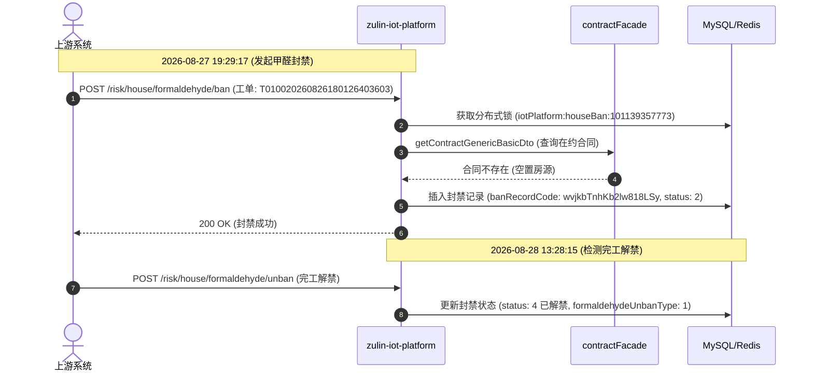

# 🔍 示例 100：FAST / Kibana 线上日志检索与 Trace 全链路排障

本示例展示如何利用 `leo-live-runner` 的底层极速日志引擎，在 **1 秒内** 完成线上微服务日志抓取、TraceId 调用链路回溯与异常排查。

---

## 🚀 核心指令快速上手

### 1. 查询微服务实时日志
```bash
# 查询 iot-platform 过去 1 小时的房源封禁相关日志（抓取前 5 条）
node scripts/fast_query.js iot-platform '"开始执行房源封禁"' 1h 5
```

### 2. 依据 TraceId 回溯全生命周期链路
```bash
# 根据 TraceId 跨 48 小时拉取完整调用时序日志
node scripts/fast_query.js iot-platform '"361922-10.22.53.98-4130-1787830157652-8055"' 48h 30
```

### 3. 跨服务查询异常与 500 报错
```bash
# 查询 utopia-scs-saas 过去 15 分钟内所有 HTTP 500 报错
node scripts/fast_query.js utopia-scs-saas 'loglevel:ERROR OR "status\":500' 15m 10
```

---

## 📊 典型输出与链路图生成

当输入 TraceId 查询后，引擎将按时间升序返回完整的事件步骤。AI 可直接为用户生成如下时序图：



---

## ⚙️ 自学习缓存机制

所有微服务与 Elasticsearch 索引的映射关系将自动缓存在用户的本机目录：
* **缓存路径**：`~/.shrimp/skills/live-runner/service_map.json`
* **格式示例**：
  ```json
  {
    "iot-platform": "index-8172-7302*",
    "utopia-scs-saas": "index-8481-7703*"
  }
  ```
初次查询新微服务时，脚本会自动通过探针定位并在 1~2 秒内写入该字典，之后的查询均享受 **0.5 秒内** 毫秒级直连响应。
