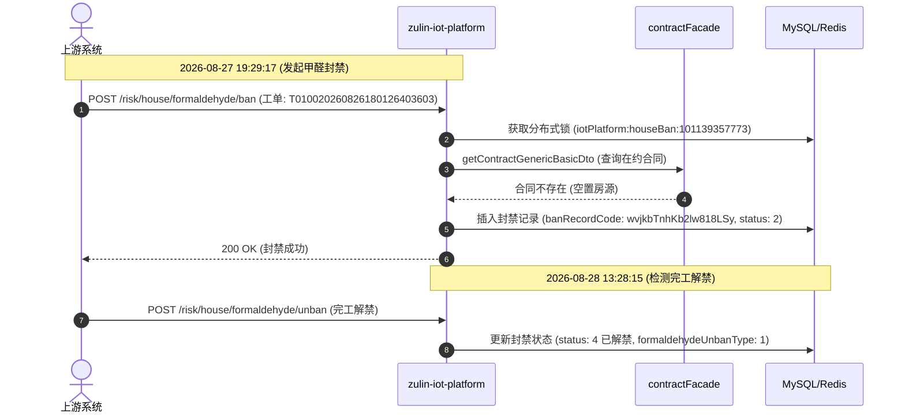

# 🔍 示例 100：FAST / Kibana 线上日志检索与 Trace 全链路排障

本示例展示如何利用 `leo-live-inspector` 的底层极速日志引擎，在 **1 秒内** 完成线上微服务日志抓取、TraceId 调用链路回溯与异常排查。

---

## 🚀 核心指令快速上手

### 1. 查询微服务实时最新日志
```bash
# 查询 iot-platform 过去 15 分钟的最新 10 条日志 (默认倒序)
node scripts/fast_query.js -a iot-platform -t 15m -n 10
```

### 2. 依据 TraceId 回溯全生命周期链路
```bash
# 根据 TraceId 自动按时间升序拉取全生命周期日志
node scripts/fast_query.js -a iot-platform --traceId "361922-10.22.53.98-4130-1787830157652-8055"
```

### 3. 跨服务查询 ERROR 异常与 500 报错
```bash
# 查询 utopia-scs-saas 过去 15 分钟内所有 ERROR 报错
node scripts/fast_query.js -a utopia-scs-saas --level ERROR -t 15m -n 10
```

### 4. 精准历史时间段与接口出入参抓取
```bash
# 查询指定时间段内某接口的 HTTP 响应出参报文
node scripts/fast_query.js -a iot-platform --from "2026-08-31 14:00:00" --to "2026-08-31 14:30:00" --uri "/api/sync/lockDetail" --bltag request_out -n 5
```

---

## 📊 典型输出与链路图生成

当输入 TraceId 查询后，引擎将按时间升序返回完整的事件步骤。AI 可直接为用户生成如下时序图：



---

## ⚙️ 自学习缓存机制

所有微服务与 Elasticsearch 索引的映射关系将自动缓存在用户的本机目录：
* **缓存路径**：`~/.shrimp/skills/live-runner/service_map.json`
* **格式示例**：
  ```json
  {
    "iot-platform": "index-8172-7302*",
    "utopia-scs-saas": "index-8481-7703*"
  }
  ```
初次查询新微服务时，脚本会自动通过探针定位并在 1~2 秒内写入该字典，之后的查询均享受 **0.5 秒内** 毫秒级直连响应。
