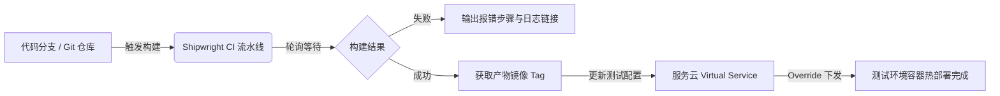

# 🚀 CI 构建与测试环境工作负载自动化部署参考手册

本手册为 **AI Agent** 提供贝壳内部持续集成平台（Shipwright）与服务云容器平台（Cloud Console）的底层 API 协议、鉴权机制、自动发现机制与交付安全规范。

---

## 🧭 一、核心自动化链路设计



整个闭环由 `scripts/ci_deploy.js` 统一调度，具备以下关键特性：
1. **纯自动化执行**：AI 根据用户自然语言一键触发，自动提取 Git 分支、轮询至镜像出炉、自动更新测试工作负载；
2. **新人零配置自发现 (Auto-Discovery)**：无需手动维护服务配置文件，支持动态调用 API 嗅探 CI 流水线与测试工作负载并自学习缓存；
3. **生产环境铁律隔离 (Advisor Mode)**：坚守安全底线，自动化部署仅限 `test` 环境，线上环境仅提供镜像建议单与官方控制台直达链接。

---

## 🔌 二、底层逆向 API 协议速查

### 1. Shipwright 构建流水线 API (shipwright.ke.com)

- **动态触发构建 (Dynamic Trigger)**
  - **URL**: `POST https://shipwright.ke.com/workflow-context/v1/workflows/{workflowId}/dynamic-trigger?overwrite=true`
  - **Headers**:
    ```json
    {
      "Content-Type": "application/json",
      "Cookie": "EGG_SESS=...; session_id=...;"
    }
    ```
  - **Body**:
    ```json
    {
      "triggerType": "MANUAL",
      "codeRepositories": [
        {
          "branch": "master"
        }
      ]
    }
    ```
  - **Response**:
    `{ "code": 0, "data": { "recordId": "6aa902..." } }`

- **轮询构建进度 (Workflow Records Query)**
  - **URL**: `POST https://shipwright.ke.com/workflow-context/v1/workflow-records/query?pageNumber=1&pageSize=5`
  - **Body**:
    ```json
    {
      "workflowId": "{workflowId}"
    }
    ```
  - **Status**: `RUNNING`, `SUCCESS`, `FAILED`, `ABORTED`

- **提取产物镜像 (Artifacts Query)**
  - **URL**: `POST https://shipwright.ke.com/workflow-context/v1/artifacts/query?pageNumber=1&pageSize=5`
  - **Body**:
    ```json
    {
      "recordId": "{recordId}"
    }
    ```
  - **Response Data**:
    `data[].artifactMeta.image`（例如 `hub.ke.com/smart-customer-service/smart-customer-service:202609181530-master-abcdef`）

---

### 2. 服务云工作负载部署 API (cloud.intra.ke.com)

- **获取当前测试工作负载配置 (Pre-deploy Config)**
  - **URL**: `GET https://cloud.intra.ke.com/cloud-proxy-api/cloud-application/app/{serviceId}/virtual-service/{workloadId}/edit`
  - **Headers**:
    ```json
    {
      "Cookie": "EGG_SESS=...; session_id=...; cloud_console_token_egg=..."
    }
    ```
  - **Key Fields**: `data.appVirtualService.virtualService.spec.containers[0].image`

- **下发工作负载更新 (Deploy Override)**
  - **URL**: `PUT https://cloud.intra.ke.com/cloud-proxy-api/cloud-application/app/{serviceId}/virtual-service/{workloadId}/override`
  - **Body**: 完整的更新后 virtualService 规格对象
  - **Response**: `{ "code": 0, "msg": "success" }`

- **查询历史构建镜像列表**
  - **URL**: `GET https://cloud.intra.ke.com/apis/ci/v1/deployment/images/{serviceId}?pageNumber=1&pageSize=10`
  - **Response**: 最近构建成功的镜像地址、创建时间、触发人等列表。

---

## 🧭 三、新人与未配置服务自动发现机制 (Auto-Discovery)

当用户指定了一个尚未在 `resources/default_services.json` 注册的微服务（例如新入职同学自研服务 `my-new-svc`）时，`ci_deploy.js` 将自动执行两步探测：

1. **探测 CI 流水线**：
   - 接口：`POST https://shipwright.ke.com/workflow-context/v1/workflows/query?pageNumber=1&pageSize=10`
   - 检索条件：在项目所属工作流中检索环境为 `test` 或名称包含 `my-new-svc` 的 workflow，提取 `workflowId`；
2. **探测测试工作负载**：
   - 接口：`GET https://cloud.intra.ke.com/cloud-proxy-api/cloud-application/app/{serviceId}/virtual-services`
   - 检索条件：筛选 `envType === 'test'` 的第一个工作负载，提取 `workloadId`（如 `env-my-new-svc-test-xxx`）；
3. **自学习静默沉淀**：
   - 校验探测到的 ID 有效后，自动写入 `~/.shrimp/skills/live-inspector/service_catalog.json`；
   - 下次执行无需重新探测，实现零配置自愈。

---

## 🔑 四、鉴权凭证规范与多系统通用机制

### 1. 为什么 `cloud_console_token_egg` 无法单独用于构建部署？
- `cloud_console_token_egg` 仅为服务云控制台内部部分接口（如 MySQL 自助查库）的校验 Token；
- `shipwright.ke.com`（持续集成）与 `cloud.intra.ke.com`（容器负载热更新）依赖内网统一 SSO 鉴权机制，接口网关严格检查 Cookie 中的 **`EGG_SESS`** 与 **`session_id`**；
- 若只传递 `cloud_console_token_egg`，Shipwright 会返回 `401 Unauthorized`，云控制台部署接口会返回 `302 Found` 重定向至登录页。

### 2. 通用解决方案：保存完整 Cookie
`leo-live-inspector` 支持将用户在浏览器控制台（F12）或 Chrome 扩展（**Leo cookie.txt Locally**）复制的完整 Cookie 字符串直接持久化保存至：
`~/.shrimp/skills/live-inspector/cloud_token.json`

- **一键更新命令**：
  ```bash
  node scripts/ci_deploy.js --set-cookie "EGG_SESS=...; session_id=...; cloud_console_token_egg=..."
  ```
- **双重兼容**：
  - `cloud_mysql_query.js` 自动从该完整 Cookie 中提取 `cloud_console_token_egg` 用于查库；
  - `ci_deploy.js` 将完整 Cookie 分别发送至 `cloud.intra.ke.com` 和 `shipwright.ke.com`；
  - **一次配置，查库与构建部署双通道同时生效！**

---

## 🛡️ 五、生产环境安全隔离铁律 (Advisor SOP)

生产环境绝不接受自动化非人工干预部署！当用户尝试发布到生产环境时：
1. **代码级硬拦截**：`ci_deploy.js` 包含生产环境断言，一旦检测到环境为 `prod` / `online` 立即抛出错误并退出；
2. **AI 参谋模式输出**：
   - 汇报当前构建好的镜像版本：`hub.ke.com/{app}/{app}:{tag}`；
   - 附带对应 Git Commit、分支与构建时间；
   - 提供服务云生产工作负载官方直达链接：
     ```text
     https://cloud.intra.ke.com/console/project/cloud/application/{serviceId}/virtual-service-list
     ```
   - 引导业务负责人在平台发起正规发布审批。
