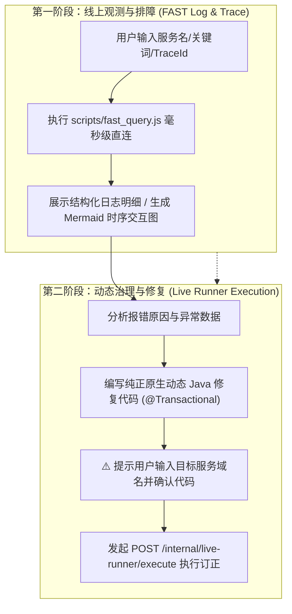

# 🚀 Leo Live Runner (AI 生产运维、全链路诊断与动态治理中枢)

本 Skill 专门指导 AI 执行线上生产环境与测试环境的 **全流程闭环运维与治理**：
1. **🔍 观测与诊断（Observe & Diagnose）**：基于 FAST / Kibana 毫秒级直连引擎，快速捞取报错日志、接口入参出参、TraceId 全链路时序与新服务索引自学习；
2. **🛠️ 治理与修复（Act & Fix）**：针对已接入 `leo-live-runner-spring-boot-starter` 的 Spring Boot 宿主工程，生成纯正原生 Java 代码，无重启执行数据订正与业务排障。

---

## 🎯 触发场景

当用户提出以下任一需求时激活本 Skill：
1. **FAST 线上日志与 TraceId 排查**：
   - 查特定微服务的报错、500 异常或接口调用记录（如 *“查一下 iot-platform 最近 10 分钟的房源封禁请求”*）；
   - 根据 TraceId 还原完整调用链路与时序（如 *“根据 traceId 361922-10... 抓下全链路日志”*）；
   - 抓取接口真实的请求入参 (`request_in`) 与响应结果 (`request_out`)。
2. **线上紧急数据订正 / 状态修复**：不重启应用，动态执行批量更新、多表对账修复；
3. **免发版动态执行 Java 代码**：调用宿主应用已有的 Spring Bean（`OrderService`, `UserMapper` 等）执行业务逻辑；
4. **运行时动态暴露 RESTful 接口**：在内存中动态注册多方法 Controller 服务族（`/query`, `/update`, `/cancel`）；
5. **数据库与事务安全保障**：需要执行写库操作并保证 `@Transactional` 异常 100% 自动回滚。

---

## 🧭 AI 标准端到端运维工作流 (End-to-End Ops Loop)



---

## 🔍 第一部分：FAST / Kibana 极速日志与 Trace 检索指南

### 1. 执行脚本快速调用
AI 可直接通过以下 Node.js 脚本毫秒级直连查询（四级阶梯自愈模式：日常纯 HTTP 极速直连 < 200ms；遇新服务自动唤起 macOS `ego-browser` 或 Windows/Chrome 扩展探针静默自愈）：

```bash
# 格式: node scripts/fast_query.js [appCode] [query/traceId] [timeRange] [size]

# 1. 查微服务最近日志 (默认 24h)
node scripts/fast_query.js iot-platform '"开始执行房源封禁"' 1h 5

# 2. 根据 TraceId 追溯全链路
node scripts/fast_query.js iot-platform '"361922-10.22.53.98-4130-1787830157652-8055"' 48h 30

# 3. 跨服务查 500 异常
node scripts/fast_query.js utopia-scs-saas 'loglevel:ERROR' 15m 10
```

### 2. 结果呈现规范
* **单次请求排查**：提炼接口 URI、入参关键字段、响应状态与耗时；
* **TraceId 追溯**：必须提取完整步骤并为用户绘制 **Mermaid 时序交互图**（参考 [examples/100_trace_and_log_query.md](examples/100_trace_and_log_query.md)）。

---

## ⚡ 第二部分：动态 Java 代码执行与数据修复规范

### 1. 决策调用模式
* **模式 A：一键即写即跑（`POST /internal/live-runner/execute`，推荐 ⭐⭐⭐⭐⭐）**
  - **适用场景**：一次性紧急修数据、单次排障、多 Pod 集群。
  - **核心优势**：一次请求携带源码与参数，当场编译、执行、卸载并返回日志，**天然免疫多 Pod 负载均衡（SLB）状态不同步问题**。
* **模式 B：常驻动态 API（`POST /register` + `POST /invoke/...`）**
  - **适用场景**：需要作为长期固定动态接口高频调用、多方法 Controller 服务族。

### 2. 编写纯正原生的动态 Java 代码
代码编写完全遵循标准 Java 语法，**无需 import 任何 live-runner 专有类**：
1. **类声明**：定义一个 public 类（如 `public class FixOrderTask`）；
2. **标准日志**：直接使用业务代码通用的 `LoggerFactory.getLogger(...)`；
3. **Spring Bean 依赖注入**：直接声明私有字段即可（如 `private JdbcTemplate jdbcTemplate;`, `private OrderService orderService;`），**无需加 `@Autowired` 注解**，框架自动按名/类型注入；
4. **事务安全（强制）**：任何写数据库操作，**必须声明 `@Transactional(rollbackFor = Exception.class)`**，框架会自动生成 CGLIB 事务 AOP 代理，遇到未捕获异常自动 100% 回滚；
5. **参数自适应**：方法形参名称直接对应请求 JSON 中的 key。

### 3. 【核心铁律】代码显式回显与状态变更强制确认 (Human-in-the-Loop)
⚠️ **AI 动态执行不可违背的安全铁律**：
1. **完整代码显式回显**：AI 在执行前**必须把完整的 Java 源码输出给用户**，严禁悄悄执行或仅展示代码片段；
2. **状态变更强制二次确认**：
   - 凡是涉及 **数据写操作**（MySQL 增删改、Redis 写入/删除、Kafka/RabbitMQ 发消息、调用第三方外部接口等）；
   - AI 生成完代码后，**必须明确请求用户确认**：
     > 💬 *“以上是为您生成的动态修复代码。由于包含状态变更/外部调用，请您仔细检查无误后回复‘确认执行’，我将为您发起调用。”*
   - **未获得用户明确确认前，绝对禁止发起 `POST /execute` 调用！**
3. **安全沙箱合规**：生成的代码必须符合七大安全规则族（AST 语法树隔离、禁止无 WHERE 条件的 UPDATE/DELETE、禁止 1=1 注入、禁止 DDL 等，详见 [references/security-rules.md](references/security-rules.md)）。

---

## 📡 HTTP 接口速查 (API Quick Reference)

| 接口路径 | HTTP 方法 | 功能描述 | 推荐场景 |
| :--- | :--- | :--- | :--- |
| **`/internal/live-runner/execute`** | `POST` | **一键即写即跑**（源码+参数同批下发，当场编译执行并卸载） | **生产多 Pod 应急修数据首选** |
| **`/internal/live-runner/register`** | `POST` | **注册动态代码**（仅预热编译，常驻内存） | 准备建立长期动态接口 |
| **`/internal/live-runner/invoke/{key}`** | `POST` | **调用单方法/默认方法**（传纯业务 JSON） | 高频调用单动作接口 |
| **`/internal/live-runner/invoke/{key}/{method}`** | `POST` | **二级子路径多方法调用**（精确调用指定 public 方法） | 调用动态 Controller 中的子方法 |
| **`/internal/live-runner/config`** | `GET` | **查看当前生效配置与线程池运行时指标** | 监控 Worker 线程池与调参 |
| **`/internal/live-runner/security-rules`** | `GET` | **动态查询当前生效的安全规则列表** | 动态探测目标实例安全边界 |
| **`/internal/live-runner/list`** | `GET` | **查看已加载脚本与调用指标** | 运维审计与状态检查 |
| **`/internal/live-runner/unregister/{key}`** | `DELETE` | **彻底卸载脚本与释放 Metaspace 元空间** | 用后清理内存 |

---

## 📚 规范文档与实战代码模板索引

- **七大安全沙箱规约与红线**：[references/security-rules.md](references/security-rules.md)
- **Live Runner 接口协议与出入参定义**：[references/api-reference.md](references/api-reference.md)
- **FAST 日志协议与检索兜底指南**：[references/fast-log-guide.md](references/fast-log-guide.md)
- **Spring 注入与事务代理规范**：[references/injection-rules.md](references/injection-rules.md)
- **实战示例索引**：
  - [examples/01_one_shot_sql_fix.java](examples/01_one_shot_sql_fix.java) — 一次性应急 SQL 修复（带事务与 SLF4J 日志）
  - [examples/02_mybatis_plus_dynamic.java](examples/02_mybatis_plus_dynamic.java) — MyBatis-Plus Lambda Wrapper 动态条件更新
  - [examples/03_existing_service_facade.java](examples/03_existing_service_facade.java) — 注入宿主工程现有 Service 门面
  - [examples/04_multi_method_controller.java](examples/04_multi_method_controller.java) — 多方法动态 Controller 服务族
  - [examples/05_advanced_type_and_logger.java](examples/05_advanced_type_and_logger.java) — 生产级全类型自动映射与 LiveLogger 双写实时日志回显
  - [examples/100_trace_and_log_query.md](examples/100_trace_and_log_query.md) — FAST 日志与 TraceId 全链路排障实战
