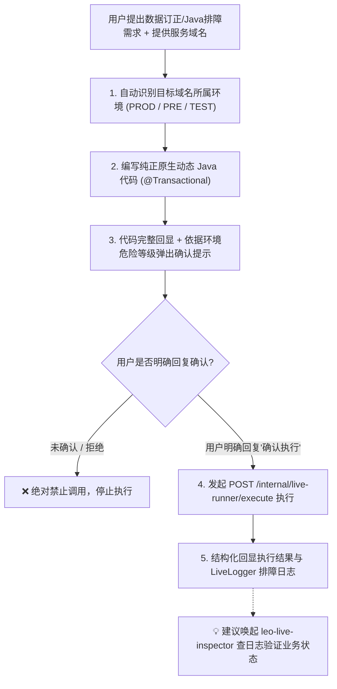

# 🚀 Leo Live Runner (Spring Boot 运行时免发版动态 Java 执行与数据治理中枢)

本 Skill 专门指导 AI 在生产、预发与测试环境中执行 **免发版、不重启应用的动态 Java 代码排障与数据修复（Act & Fix）**：
1. **🛠️ 纯正原生 Java 代码执行**：针对接入 `leo-live-runner-spring-boot-starter` 的宿主工程，编写标准 Java 语法，直接反射装配宿主已有的 Spring Bean（`JdbcTemplate`、`OrderService`、`UserMapper` 等）；
2. **🛡️ 原生 `@Transactional` AOP 事务保护**：底层自动织入 Spring CGLIB 事务切面，写操作异常 100% 自动回滚，杜绝脏数据；
3. **🔍 目标域名环境自动嗅探**：自动识别用户提供的域名所属环境（🔴 线上生产 PROD / 🟠 预发 PRE / 🟡 测试 TEST），实施分级安全告警；
4. **🔒 七大安全沙箱编译拦截 (Druid WallFilter 标准)**：AST 语法树级别阻断高危命令、拦截无 WHERE 条件的 UPDATE/DELETE、拦截 DDL 及 Redis KEYS *。

---

## 🎯 触发场景

当用户提出以下任一需求时激活本 Skill：
1. **线上紧急数据订正 / 状态修复**：不重启应用，动态执行批量更新、多表对账修复；
2. **免发版动态执行 Java 代码**：调用宿主应用已有的 Spring Bean 执行复杂业务逻辑或排障验证；
3. **运行时动态暴露 RESTful 接口**：在内存中动态注册 Controller 服务族（`/query`, `/update`, `/cancel`）；
4. **数据库与事务安全保障**：需要执行写库操作并保证 `@Transactional` 异常 100% 自动回滚。

> 💡 **提示**：如需排查线上报错日志、抓取接口出入参或根据 TraceId 还原调用链路，请优先使用配套的 **`leo-live-inspector`** 技能。

---

## 🧭 AI 动态治理标准工作流 (Dynamic Ops Loop)

---

## 🌐 1. 域名环境自动嗅探与分级管控 (Environment Awareness)

在向用户展示确认提示前，AI **必须先分析目标域名所属环境**：

| 环境分类 | 匹配特征 | 安全管控策略 |
| :--- | :--- | :--- |
| 🔴 **生产环境 (PROD)** | `*.intra.ke.com`, `*.ke.com`（无 test/pre 等关键字）或含 `prod`/`online` | **🚨 极高风险**：必须全量回显源码，强制要求用户回复“确认在生产环境执行” |
| 🟠 **预发/仿真 (PRE/STAGING)** | 域名任意位置含 `preview`，或含 `pre-`, `-pre`, `.pre.`, `staging`, `sim`, `gray`, `beta`, `canary` | **⚠️ 高风险**：提示可能影响预发联调/压测数据，用户确认后执行 |
| 🟡 **测试/本地 (TEST/LOCAL)** | 含 `test`, `qa`, `dev`, `localhost`, `127.0.0.1` | **🟢 中低风险**：常规代码回显与确认 |

> 详见 [references/env-detection-rules.md](references/env-detection-rules.md)。

---

## ⚡ 2. 编写纯正原生的动态 Java 代码规范

代码编写完全遵循标准 Java 语法，**无需 import 任何 live-runner 专有类**：
1. **类声明**：定义 public 类（如 `public class FixOrderTask`）；
2. **日志记录**：直接使用业务通用的 `LoggerFactory.getLogger(...)` 或方法形参声明 `LiveLogger log`；
3. **Spring Bean 依赖注入**：直接声明私有字段即可（如 `private JdbcTemplate jdbcTemplate;`, `private OrderService orderService;`），**无需加 `@Autowired` 注解**，框架自动按名/类型注入；
4. **事务安全（强制）**：任何写数据库操作，**必须声明 `@Transactional(rollbackFor = Exception.class)`**；
5. **参数自适应**：方法形参名称直接对应请求 JSON 中的 key。

---

## 🚨 3. 【核心铁律】代码显式回显与生产/预发环境强制确认 (Human-in-the-Loop)

⚠️ **AI 动态执行不可违背的绝对安全铁律**：
1. **完整代码显式回显**：AI 在执行前**必须把完整的 Java 源码输出给用户**，严禁悄悄执行或仅展示代码片段；
2. **生产与预发环境强制二次确认（必须阻断等待用户明确回复）**：
   - 凡是涉及 **数据写操作**（MySQL 增删改、Redis 写入/删除、Kafka/RabbitMQ 发消息、调用第三方外部接口等）；
   - **🔴 生产环境 (PROD)**：必须弹出红色高危警示，强制要求用户明确回复包含“确认在生产环境执行”：
     > 🚨 **【高危操作告警 - 目标环境: 线上生产环境 (PROD)】**
     > * **目标域名**：`http://<user-domain>`
     > * **变更范围**：`[说明受影响的表名、数据量或调用的方法]`
     > 
     > ⚠️ **生产环境直接修改数据存在极高业务风险！请您仔细核对上方代码无误后，明确回复“确认在生产环境执行”，我将为您发起调用。**
   - **🟠 预发环境 (PRE / STAGING)**：必须弹出橙色预警，明确提示预发环境风险并等待用户明确回复“确认在预发环境执行”：
     > ⚠️ **【重要安全预警 - 目标环境: 预发环境 (PRE/STAGING)】**
     > * **目标域名**：`http://<user-domain>`
     > * **变更范围**：`[说明受影响的表名、数据量或调用的方法]`
     > 
     > ⚠️ **当前操作将直接作用于预发环境，可能影响预发集成测试与压测联调数据！请您仔细核对上方代码无误后，明确回复“确认在预发环境执行”，我将为您发起调用。**
   - **⛔ 未获得用户明确的文字确认前，绝对严禁发起任何 `POST /execute` 或写操作 HTTP 调用！**
3. **安全沙箱合规**：生成的代码必须符合七大安全规则族（AST 语法树隔离、禁止无 WHERE 条件的 UPDATE/DELETE、禁止 1=1 注入、禁止 DDL 等，详见 [references/security-rules.md](references/security-rules.md)）。

---

## 📡 4. HTTP 接口速查 (API Quick Reference)

| 接口路径 | HTTP 方法 | 功能描述 | 推荐场景 |
| :--- | :--- | :--- | :--- |
| **`/internal/live-runner/execute`** | `POST` | **一键即写即跑**（源码+参数同批下发，当场编译执行并卸载） | **生产多 Pod 应急修数据首选 ⭐⭐⭐⭐⭐** |
| **`/internal/live-runner/register`** | `POST` | **注册动态代码**（仅预热编译，常驻内存） | 准备建立长期动态接口 |
| **`/internal/live-runner/invoke/{key}`** | `POST` | **调用单方法/默认方法**（传纯业务 JSON） | 高频调用单动作接口 |
| **`/internal/live-runner/invoke/{key}/{method}`** | `POST` | **二级子路径多方法调用**（精确调用指定 public 方法） | 调用动态 Controller 中的子方法 |
| **`/internal/live-runner/config`** | `GET` | **查看当前生效配置、环境 Profile 与线程池指标** | 运行前环境嗅探与监控 |
| **`/internal/live-runner/security-rules`** | `GET` | **动态查询当前生效的安全规则列表** | 动态探测目标实例安全边界 |
| **`/internal/live-runner/list`** | `GET` | **查看已加载脚本与调用指标** | 运维审计与状态检查 |
| **`/internal/live-runner/unregister/{key}`** | `DELETE` | **彻底卸载脚本与释放 Metaspace 元空间** | 用后清理内存 |

---

## 📚 规范文档与实战代码模板索引

- **域名环境自动嗅探与分级管控**：[references/env-detection-rules.md](references/env-detection-rules.md)
- **七大安全沙箱规约与红线**：[references/security-rules.md](references/security-rules.md)
- **Live Runner 接口协议与出入参定义**：[references/api-reference.md](references/api-reference.md)
- **Spring 注入与事务代理规范**：[references/injection-rules.md](references/injection-rules.md)
- **实战代码示例**：
  - [examples/01_one_shot_sql_fix.java](examples/01_one_shot_sql_fix.java) — 一次性应急 SQL 修复（带事务与 SLF4J 日志）
  - [examples/02_mybatis_plus_dynamic.java](examples/02_mybatis_plus_dynamic.java) — MyBatis-Plus Lambda Wrapper 动态条件更新
  - [examples/03_existing_service_facade.java](examples/03_existing_service_facade.java) — 注入宿主工程现有 Service 门面
  - [examples/04_multi_method_controller.java](examples/04_multi_method_controller.java) — 多方法动态 Controller 服务族
  - [examples/05_advanced_type_and_logger.java](examples/05_advanced_type_and_logger.java) — 生产级全类型自动映射与 LiveLogger 双写实时日志回显
