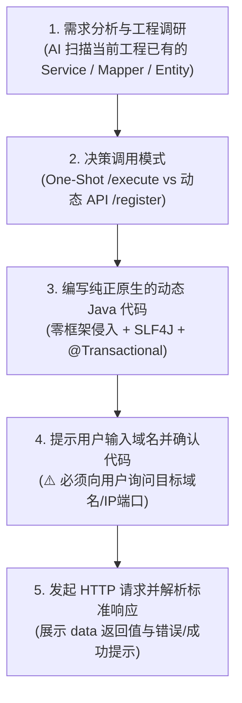

# 🚀 Leo Live Runner (AI 生产运维与动态执行 Skill)

本 Skill 专门指导 AI 针对已接入 `leo-live-runner-spring-boot-starter` 的 Spring Boot 2.x / 3.x 宿主工程，生成纯正原生 Java 代码，并通过 HTTP 端点与服务进行安全交互。

---

## 🎯 触发场景

当用户提出以下需求时激活本 Skill：
1. **线上紧急数据订正 / 状态修复**：不重启应用，动态执行批量更新、多表对账修复；
2. **免发版动态执行 Java 代码**：调用宿主应用已有的 Spring Bean（`OrderService`, `UserMapper` 等）执行业务逻辑；
3. **运行时动态暴露 RESTful 接口**：在内存中动态注册多方法 Controller 服务族（`/query`, `/update`, `/cancel`）；
4. **数据库与事务安全保障**：需要执行写库操作并保证 `@Transactional` 异常 100% 自动回滚。

---

## 🧭 AI 标准执行五步工作流 (Core Workflow)

### 步骤 1：分析需求与扫描宿主工程 (Codebase Survey)
* 使用搜索工具扫描宿主工程：
  - 查找是否已存在相关的业务类（如 `OrderService`, `AccountService`）；
  - 查找是否已存在 MyBatis Mapper（如 `OrderMapper`）或 JPA Repository；
  - 确认数据库实体字段类型与状态值定义。

### 步骤 2：决策调用模式
* **模式 A：一键即写即跑（`POST /internal/live-runner/execute`，推荐 ⭐⭐⭐⭐⭐）**
  - **适用场景**：一次性紧急修数据、单次排障、多 Pod 集群。
  - **核心优势**：一次请求携带源码与参数，当场编译、执行、卸载并返回日志，**天然免疫多 Pod 负载均衡（SLB）状态不同步问题**。
* **模式 B：常驻动态 API（`POST /register` + `POST /invoke/...`）**
  - **适用场景**：需要作为长期固定动态接口高频调用、多方法 Controller 服务族。

### 步骤 3：编写纯正原生的动态 Java 代码 (Zero-Framework-Invasion)
代码编写完全遵循标准 Java 语法，**无需 import 任何 live-runner 专有类**：
1. **类声明**：定义一个 public 类（如 `public class FixOrderTask`）；
2. **标准日志**：直接使用业务代码通用的 `LoggerFactory.getLogger(...)`（如 `private static final Logger log = LoggerFactory.getLogger(FixOrderTask.class);`）；
3. **Spring Bean 依赖注入**：直接声明私有字段即可（如 `private JdbcTemplate jdbcTemplate;`, `private OrderService orderService;`），**无需加 `@Autowired` 注解**，框架自动按名/类型注入（详见 [injection-rules.md](references/injection-rules.md)）；
4. **事务安全（强制）**：任何写数据库操作，**必须声明 `@Transactional(rollbackFor = Exception.class)`**，框架会自动生成 CGLIB 事务 AOP 代理，遇到未捕获异常自动 100% 回滚；
5. **参数自适应**：方法形参名称直接对应请求 JSON 中的 key（如 `public Object run(String orderId, String status)`），引擎自动转换数据类型。

### 步骤 4：【必须】提示用户输入域名并确认代码 (Prompt for Domain)
⚠️ **安全与网络铁律**：AI 绝对不能臆造或写死生产域名。
在准备发起 HTTP 调用前，**必须明确提示用户提供目标服务的访问域名或 IP:Port**：
> 💬 *“代码已生成完毕，请提供目标微服务的域名或访问地址（例如：`http://localhost:8080`、`https://order-service.prod.internal` 或 Pod 直连 IP `http://10.244.1.12:8080`），以及可选的 `X-Live-Token` 密钥（若已开启鉴权）。”*

### 步骤 5：发起 HTTP 请求并格式化展示结果
向用户提供的域名发送 HTTP 请求，并解析统一企业响应：
* **执行成功 (`code: 200`)**：`data` 返回业务计算结果，`msg` 为 `"SUCCESS"`；
* **执行失败 (`code: 500`)**：`msg` 回显精准的异常原因（如 SQL 错误、业务校验未通过），`data` 为 `null`。

---

## 📡 HTTP 接口速查 (API Quick Reference)

所有接口默认挂载在 `/internal/live-runner` 前缀下（详见 [api-reference.md](references/api-reference.md)）：

| 接口路径 | HTTP 方法 | 功能描述 | 推荐场景 |
| :--- | :--- | :--- | :--- |
| **`/internal/live-runner/execute`** | `POST` | **一键即写即跑**（源码+参数同批下发，当场编译执行并卸载） | **生产多 Pod 应急修数据首选** |
| **`/internal/live-runner/register`** | `POST` | **注册动态代码**（仅预热编译，常驻内存） | 准备建立长期动态接口 |
| **`/internal/live-runner/invoke/{key}`** | `POST` | **调用单方法/默认方法**（传纯业务 JSON） | 高频调用单动作接口 |
| **`/internal/live-runner/invoke/{key}/{method}`** | `POST` | **二级子路径多方法调用**（精确调用指定 public 方法） | 调用动态 Controller 中的子方法 |
| **`/internal/live-runner/list`** | `GET` | **查看已加载脚本与调用指标** | 运维审计与状态检查 |
| **`/internal/live-runner/unregister/{key}`** | `DELETE` | **彻底卸载脚本与释放 Metaspace 元空间** | 用后清理内存 |

---

## 📚 规范文档与实战代码模板索引

- **完整接口协议与出入参定义**：[references/api-reference.md](references/api-reference.md)
- **Spring 注入与事务代理规范**：[references/injection-rules.md](references/injection-rules.md)
- **实战代码模板**：
  - [examples/01_one_shot_sql_fix.java](examples/01_one_shot_sql_fix.java) — 一次性应急 SQL 修复（带事务与 SLF4J 日志）
  - [examples/02_mybatis_plus_dynamic.java](examples/02_mybatis_plus_dynamic.java) — MyBatis-Plus Lambda Wrapper 动态条件更新
  - [examples/03_existing_service_facade.java](examples/03_existing_service_facade.java) — 注入宿主工程现有 Service 门面
  - [examples/04_multi_method_controller.java](examples/04_multi_method_controller.java) — 多方法动态 Controller 服务族
