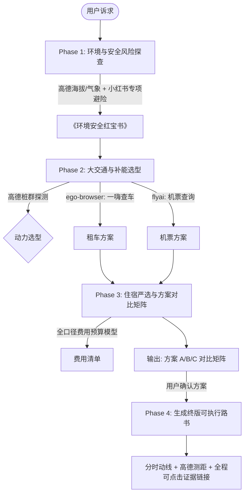

# Leo Travel Planner (智能旅行自驾规划助手)

多源协同的高可靠旅行与自驾规划中枢。整合 **FlyAI**、**高德地图 MCP** 与 **ego-browser**（小红书素人经验与一嗨租车），提供全口径费用测算、环境风险主动防御与全程可追溯的交互式旅行路书。

---

## 核心法则（Non-negotiable Rules）

1. **证据与链接可溯源（Evidence Grounding）**：
   * 任何推荐结论、避坑经验、门票价格、酒店选择，**必须附带真实原链接**。
   * 小红书素人经验：`[小红书·作者名: 笔记标题]({noteUrl})`。
   * FlyAI 机酒门票：`[飞猪直达预订: {名称}]({jumpUrl/detailUrl})` 且配图 ``。
   * 一嗨租车：`[一嗨租车: {门店名}]({url})`。
   * 高德地图导航：`[高德地图导航: {地点名}](https://uri.amap.com/marker?position={lon},{lat}&name={name})`。
   * 文末必须附带统一的 **《数据来源与参考凭证索引表》（Evidence Ledger）**。

2. **小红书去伪存真（素人过滤法则）**：
   * **黑名单直接剔除**：包含 `定制游`、`小团`、`纯玩团`、`私信`、`拼车领队`、`包车师傅`、`旅行社`、`报团`、`滴滴我` 等商业营销笔记。
   * **白名单正向采信**：包含 `避坑`、`劝退`、`血泪教训`、`排队多久`、`真实自驾`、`冷门机位`、`暗冰`、`高反` 等第一人称素人分享。

3. **动力选型（基于高德充电桩密度的自适应决策）**：
   * 在涉及自驾时，调用高德 MCP 检索全线节点 10km 范围内的充电站密度。
   * 若沿途节点充电站稀少（< 3个）、属于跨城远途偏远区（如西北/高原/大环线）或正值节假日高峰，**坚决推荐增程 / 插混 / 燃油 SUV**，杜绝排队充电或低温断电风险；
   * 仅在充电网络极其成熟、气候温和的平原/海岛短途（如海南、江浙沪），方可推荐纯电车型。

4. **住宿严选与剔除黑名单**：
   * 🚫 **明确拉黑**：`智选假日`（Holiday Inn Express）、低端老旧连锁（7天、老如家、老汉庭）。
   * ⭐ **优先推荐池**：`亚朵`（Atour）、`全季`（Ji Hotel）、`喆啡`（James Joyce Coffetel）、`桔子 / 桔子水晶`、`美居`（Mercure）、`漫心`。
   * 🚗 **自驾两大硬指标**：**必须配有专属/免费宽敞停车场**（免拖箱步行），**必须配备自助洗衣房**（长线自驾刚需）。

5. **交互流程：先出三方案对比与费用总账，再出终版路书**：
   * 严禁直接输出单一套路路书。第一轮交互必须给出 **方案 A（经典打卡）、方案 B（深度慢游）、方案 C（小众避堵）** 对比矩阵与全口径预算表，供用户挑选确认后再展开分时完整路书。

6. **网页搜索与抓取双轨机制（参考 `leo-live-inspector` / `fast-log` 规范）**：
   * **仅在需要网页搜索与抓取时**（如小红书素人笔记避坑、一嗨租车比价与选型）按操作系统分轨：
     * **🍎 macOS 平台**：走 **`ego-browser`** 原生 CLI 驱动，在隔离 Task Space 中复用用户登录态快速抓取；
     * **🪟 Windows 平台**：走 **Chrome 插件形式**（借用项目内置的 Leo Lantern 扩展桥接 `http://127.0.0.1:19527` 派发后台任务至日常 Chrome），直接复用用户已登录小红书与一嗨的真实浏览器会话（详见 `references/cross-platform-fallback.md`）；
   * **非网页检索能力全平台一致**：高德地图 MCP（路径/气象/桩群）和 FlyAI（机票/酒店）本身就是标准跨平台接口，全平台直接调用。

7. **人机协同接管守则（Captcha / Login Handoff）**：
   * 无论在 macOS（ego-browser）还是 Windows（Chrome 插件），若检测到小红书或一嗨弹出**滑块拼图验证码、短信二次验证或安全拦截**：
   * **严禁机械死等或无限重试**。必须立即调用 `await handOffTaskSpace()`（或释放控制权），并向用户友好提示：*“检测到小红书/一嗨安全验证，已将浏览器控制权切给您，请在弹出的窗口中滑动一下验证码后告诉我，我立即继续为您生成”*；
   * 用户完成后，Agent 调用 `takeOverTaskSpace` 平滑恢复执行。

8. **季节封路与夜间管制预警（Seasonal Closure & Bypass Route）**：
   * 途经独库公路、伊昭公路、盘山高海拔路段时，必须自动预警：
     * **季节通车期**：9 月下旬至次年 6 月因山区初雪随时全线封路；
     * **时段与车型管控**：部分路段每天 20:00 至次日 08:00 实行夜间禁行，且禁止 7 座以上客车与房车通行；
     * **保底备选线**：方案中**必须同步附带一条全天候高速/国道保底绕行路线**（如 G30 连霍高速绕行）。

9. **自驾全流程闭环（异地还车费与底盘全险）**：
   * 若行程设计为异地取还（如乌鲁木齐取、喀什/阿勒泰还），费用预算中**必须明确计入异地还车附加费（¥800~¥2000）**；
   * 长途自驾路况复杂，一嗨租车必须明确建议选配包含**车辆底盘刮蹭、前挡风玻璃碎裂、轮胎爆胎**的全面保障（尊享险/百万三者）。

10. **门票预约抢票窗口与人群画像定制**：
    * 节假日核心景区（如喀纳斯、莫高窟、故宫、布达拉宫）必须明确标出**“需提前 X 天抢票（几点放票）”**，防止现场无票跑空；
    * 若同行人包含长辈或幼童：动线自动避免高强度陡峭徒步（单日步数控制在 10,000 步以内），驻点酒店强制校验**“必须配有客梯（拒绝搬箱爬楼）”**，高海拔区域酒店强制推荐**“具备弥散式供氧”**。

11. **终版路书集成《行李 CheckList》与《紧急救援通讯录》**：
    * 选定方案后生成的终版路书中，必须自动包含针对该路线气候/地形定制的《环境自适应行李打包 Checklist》与《24h 紧急救援通讯录》（含全国报警救援、一嗨救援 400-888-6608、高速救援 12122 等），确保离线自驾安全无忧（详见 `references/checklist-and-emergency.md`）。

---

## 四阶段规划流水线（4-Phase Pipeline）



### Phase 1: 意图解析与环境安全风险探查（Environmental Pre-check）
1. 解析目的地、天数、同行人（亲子/情侣/摄影/自驾）、出行季节与节假日属性。
2. 调用高德 MCP：
   * `maps_geo` / `maps_text_search`：分析核心景点的海拔高度。
   * `maps_weather`：分析目的地白天、夜间温差及近期待报。
3. 触发环境安全自适应雷达（详见 `references/safety-guardrails.md`）：
   * **海拔 $\ge 2500$m（高反风险）**：激活阶梯爬升规则、洗头禁忌、止痛药物清单。
   * **夜温 $\le 5$℃ 或温差 $\ge 15$℃（极温/暗冰风险）**：激活洋葱穿衣法、手机保暖贴、背阴暗冰驾驶防御。
   * **无人区/沙漠公路**：激活离线地图包下载提醒、见站必加满、常备水粮储备。
   * **长距离盘山险路**：激活发动机低速挡辅助制动规则（防刹车片热过载）。
   * **边境/少数民族地区**：激活边防证办理指南与民俗合规提示。
4. 使用 `ego-browser` 在小红书专项检索该环境下的素人避险经验（如 `[地点] 高反 真实经历 药物 避坑`），提炼真实防护要点。

### Phase 2: 大交通与自驾选型（Transportation & Powertrain）
1. **补能与车型判定**：
   * 调用高德 `maps_around_search`（`keywords="充电站"`）扫描沿途主要经停点与服务区。
   * 结合行程是否跨城（>300km）及是否为中秋/国庆等旺季，决策推荐纯电还是增程/插混/燃油。
2. **一嗨租车检索**：
   * 通过 `ego-browser` 检查一嗨租车机场/高铁站网点的车型与日租价格，优先锁定 SUV。
3. **大交通机酒预订**：
   * 调用 `flyai search-flight` 或 `flyai keyword-search` 锁定往返机票/高铁直达链接。

### Phase 3: 住宿严选与三方案对比矩阵（Multi-Scenario Options）
1. **住宿定向筛选**：
   * 调用 `flyai search-hotel`，以 `亚朵`、`全季`、`喆啡`、`桔子` 为关键词，过滤掉智选假日与低端经济型。
   * 确保每个驻点酒店具备免费停车场与自助洗衣房。
2. **全口径费用预算测算（详见 `references/budget-estimator.md`）**：
   * 大交通费用 + 租车费用 + 油电能源费（高德总里程测算） + 高速通行费 + 酒店房费 + 门票/区间车 + 餐饮备用金。
3. **输出方案对比矩阵**：
   * **方案 A【全景经典·大环线】**：核心地标全覆盖，高性价比，日均车程适中。
   * **方案 B【深度慢游·秋色行摄】**：少换酒店（核心村落连住2晚），纯享日落晨雾与松弛感。
   * **方案 C【小众反向·避开人流】**：避开节假日核心景区拥堵排队，探寻周边冷门秘境。

### Phase 4: 终版可执行路书生成（Interactive Dashboard）
用户选定具体方案后，输出结构化 Markdown 路书：
1. **行前速览与《环境安全红宝书》**：着装清单、备用药物、离线离车指引、边防证流程。
2. **动线与高德测距地图（Mermaid 图）**：各段里程、耗时、道路等级（高速/国道/盘山路）。
3. **分天详细分时指南（Day 1 ~ Day N）**：
   * 早/中/晚精准动线与避堵建议。
   * 景点门票卡片（含飞猪直达预订链接与高清图）。
   * 严选酒店卡片（含图片、价格、直达预订、停车与洗衣说明）。
   * 小红书素人避坑 Tips（必须带原贴链接）。
4. **全口径费用预算明细表**（整车总计与人均总计）。
5. **《数据来源与参考凭证索引表》（Evidence Ledger）**。

---

## 工具调用规范示例

### 1. ego-browser 小红书素人笔记检索
```bash
ego-browser nodejs <<'EOF'
const task = await useOrCreateTaskSpace('travel-xhs-search')
await openOrReuseTab('https://www.xiaohongshu.com/search_result?keyword=' + encodeURIComponent('目的地 避坑 真实自驾'), { wait: true, timeout: 20 })
await wait(3)

const notes = await js(String.raw`(() => {
  const cards = Array.from(document.querySelectorAll('section.note-item, .note-card'));
  const blackWords = ['私信', '定制游', '纯玩团', '小团', '拼车', '包车师傅', '旅行社', '报团'];
  return cards.map(c => {
    const title = c.querySelector('.title, a.title')?.innerText || '';
    const author = c.querySelector('.author, .user-name')?.innerText || '';
    const href = c.querySelector('a')?.href || '';
    return { title, author, href };
  }).filter(n => n.title && !blackWords.some(bw => n.title.includes(bw))).slice(0, 5);
})()`);

cliLog(JSON.stringify(notes, null, 2))
await completeTaskSpace(task.id, { keep: false })
EOF
```

### 2. 高德地图 MCP 动线与充电站测算
* 地点编码：`maps_geo(address="乌鲁木齐站")`
* 天气预警：`maps_weather(city="阿勒泰地区")`
* 充电站密度：`maps_around_search(keywords="充电站", location="87.333413,48.450456", radius="10000")`
* 驾车测算：`maps_direction_driving(origin="...", destination="...")`
  * 通过高德 `distance`（米）计算油电成本与过路费。
  * 高德地图导航标注链接：`https://uri.amap.com/marker?position={lon},{lat}&name={name}`

### 3. FlyAI 酒店与景点调用
```bash
# 酒店查询（锁定全季/亚朵/喆啡，指定日期）
flyai search-hotel --dest-name "乌鲁木齐" --key-words "亚朵" --check-in-date "2026-09-24" --check-out-date "2026-09-25"

# 景点与门票查询
flyai search-poi --city-name "阿勒泰"
```
* 渲染规范：
  * 图片独立成行：``（酒店使用 ``）
  * 预订直达独立成行：`[点击预订]({jumpUrl})`（酒店使用 `[点击预订]({detailUrl})`）

---

## 终版交付样例结构（模板）

```markdown
# 🚗 [目的地·时节] [方案名称] 全景路书

> 📅 **建议时段**：...  
> 👥 **适合人群**：...  
> 🚙 **推荐车型**：... (动力选型原因: 基于高德沿途充电站密度评估)  
> 💰 **预估人均**：¥... / 人 (整车 ¥...)

---

## 🛡️ 《行前安全与避险红宝书》（环境安全雷达）
- **高反/极温应对**：... [小红书·xxx: 亲历高反用药实测](url)
- **自驾与路况要诀**：... [小红书·xxx: 险段避雷与暗冰应对](url)

---

## 🗺️ 动线规划与高德空间测算
[Mermaid 路线图]
[总里程、总驾驶时长、道路等级比例]

---

## 📅 分日详细行程与直达卡片

### Day 1：[起点] → [途经] → [驻点]
* **今日动线**：... [高德地图导航: 目的地](https://uri.amap.com/marker?...)
* **核心景点**：
  
  [点击预订门票: xxx](jumpUrl)
* **严选住宿**：
  
  **亚朵酒店 / 全季酒店** (专属免费车位 / 自助洗衣房)  
  [点击预订酒店](detailUrl)
* **小红书素人避坑 Tips**：
  1. ... [小红书·xxx: 笔记标题](url)

---

## 🧾 全口径费用预算表
[分类明细与总计]

---

## 🔗 《数据来源与参考凭证索引表》（Evidence Ledger）
| 类别 | 来源与名称 | 凭证/跳转链接 |
| :--- | :--- | :--- |
| **小红书笔记** | [作者: 标题] | [点击查看原帖](url) |
| **酒店预订** | [飞猪: 亚朵酒店] | [直达预订](url) |
| **景点票务** | [飞猪: 喀纳斯门票] | [直达预订](url) |
| **租车方案** | [一嗨租车: 机场店] | [查看网点](url) |
| **高德导航** | [高德: 禾木门票站] | [打开高德地图](url) |
```
