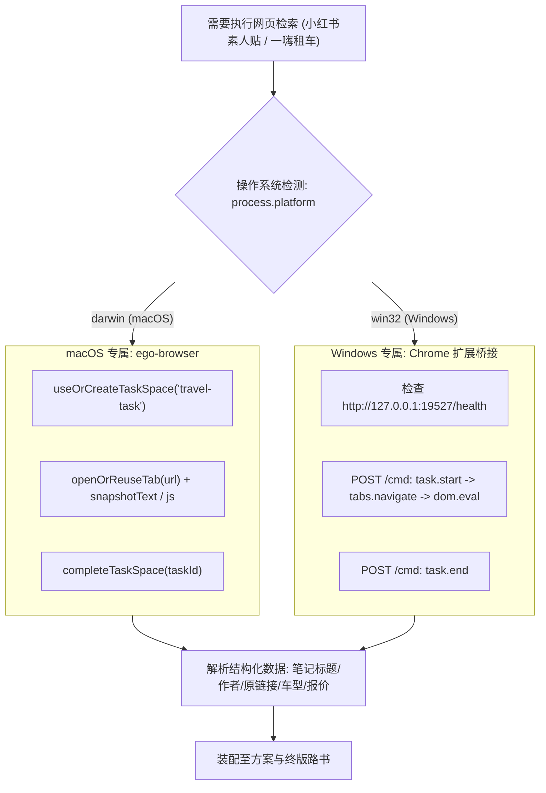

# 网页搜索与抓取的双轨架构规范：macOS (ego-browser) vs Windows (Chrome 插件)

参考 `leo-live-inspector`（`fast-log-guide.md` 与 `fast_query.js`）的成熟实践，当 Agent 需要执行**网页搜索与数据抓取**（包括小红书素人避坑笔记检索、一嗨租车门店与车型比价）时，严格遵循操作系统分轨机制：

* **🍎 macOS 环境**：走 **`ego-browser`** CLI 原生隔离空间驱动；
* **🪟 Windows 环境**：走 **Chrome 插件形式**（通过本地 Leo Lantern Bridge `http://127.0.0.1:19527` 发送长轮询指令至用户真实日常 Chrome）。

两者均能**无缝继承用户在浏览器中已经登录的小红书和一嗨租车账号状态**，彻底解决鉴权、验证码与页面渲染问题。

---

## 🧭 双轨调度流程



---

## 1. 🍎 macOS 轨道：ego-browser 执行规范

在 macOS 上，直接使用 `ego-browser nodejs <<'EOF'` 脚本执行，完全独立且不干扰用户前台操作。

### 小红书检索代码示例：
```bash
ego-browser nodejs <<'EOF'
const task = await useOrCreateTaskSpace('travel-xhs-mac')
await openOrReuseTab('https://www.xiaohongshu.com/search_result?keyword=' + encodeURIComponent('喀纳斯 避坑 真实经历'), { wait: true, timeout: 20 })
await wait(3)

const notes = await js(String.raw`(() => {
  const cards = Array.from(document.querySelectorAll('section.note-item, .note-card, div.feeds-container section'));
  const blackList = ['私信', '定制游', '纯玩团', '小团', '拼车', '包车师傅', '旅行社', '报团', '私聊'];
  return cards.map(c => ({
    title: c.querySelector('.title, a.title, .footer .title')?.innerText || '',
    author: c.querySelector('.author, .user-name, .name')?.innerText || '',
    href: c.querySelector('a')?.href || ''
  })).filter(n => n.title && n.href && !blackList.some(bw => n.title.includes(bw))).slice(0, 6);
})()`);

cliLog(JSON.stringify(notes, null, 2))
await completeTaskSpace(task.id, { keep: false })
EOF
```

---

## 2. 🪟 Windows 轨道：Chrome 插件（Leo Lantern 19527 端口）执行规范

在 Windows 上，项目内置了专门的自动化控制 CLI：`clis/leo-lantern/index.mjs`。通过该 CLI 可直接向用户日常 Chrome（已加载 `extensions/leo-cookie-txt-locally`）派发指令，完全复用登录态。

### 原生 CLI 标准操作流水线 (Production CLI Pipeline)：

```bash
# 1. 检查扩展与 Bridge 连通状态
node ./clis/leo-lantern/index.mjs health

# 2. 列出浏览器中打开的 Tab (识别小红书与一嗨页面)
node ./clis/leo-lantern/index.mjs tabs

# 3. 开启工作区任务
node ./clis/leo-lantern/index.mjs start-task --title="travel-scrape" --sameWindow=true

# 4. 小红书真实检索与素人笔记抓取
node ./clis/leo-lantern/index.mjs claim --tabId=<xhsTabId>
node ./clis/leo-lantern/index.mjs goto "https://www.xiaohongshu.com/search_result?keyword=川西大环线%20避坑"
node ./clis/leo-lantern/index.mjs wait --selector="section.note-item, .note-card, .title" --timeoutMs=8000
node ./clis/leo-lantern/index.mjs content --maxChars=4000

# 5. 一嗨租车真实车型与门店信息抓取
node ./clis/leo-lantern/index.mjs claim --tabId=<ehiTabId>
node ./clis/leo-lantern/index.mjs content --maxChars=4000

# 6. 结束任务
node ./clis/leo-lantern/index.mjs end-task --closeGroup=false
```
---

## 3. 跨平台路由决策表

| 场景 | macOS 平台行为 | Windows 平台行为 |
| :--- | :--- | :--- |
| **小红书避坑搜索** | 调用 `ego-browser` CLI | 调用本地 `19527` 接口通知 Chrome 插件执行 |
| **一嗨租车比价** | 调用 `ego-browser` CLI | 调用本地 `19527` 接口通知 Chrome 插件执行 |
| **登录态复用** | 复用 macOS ego 浏览器环境数据 | 直接复用 Windows 用户日常 Chrome 的登录态 Cookie |
| **高德地图 MCP** | 跨平台统一：MCP 直连调用 | 跨平台统一：MCP 直连调用 |
| **FlyAI 机酒查询** | 跨平台统一：FlyAI CLI 直连调用 | 跨平台统一：FlyAI CLI 直连调用 |

---

## 4. 环境初始化与一键安装流程 (Installation & Setup)

参考 `leo-live-inspector`（`install_ego.sh` 与 `setup_chrome_ext.bat`），本技能自带全自动安装脚本：

### 🍎 macOS：安装 ego-browser
若终端提示 `ego-browser: command not found`，在项目目录下直接运行内置静默安装脚本：
```bash
sh lib/skills/leo-travel-planner/scripts/install_ego.sh
```
* **执行动作**：自动识别 arm64/x64 架构，下载官方最新 DMG 安装包，挂载解压至 `/Applications/ego lite.app`，并在 `~/.local/bin/ego-browser` 创建软链接，开箱即用。

### 🪟 Windows：加载 Chrome 插件
若向 `127.0.0.1:19527/health` 请求超时或离线，直接双击运行内置批处理脚本：
```bat
lib\skills\leo-travel-planner\scripts\setup_chrome_ext.bat
```
* **执行动作**：
  1. 自动定位内置扩展目录并将绝对路径复制到系统剪贴板（`clip`）；
  2. 自动启动系统 Chrome 并打开 `chrome://extensions`；
  3. 引导开启「开发者模式」并点击「加载已解压的扩展程序」，直接 `Ctrl + V` 粘贴路径即可完成加载。

